# Week 1: Foundations of Production AI

---

## Chapter 1: The Production AI Landscape

### 1.1 The Demo-to-Production Gap

Every AI project begins the same way: excitement. You prompt a model, it generates something impressive, and suddenly the possibilities seem endless. Your CEO wants it shipped yesterday. Your PM asks, "How hard could it be?"

Very hard, it turns out.

```mermaid
%%{init: {'theme': 'base', 'themeVariables': {'primaryColor': '#4F46E5', 'primaryTextColor': '#FFFFFF', 'primaryBorderColor': '#3730A3', 'secondaryColor': '#D1FAE5', 'secondaryTextColor': '#065F46', 'secondaryBorderColor': '#059669', 'tertiaryColor': '#FEF3C7', 'tertiaryTextColor': '#92400E', 'tertiaryBorderColor': '#D97706', 'lineColor': '#6B7280', 'textColor': '#1F2937', 'fontSize': '14px'}}}%%
flowchart TD
    subgraph DEMO["DEMO STAGE"]
        D1["Works on laptop · Single user · Happy path only"]:::data
        D2["Cost ignored · Security ignored"]:::data
        D3["'It usually works' · Notebook cells"]:::data
        D4["Time: 2 hours · Team: 1 person"]:::data
    end

    DEMO -->|"Most projects die here"| VALLEY
    VALLEY["⚠ The Valley of Production Death"]:::danger
    VALLEY --> PROD

    subgraph PROD["PRODUCTION STAGE"]
        P1["Works at scale · Thousands concurrent · All edge cases"]:::service
        P2["Cost optimized · Defense in depth"]:::service
        P3["99.9% reliability · Production services"]:::service
        P4["Time: 2-6 months · Team: 3-10 people"]:::service
    end

    classDef danger fill:#EF4444,stroke:#B91C1C,color:#FFFFFF,font-size:16px
    classDef data fill:#10B981,stroke:#047857,color:#FFFFFF
    classDef service fill:#4F46E5,stroke:#3730A3,color:#FFFFFF
```



**Figure 1.1:** The journey from demo to production—where most AI projects fail

#### Why Projects Fail

The failure rate for AI projects is strikingly high. According to a [RAND Corporation study](https://www.rand.org/pubs/research_reports/RRA2680-1.html), over 80% of AI projects fail — roughly double the rate of non-AI IT projects. [IDC reports](https://www.cio.com/article/3850763/88-of-ai-pilots-fail-to-reach-production-but-thats-not-all-on-it.html) that 88% of AI proof-of-concepts never reach production. A [2025 MIT study](https://mitsloan.mit.edu/ideas-made-to-matter/companies-are-not-seeing-profits-generative-ai) found that only about 5% of generative AI initiatives deliver sustained, measurable business impact.

The common failure modes include:

| Failure Mode | Example |
|--------------|---------|
| **Cost Overruns** | Uncontrolled API spending, no rate limiting or cost caps |
| **Quality Regressions** | Model updates or prompt changes degrade user-facing output |
| **Security Incidents** | Prompt injection, jailbreaks, data leakage through LLM outputs |
| **Scaling Failures** | Systems that work for demos collapse under concurrent load |
| **Integration Issues** | AI components that can't connect to existing data and workflows |

---

### 1.2 Anatomy of Production AI Systems

A production AI system is not just a model—it's an ecosystem of components working together:


**Figure 1.2:** Complete production AI system architecture

Each layer serves a critical purpose:

1. **Edge Layer**: Protects your system from the chaos of the internet
2. **API Gateway**: Enforces policies and validates requests
3. **Application Layer**: Orchestrates the business logic
4. **Service Layer**: Implements AI capabilities
5. **Data Layer**: Stores and retrieves information
6. **Observability Layer**: Makes the system understandable

---

### 1.3 War Story: When AI Costs Spiral

> **🔥 War Story: Klarna's AI Customer Service Pivot**
>
> In 2024, Klarna made headlines by replacing 700 customer service agents with an AI assistant powered by OpenAI. The company reported the AI handled two-thirds of customer chats in its first month — equivalent to the work of 700 agents — and projected $40 million in annual savings. ([Source](https://www.klarna.com/international/press/klarna-ai-assistant-handles-two-thirds-of-customer-service-chats-in-its-first-month/))
>
> But by 2025, CEO Sebastian Siemiatkowski acknowledged the company had gone too far. Users encountered inaccurate answers, robotic tone, circular interactions, and inability to escalate to a human. The overemphasis on cost-cutting had compromised service quality. Klarna began rehiring human agents. ([Source](https://www.bbc.com/news/articles/c0jnlp3vy8zo))
>
> The lessons for production AI systems:
>
> 1. **Cost optimization without quality monitoring is dangerous**: Savings mean nothing if users leave
> 2. **AI needs guardrails and escalation paths**: Not every request can be handled by a model
> 3. **Evaluation systems are essential** (Week 3): You can't improve what you don't measure
> 4. **Human-in-the-loop matters**: Hybrid systems often outperform pure AI or pure human approaches
> 5. **Observability is not optional** (Week 8): You need to detect quality regressions before users do

---

### 1.4 The Trade-off Framework

Production AI engineering is fundamentally about trade-offs. Here are the primary tensions:

```mermaid
quadrantChart
    title The Four Trade-off Dimensions
    x-axis Velocity --> Reliability
    y-axis Cost --> Quality
    quadrant-1 Expensive but Reliable
    quadrant-2 Ideal (myth)
    quadrant-3 Cheap & Fast
    quadrant-4 Robust but Basic
    Startup MVP: [0.2, 0.3]
    Healthcare App: [0.7, 0.9]
    High-Volume Consumer: [0.5, 0.2]
    Enterprise B2B: [0.8, 0.6]
```

**Trade-off Decisions in Practice:**

| Scenario | Trade-off Decision |
|----------|-------------------|
| Startup MVP | Velocity > Reliability > Cost > Quality |
| Healthcare Application | Quality > Reliability > Cost > Velocity |
| High-Volume Consumer App | Cost > Reliability > Velocity > Quality |
| Enterprise B2B | Reliability > Quality > Cost > Velocity |

**Figure 1.3:** The four dimensions of production trade-offs

#### Latency vs. Cost

```python
# Example: Model selection based on latency/cost requirements

from enum import Enum
from dataclasses import dataclass

class ModelTier(Enum):
    FAST_CHEAP = "gpt-4o-mini"             # ~500ms, $0.15/$0.60 per 1M tokens
    BALANCED = "gpt-4o"                    # ~800ms, $2.50/$10 per 1M tokens
    QUALITY = "claude-3-5-sonnet"          # ~1200ms, $3/$15 per 1M tokens
    MAXIMUM = "claude-3-opus"              # ~2000ms, $15/$75 per 1M tokens

@dataclass
class RequestContext:
    user_tier: str          # "free", "paid", "enterprise"
    task_complexity: str    # "simple", "moderate", "complex"
    latency_budget_ms: int  # Maximum acceptable latency

def select_model(context: RequestContext) -> ModelTier:
    """Select appropriate model based on context."""

    # Enterprise users get best quality
    if context.user_tier == "enterprise":
        return ModelTier.QUALITY

    # Simple tasks use cheap models
    if context.task_complexity == "simple":
        return ModelTier.FAST_CHEAP

    # Tight latency budget forces faster models
    if context.latency_budget_ms < 1000:
        return ModelTier.FAST_CHEAP

    # Default to balanced
    return ModelTier.BALANCED
```

#### Reliability vs. Velocity

Moving fast breaks things. Moving slow loses markets. The art is knowing when to slow down:

```
┌─────────────────────────────────────────────────────────────────────────────┐
│                    WHEN TO PRIORITIZE RELIABILITY                           │
└─────────────────────────────────────────────────────────────────────────────┘

   HIGH RELIABILITY REQUIRED          │  VELOCITY ACCEPTABLE
   ──────────────────────────         │  ────────────────────
   • User-facing features             │  • Internal tools
   • Financial transactions           │  • Experiments
   • Healthcare/safety-critical       │  • Non-critical features
   • Data that can't be recovered     │  • Features with easy rollback
   • Large blast radius changes       │  • Small, isolated changes

   RELIABILITY PRACTICES              │  VELOCITY PRACTICES
   ──────────────────────────         │  ────────────────────
   • Extensive testing                │  • Ship and iterate
   • Staged rollouts                  │  • Feature flags
   • Manual review gates              │  • Automated deployment
   • Runbooks and playbooks           │  • Quick rollback capability
```

---

### 1.5 Modern AI Architecture Patterns

Production AI systems typically follow one of these patterns:

#### Pattern 1: Direct LLM Integration

The simplest pattern—direct API calls to an LLM provider:


**Use when:** Simple chatbots, content generation, straightforward Q&A
**Avoid when:** Need for custom knowledge, complex reasoning, high reliability

#### Pattern 2: RAG (Retrieval-Augmented Generation)

Combines LLM with external knowledge:


**Use when:** Customer support, documentation Q&A, knowledge bases
**Avoid when:** Real-time data needs, highly creative tasks

#### Pattern 3: Agentic Systems

AI that can take actions and use tools:


**Use when:** Complex multi-step tasks, code generation, research
**Avoid when:** Simple queries, latency-critical applications

---

## Chapter 2: Generative AI Technical Review

### 2.1 Transformer Architecture Refresher

Before building production systems, let's ensure a solid understanding of what we're deploying:


**Figure 2.1:** Simplified transformer architecture

### 2.2 Key Concepts for Production

#### Context Windows and Token Limits

```python
# Understanding token limits is critical for production systems

from dataclasses import dataclass

@dataclass
class ModelContext:
    name: str
    context_window: int      # Total tokens allowed
    output_limit: int        # Max tokens in response
    cost_per_1k_input: float
    cost_per_1k_output: float

MODELS = {
    # Pricing as of mid-2025 — check https://openai.com/api/pricing/
    # and https://www.anthropic.com/pricing for current rates
    "gpt-4o": ModelContext(
        name="gpt-4o",
        context_window=128_000,
        output_limit=16_384,
        cost_per_1k_input=0.0025,
        cost_per_1k_output=0.010
    ),
    "claude-3-5-sonnet": ModelContext(
        name="claude-3-5-sonnet",
        context_window=200_000,
        output_limit=8_192,
        cost_per_1k_input=0.003,
        cost_per_1k_output=0.015
    ),
    "gpt-4o-mini": ModelContext(
        name="gpt-4o-mini",
        context_window=128_000,
        output_limit=16_384,
        cost_per_1k_input=0.00015,
        cost_per_1k_output=0.0006
    ),
}

def estimate_cost(
    model: str,
    input_tokens: int,
    output_tokens: int
) -> float:
    """Estimate API cost for a request."""
    config = MODELS[model]
    input_cost = (input_tokens / 1000) * config.cost_per_1k_input
    output_cost = (output_tokens / 1000) * config.cost_per_1k_output
    return input_cost + output_cost

# Example: Estimate cost for a typical RAG query
# 2000 tokens context + 500 token query + 1000 token response
cost = estimate_cost("gpt-4o", input_tokens=2500, output_tokens=1000)
print(f"Estimated cost: ${cost:.4f}")  # ~$0.0163
```

> **💡 Tip:** Always track token usage in production. Unexpected token counts are often the first sign of prompt injection attacks or system bugs.

#### API-Based vs. Self-Hosted Models

| Dimension | API-Based | Self-Hosted |
|-----------|-----------|-------------|
| **Setup Time** | Minutes | Days to Weeks |
| **Upfront Cost** | $0 | $10K-$500K (GPUs) |
| **Marginal Cost** | $0.00015-$0.015 per 1K tokens | Compute + Ops |
| **Latency** | 500ms-3s (network + compute) | 100ms-1s (compute) |
| **Data Privacy** | Data leaves your infra | Data stays local |
| **Customization** | Prompting, some fine-tuning | Full control |
| **Reliability** | Provider SLA (99.9%) | Your responsibility |
| **Best For** | Most use cases, MVPs, quality-critical tasks | High volume, privacy requirements, latency |

**Decision Flowchart:**


**Figure 2.2:** Decision framework for model deployment approach

### 2.3 Development Environment Setup

Let's build the foundation of our production system:

```python
# src/config/settings.py
"""
Application settings using Pydantic Settings.
Loads from environment variables with validation.
"""

from functools import lru_cache
from pydantic_settings import BaseSettings, SettingsConfigDict
from pydantic import Field, SecretStr


class Settings(BaseSettings):
    """Application settings with environment variable loading."""

    model_config = SettingsConfigDict(
        env_file=".env",
        env_file_encoding="utf-8",
        case_sensitive=False,
    )

    # Application
    app_name: str = "Production AI System"
    debug: bool = False
    log_level: str = "INFO"

    # LLM Providers
    openai_api_key: SecretStr = Field(..., description="OpenAI API key")
    anthropic_api_key: SecretStr | None = Field(
        default=None,
        description="Anthropic API key"
    )

    # Default model configuration
    default_model: str = "gpt-4o-mini"
    default_temperature: float = 0.7
    default_max_tokens: int = 1024

    # Redis configuration
    redis_url: str = "redis://localhost:6379/0"

    # Vector database
    qdrant_url: str = "http://localhost:6333"
    qdrant_api_key: SecretStr | None = None

    # Observability
    langsmith_api_key: SecretStr | None = None
    langsmith_project: str = "production-ai"

    # Rate limiting
    rate_limit_requests: int = 100
    rate_limit_window_seconds: int = 60

    # Cost controls
    max_tokens_per_request: int = 4096
    daily_cost_limit_usd: float = 100.0


@lru_cache
def get_settings() -> Settings:
    """Get cached settings instance."""
    return Settings()
```

```python
# src/services/llm.py
"""
LLM service with provider abstraction and error handling.
"""

import asyncio
from abc import ABC, abstractmethod
from typing import AsyncIterator
from dataclasses import dataclass, field
import openai
from openai import AsyncOpenAI
import anthropic
from anthropic import AsyncAnthropic

from src.config.settings import get_settings


@dataclass
class LLMResponse:
    """Standardized LLM response."""
    content: str
    model: str
    input_tokens: int
    output_tokens: int
    latency_ms: float
    cost_usd: float = field(default=0.0)

    def __post_init__(self):
        """Calculate cost after initialization."""
        self.cost_usd = self._calculate_cost()

    def _calculate_cost(self) -> float:
        """Calculate cost based on model and token usage."""
        # Simplified cost calculation
        # Per 1K token rates — check provider pricing pages for current rates
        costs = {
            "gpt-4o": (0.0025, 0.010),
            "gpt-4o-mini": (0.00015, 0.0006),
            "claude-3-5-sonnet": (0.003, 0.015),
        }
        if self.model in costs:
            input_rate, output_rate = costs[self.model]
            return (
                (self.input_tokens / 1000) * input_rate +
                (self.output_tokens / 1000) * output_rate
            )
        return 0.0


class LLMProvider(ABC):
    """Abstract base class for LLM providers."""

    @abstractmethod
    async def generate(
        self,
        messages: list[dict[str, str]],
        model: str | None = None,
        temperature: float = 0.7,
        max_tokens: int = 1024,
    ) -> LLMResponse:
        """Generate a completion."""
        pass

    @abstractmethod
    async def stream(
        self,
        messages: list[dict[str, str]],
        model: str | None = None,
        temperature: float = 0.7,
        max_tokens: int = 1024,
    ) -> AsyncIterator[str]:
        """Stream a completion."""
        pass


class OpenAIProvider(LLMProvider):
    """OpenAI API provider."""

    def __init__(self):
        settings = get_settings()
        self.client = AsyncOpenAI(
            api_key=settings.openai_api_key.get_secret_value()
        )
        self.default_model = settings.default_model

    async def generate(
        self,
        messages: list[dict[str, str]],
        model: str | None = None,
        temperature: float = 0.7,
        max_tokens: int = 1024,
    ) -> LLMResponse:
        """Generate a completion using OpenAI."""
        import time

        model = model or self.default_model
        start_time = time.perf_counter()

        response = await self.client.chat.completions.create(
            model=model,
            messages=messages,
            temperature=temperature,
            max_tokens=max_tokens,
        )

        latency_ms = (time.perf_counter() - start_time) * 1000

        return LLMResponse(
            content=response.choices[0].message.content or "",
            model=model,
            input_tokens=response.usage.prompt_tokens,
            output_tokens=response.usage.completion_tokens,
            latency_ms=latency_ms,
        )

    async def stream(
        self,
        messages: list[dict[str, str]],
        model: str | None = None,
        temperature: float = 0.7,
        max_tokens: int = 1024,
    ) -> AsyncIterator[str]:
        """Stream a completion using OpenAI."""
        model = model or self.default_model

        stream = await self.client.chat.completions.create(
            model=model,
            messages=messages,
            temperature=temperature,
            max_tokens=max_tokens,
            stream=True,
        )

        async for chunk in stream:
            if chunk.choices[0].delta.content:
                yield chunk.choices[0].delta.content


class LLMService:
    """
    Main LLM service with provider abstraction,
    retries, and fallback support.
    """

    def __init__(
        self,
        primary_provider: LLMProvider | None = None,
        fallback_provider: LLMProvider | None = None,
        max_retries: int = 3,
    ):
        self.primary = primary_provider or OpenAIProvider()
        self.fallback = fallback_provider
        self.max_retries = max_retries

    async def generate(
        self,
        messages: list[dict[str, str]],
        **kwargs
    ) -> LLMResponse:
        """Generate with retries and fallback."""
        last_error = None

        for attempt in range(self.max_retries):
            try:
                return await self.primary.generate(messages, **kwargs)
            except openai.RateLimitError as e:
                last_error = e
                # Exponential backoff
                await asyncio.sleep(2 ** attempt)
            except openai.APIError as e:
                last_error = e
                if attempt == self.max_retries - 1 and self.fallback:
                    # Try fallback on last attempt
                    return await self.fallback.generate(messages, **kwargs)
                await asyncio.sleep(1)

        raise last_error or Exception("Failed to generate response")
```

This foundation sets up:
- Typed configuration with validation
- Provider abstraction for flexibility
- Automatic retry with exponential backoff
- Fallback support for resilience
- Cost tracking per request

---

### 2.4 Hands-On: Your First Production Endpoint

Let's create a production-ready chat endpoint:

```python
# src/api/chat.py
"""
Production chat endpoint with validation, rate limiting,
and proper error handling.
"""

from fastapi import APIRouter, HTTPException, Depends, Request
from fastapi.responses import StreamingResponse
from pydantic import BaseModel, Field, field_validator
import time

from src.services.llm import LLMService, LLMResponse
from src.config.settings import get_settings

router = APIRouter(prefix="/chat", tags=["chat"])


class ChatMessage(BaseModel):
    """A single chat message."""
    role: str = Field(..., pattern="^(system|user|assistant)$")
    content: str = Field(..., min_length=1, max_length=32000)


class ChatRequest(BaseModel):
    """Chat completion request."""
    messages: list[ChatMessage] = Field(..., min_length=1, max_length=100)
    model: str | None = Field(default=None)
    temperature: float = Field(default=0.7, ge=0.0, le=2.0)
    max_tokens: int = Field(default=1024, ge=1, le=4096)
    stream: bool = Field(default=False)

    @field_validator("messages")
    @classmethod
    def validate_messages(cls, v: list[ChatMessage]) -> list[ChatMessage]:
        """Ensure conversation structure is valid."""
        if not v:
            raise ValueError("At least one message required")
        # First message should be system or user
        if v[0].role not in ("system", "user"):
            raise ValueError("First message must be system or user")
        return v


class ChatResponse(BaseModel):
    """Chat completion response."""
    content: str
    model: str
    usage: dict[str, int]
    latency_ms: float


def get_llm_service() -> LLMService:
    """Dependency for LLM service."""
    return LLMService()


@router.post("/completions", response_model=ChatResponse)
async def create_chat_completion(
    request: ChatRequest,
    llm_service: LLMService = Depends(get_llm_service),
) -> ChatResponse:
    """
    Create a chat completion.

    This endpoint handles:
    - Input validation
    - Rate limiting (via middleware)
    - Automatic retries
    - Structured error responses
    """
    settings = get_settings()

    # Enforce token limits
    if request.max_tokens > settings.max_tokens_per_request:
        raise HTTPException(
            status_code=400,
            detail=f"max_tokens cannot exceed {settings.max_tokens_per_request}"
        )

    try:
        # Convert to format expected by LLM service
        messages = [
            {"role": m.role, "content": m.content}
            for m in request.messages
        ]

        response: LLMResponse = await llm_service.generate(
            messages=messages,
            model=request.model,
            temperature=request.temperature,
            max_tokens=request.max_tokens,
        )

        return ChatResponse(
            content=response.content,
            model=response.model,
            usage={
                "input_tokens": response.input_tokens,
                "output_tokens": response.output_tokens,
                "total_tokens": response.input_tokens + response.output_tokens,
            },
            latency_ms=response.latency_ms,
        )

    except Exception as e:
        # Log the error (in production, use structured logging)
        raise HTTPException(
            status_code=500,
            detail="Failed to generate response. Please try again."
        )


@router.post("/completions/stream")
async def create_chat_completion_stream(
    request: ChatRequest,
    llm_service: LLMService = Depends(get_llm_service),
) -> StreamingResponse:
    """
    Stream a chat completion.

    Returns Server-Sent Events (SSE) for real-time streaming.
    """
    async def event_generator():
        messages = [
            {"role": m.role, "content": m.content}
            for m in request.messages
        ]

        async for token in llm_service.primary.stream(
            messages=messages,
            model=request.model,
            temperature=request.temperature,
            max_tokens=request.max_tokens,
        ):
            yield f"data: {token}\n\n"

        yield "data: [DONE]\n\n"

    return StreamingResponse(
        event_generator(),
        media_type="text/event-stream",
    )
```

```python
# src/main.py
"""
Application entry point.
"""

from fastapi import FastAPI
from fastapi.middleware.cors import CORSMiddleware
import uvicorn

from src.api import chat
from src.config.settings import get_settings

settings = get_settings()

app = FastAPI(
    title=settings.app_name,
    debug=settings.debug,
)

# CORS middleware
app.add_middleware(
    CORSMiddleware,
    allow_origins=["*"],  # Configure appropriately for production
    allow_credentials=True,
    allow_methods=["*"],
    allow_headers=["*"],
)

# Include routers
app.include_router(chat.router, prefix="/api/v1")


@app.get("/health")
async def health_check():
    """Health check endpoint."""
    return {"status": "healthy"}


if __name__ == "__main__":
    uvicorn.run(
        "src.main:app",
        host="0.0.0.0",
        port=8000,
        reload=settings.debug,
    )
```

---

### Summary: Week 1

In this week, we covered:

1. **The production gap**: Understanding why demos don't equal products
2. **System architecture**: The components of production AI systems
3. **Trade-off frameworks**: Making conscious decisions about cost, latency, quality, and reliability
4. **Architecture patterns**: Direct integration, RAG, and agentic systems
5. **Technical foundations**: Transformers, tokenization, and model selection
6. **Practical setup**: Building a production-ready FastAPI application

**Key Takeaways:**

- Production AI is fundamentally different from demo AI
- Every decision involves trade-offs—make them consciously
- Start with APIs, consider self-hosting when scale demands it
- Build observability in from day one

---

### Exercises

**Exercise 1.1:** Calculate the monthly cost of running 100,000 daily chat requests averaging 2,000 input tokens and 500 output tokens using GPT-4o vs. GPT-4o-mini.

**Exercise 1.2:** Modify the chat endpoint to include a request ID header that gets logged and returned in the response for tracing.

**Exercise 1.3:** Implement a simple in-memory rate limiter that restricts each IP to 10 requests per minute.

**Exercise 1.4:** Add a fallback to use GPT-4o-mini when the primary model is rate limited.

---

*Next Week: Production Architecture Patterns with FastAPI, Pydantic, and Async Processing*
