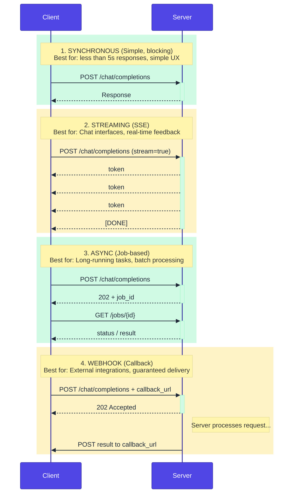
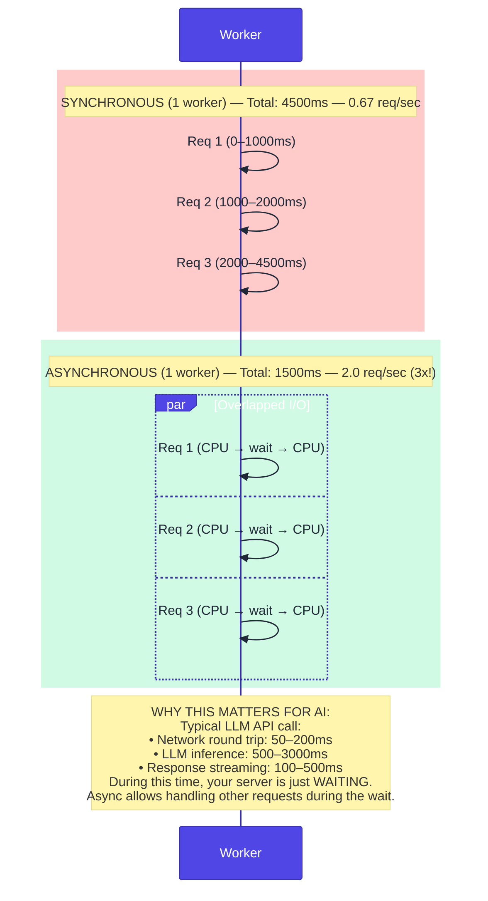
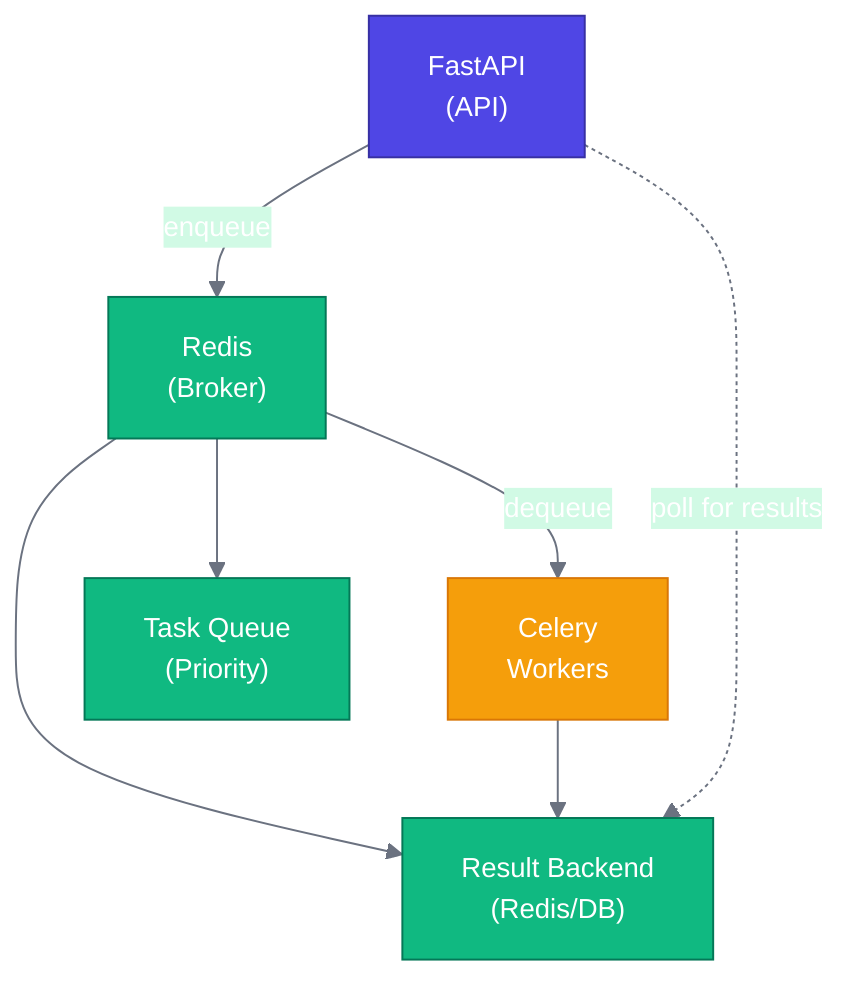
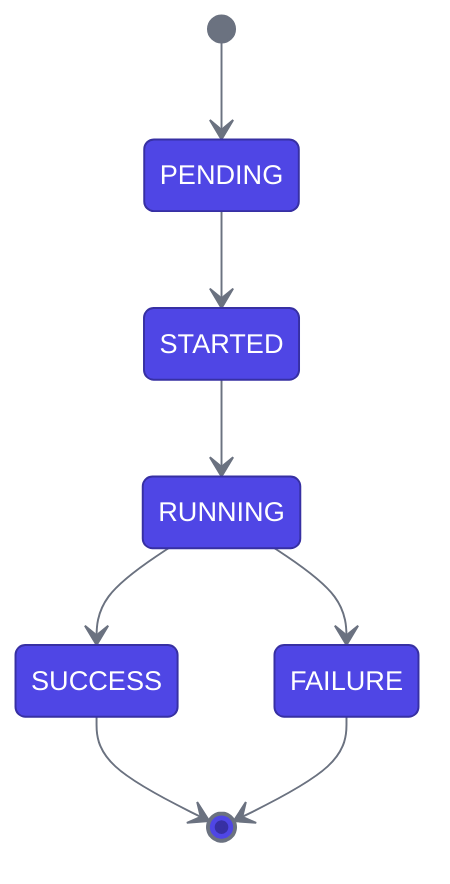
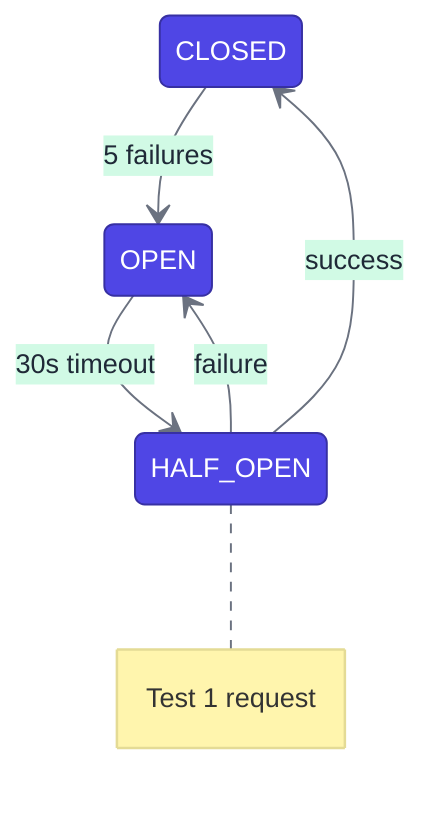
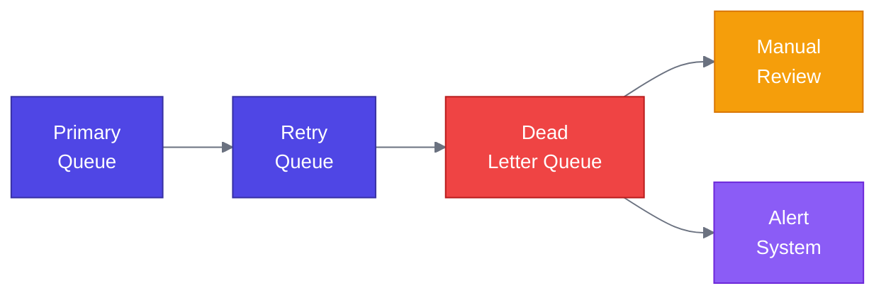

# Week 2: Production Architecture Patterns

---

## Chapter 3: The FastAPI + Pydantic Stack

### 3.1 Why FastAPI for AI Systems

FastAPI has become the de facto standard for AI application backends. Here's why:

```
┌─────────────────────────────────────────────────────────────────────────────┐
│                     FASTAPI PERFORMANCE COMPARISON                          │
└─────────────────────────────────────────────────────────────────────────────┘

   Framework          │  Requests/sec  │  Latency (p99)  │  Async Support
   ───────────────────┼────────────────┼─────────────────┼─────────────────
   FastAPI            │  ~15,000       │  ~10ms          │  Native
   Flask              │  ~4,000        │  ~40ms          │  Limited
   Django             │  ~3,500        │  ~50ms          │  Django 4.0+
   Express (Node.js)  │  ~12,000       │  ~15ms          │  Native

   Note: Approximate figures for simple JSON responses on modern hardware.
   Actual performance varies significantly by workload, hardware, and
   configuration. See TechEmpower Framework Benchmarks for comparative
   data: https://www.techempower.com/benchmarks/
   AI workloads are typically I/O bound, making async support more
   important than raw throughput.
```

**Key advantages for AI workloads:**

1. **Native async support**: Essential for parallel LLM calls
2. **Automatic OpenAPI documentation**: Self-documenting APIs
3. **Pydantic integration**: Type-safe request/response handling
4. **Dependency injection**: Clean architecture patterns
5. **WebSocket support**: Real-time streaming

### 3.2 Pydantic v2: Data Validation at the Speed of Rust

Pydantic v2 was rewritten in Rust, making it [5-50x faster than v1](https://docs.pydantic.dev/latest/concepts/performance/) depending on the validation task. This matters for AI systems where you validate many requests:

```python
# src/models/requests.py
"""
Request models with comprehensive validation.
"""

from datetime import datetime
from typing import Literal, Annotated
from pydantic import (
    BaseModel,
    Field,
    field_validator,
    model_validator,
    ConfigDict,
)
import re


class Message(BaseModel):
    """A chat message with role-based validation."""

    model_config = ConfigDict(
        str_strip_whitespace=True,  # Auto-strip whitespace
        str_min_length=1,           # No empty strings
    )

    role: Literal["system", "user", "assistant"]
    content: str = Field(..., max_length=100_000)
    name: str | None = Field(default=None, max_length=64)

    @field_validator("content")
    @classmethod
    def validate_content(cls, v: str) -> str:
        """Validate message content."""
        # Check for null bytes (potential injection)
        if "\x00" in v:
            raise ValueError("Content cannot contain null bytes")
        return v


class ChatCompletionRequest(BaseModel):
    """Production-grade chat completion request."""

    model_config = ConfigDict(
        extra="forbid",  # Reject unknown fields
    )

    messages: list[Message] = Field(
        ...,
        min_length=1,
        max_length=1000,
        description="List of messages in the conversation"
    )

    model: str = Field(
        default="gpt-4o-mini",
        pattern=r"^[a-zA-Z0-9\-_.]+$",
        description="Model identifier"
    )

    temperature: Annotated[
        float,
        Field(ge=0.0, le=2.0, default=0.7)
    ]

    max_tokens: Annotated[
        int,
        Field(ge=1, le=16384, default=1024)
    ]

    top_p: Annotated[
        float,
        Field(ge=0.0, le=1.0, default=1.0)
    ]

    frequency_penalty: Annotated[
        float,
        Field(ge=-2.0, le=2.0, default=0.0)
    ]

    presence_penalty: Annotated[
        float,
        Field(ge=-2.0, le=2.0, default=0.0)
    ]

    stop: list[str] | str | None = Field(
        default=None,
        max_length=4,
    )

    stream: bool = Field(default=False)

    user: str | None = Field(
        default=None,
        max_length=256,
        description="Unique user identifier for abuse detection"
    )

    @model_validator(mode="after")
    def validate_request(self) -> "ChatCompletionRequest":
        """Cross-field validation."""
        # Ensure reasonable total token count
        total_content_length = sum(
            len(m.content) for m in self.messages
        )
        # Rough estimate: 4 chars per token
        estimated_tokens = total_content_length // 4 + self.max_tokens

        if estimated_tokens > 128_000:
            raise ValueError(
                "Request too large: estimated tokens exceed context window"
            )

        return self


class EmbeddingRequest(BaseModel):
    """Request for text embeddings."""

    model_config = ConfigDict(extra="forbid")

    input: str | list[str] = Field(
        ...,
        description="Text(s) to embed"
    )

    model: str = Field(
        default="text-embedding-3-small",
        pattern=r"^[a-zA-Z0-9\-_.]+$"
    )

    encoding_format: Literal["float", "base64"] = "float"

    dimensions: int | None = Field(
        default=None,
        ge=1,
        le=3072,
        description="Output dimensions (for models that support it)"
    )

    @field_validator("input")
    @classmethod
    def validate_input(cls, v: str | list[str]) -> str | list[str]:
        """Validate embedding input."""
        if isinstance(v, str):
            if len(v) > 100_000:
                raise ValueError("Input text too long")
        else:
            if len(v) > 2048:
                raise ValueError("Too many texts in batch")
            if any(len(text) > 100_000 for text in v):
                raise ValueError("Individual text too long")
        return v
```

```python
# src/models/responses.py
"""
Response models with computed fields.
"""

from datetime import datetime
from typing import Literal
from pydantic import BaseModel, Field, computed_field


class Usage(BaseModel):
    """Token usage statistics."""
    prompt_tokens: int
    completion_tokens: int

    @computed_field
    @property
    def total_tokens(self) -> int:
        """Total tokens used."""
        return self.prompt_tokens + self.completion_tokens


class Choice(BaseModel):
    """A completion choice."""
    index: int
    message: dict[str, str]
    finish_reason: Literal["stop", "length", "content_filter", "null"]


class ChatCompletionResponse(BaseModel):
    """OpenAI-compatible chat completion response."""
    id: str = Field(..., pattern=r"^chatcmpl-[a-zA-Z0-9]+$")
    object: Literal["chat.completion"] = "chat.completion"
    created: int
    model: str
    choices: list[Choice]
    usage: Usage

    @computed_field
    @property
    def cost_usd(self) -> float:
        """Estimated cost in USD."""
        # Simplified cost calculation
        # Per 1K token rates (mid-2025) — check https://openai.com/api/pricing/
        input_rates = {"gpt-4o": 0.0025, "gpt-4o-mini": 0.00015}
        output_rates = {"gpt-4o": 0.010, "gpt-4o-mini": 0.0006}
        in_rate = input_rates.get(self.model, 0.0025)
        out_rate = output_rates.get(self.model, 0.010)
        return (
            (self.usage.prompt_tokens / 1000) * in_rate +
            (self.usage.completion_tokens / 1000) * out_rate
        )


class ErrorResponse(BaseModel):
    """Standardized error response."""
    error: str
    code: str
    request_id: str | None = None
    details: dict | None = None
```

### 3.3 Request/Response Patterns for AI Endpoints

AI endpoints have unique patterns that differ from traditional CRUD APIs:

**AI API vs Traditional REST API:**

| Aspect | Traditional REST API | AI API |
|---|---|---|
| Example | `GET /users/123` | `POST /chat/completions` |
| Speed | Fast (10-50ms) | Slow (500-5000ms) |
| Behavior | Deterministic | Non-deterministic |
| Caching | Cacheable | Rarely cacheable |
| Payload size | Small (1-10KB) | Large (10-500KB) |
| Response shape | Fixed | Variable length |

**Patterns for AI Endpoints:**



**Figure 3.1:** API patterns for AI workloads

### 3.4 Dependency Injection Patterns

FastAPI's dependency injection enables clean, testable code:

```python
# src/dependencies.py
"""
Dependency injection for services and utilities.
"""

from functools import lru_cache
from typing import Annotated, AsyncGenerator
from fastapi import Depends, Request, HTTPException
from redis.asyncio import Redis
import time

from src.config.settings import Settings, get_settings
from src.services.llm import LLMService, OpenAIProvider


# Settings dependency
SettingsDep = Annotated[Settings, Depends(get_settings)]


# LLM Service
@lru_cache
def get_llm_service() -> LLMService:
    """Get cached LLM service instance."""
    return LLMService(primary_provider=OpenAIProvider())


LLMServiceDep = Annotated[LLMService, Depends(get_llm_service)]


# Redis connection
async def get_redis(settings: SettingsDep) -> AsyncGenerator[Redis, None]:
    """Get Redis connection with automatic cleanup."""
    redis = Redis.from_url(settings.redis_url)
    try:
        yield redis
    finally:
        await redis.close()


RedisDep = Annotated[Redis, Depends(get_redis)]


# Rate limiter dependency
class RateLimiter:
    """Token bucket rate limiter using Redis."""

    def __init__(
        self,
        requests: int = 100,
        window_seconds: int = 60
    ):
        self.requests = requests
        self.window = window_seconds

    async def __call__(
        self,
        request: Request,
        redis: RedisDep,
        settings: SettingsDep,
    ) -> None:
        """Check rate limit for request."""
        # Get client identifier
        client_id = request.client.host if request.client else "unknown"
        user_id = request.headers.get("X-User-ID", client_id)

        key = f"rate_limit:{user_id}"
        current = await redis.get(key)

        if current is not None and int(current) >= self.requests:
            raise HTTPException(
                status_code=429,
                detail="Rate limit exceeded",
                headers={"Retry-After": str(self.window)}
            )

        pipe = redis.pipeline()
        pipe.incr(key)
        pipe.expire(key, self.window)
        await pipe.execute()


# Pre-configured rate limiters
default_rate_limit = RateLimiter(requests=100, window_seconds=60)
strict_rate_limit = RateLimiter(requests=10, window_seconds=60)


# Request context
class RequestContext:
    """Context for the current request."""

    def __init__(self, request: Request):
        self.request_id = request.headers.get(
            "X-Request-ID",
            f"req_{int(time.time() * 1000)}"
        )
        self.user_id = request.headers.get("X-User-ID")
        self.start_time = time.perf_counter()

    @property
    def elapsed_ms(self) -> float:
        """Milliseconds since request started."""
        return (time.perf_counter() - self.start_time) * 1000


def get_request_context(request: Request) -> RequestContext:
    """Extract context from request."""
    return RequestContext(request)


RequestContextDep = Annotated[RequestContext, Depends(get_request_context)]
```

### 3.5 Error Handling Strategies

AI systems fail in unique ways. Here's how to handle them:

```python
# src/errors.py
"""
Custom exceptions and error handling.
"""

from enum import Enum
from typing import Any
from fastapi import HTTPException, Request
from fastapi.responses import JSONResponse
from pydantic import BaseModel
import logging

logger = logging.getLogger(__name__)


class ErrorCode(str, Enum):
    """Application error codes."""
    VALIDATION_ERROR = "validation_error"
    RATE_LIMIT_EXCEEDED = "rate_limit_exceeded"
    MODEL_ERROR = "model_error"
    CONTEXT_LENGTH_EXCEEDED = "context_length_exceeded"
    CONTENT_FILTERED = "content_filtered"
    SERVICE_UNAVAILABLE = "service_unavailable"
    INTERNAL_ERROR = "internal_error"
    TIMEOUT = "timeout"


class AIError(Exception):
    """Base exception for AI-related errors."""

    def __init__(
        self,
        message: str,
        code: ErrorCode,
        status_code: int = 500,
        details: dict[str, Any] | None = None,
    ):
        self.message = message
        self.code = code
        self.status_code = status_code
        self.details = details or {}
        super().__init__(message)


class ModelOverloadedError(AIError):
    """Raised when the model is overloaded."""

    def __init__(self, retry_after: int = 60):
        super().__init__(
            message="Model is currently overloaded. Please try again.",
            code=ErrorCode.SERVICE_UNAVAILABLE,
            status_code=503,
            details={"retry_after": retry_after}
        )


class ContextLengthError(AIError):
    """Raised when context length is exceeded."""

    def __init__(self, tokens_used: int, max_tokens: int):
        super().__init__(
            message=f"Context length exceeded: {tokens_used} > {max_tokens}",
            code=ErrorCode.CONTEXT_LENGTH_EXCEEDED,
            status_code=400,
            details={
                "tokens_used": tokens_used,
                "max_tokens": max_tokens
            }
        )


class ContentFilteredError(AIError):
    """Raised when content is filtered."""

    def __init__(self, reason: str = "Content policy violation"):
        super().__init__(
            message="Request was filtered due to content policy",
            code=ErrorCode.CONTENT_FILTERED,
            status_code=400,
            details={"reason": reason}
        )


class ErrorResponseBody(BaseModel):
    """Standardized error response body."""
    error: str
    code: str
    request_id: str | None = None
    details: dict[str, Any] | None = None


async def ai_error_handler(
    request: Request,
    exc: AIError
) -> JSONResponse:
    """Handle AI-specific errors."""
    request_id = request.headers.get("X-Request-ID")

    # Log with context
    logger.error(
        f"AI Error: {exc.code}",
        extra={
            "request_id": request_id,
            "error_code": exc.code,
            "details": exc.details,
        }
    )

    return JSONResponse(
        status_code=exc.status_code,
        content=ErrorResponseBody(
            error=exc.message,
            code=exc.code,
            request_id=request_id,
            details=exc.details,
        ).model_dump(),
        headers={
            "X-Request-ID": request_id or "unknown",
        }
    )


def setup_error_handlers(app):
    """Register error handlers with FastAPI app."""

    @app.exception_handler(AIError)
    async def handle_ai_error(request: Request, exc: AIError):
        return await ai_error_handler(request, exc)

    @app.exception_handler(HTTPException)
    async def handle_http_error(request: Request, exc: HTTPException):
        request_id = request.headers.get("X-Request-ID")
        return JSONResponse(
            status_code=exc.status_code,
            content=ErrorResponseBody(
                error=exc.detail,
                code="http_error",
                request_id=request_id,
            ).model_dump(),
        )

    @app.exception_handler(Exception)
    async def handle_unexpected_error(request: Request, exc: Exception):
        request_id = request.headers.get("X-Request-ID")
        logger.exception(
            "Unexpected error",
            extra={"request_id": request_id}
        )
        return JSONResponse(
            status_code=500,
            content=ErrorResponseBody(
                error="An unexpected error occurred",
                code=ErrorCode.INTERNAL_ERROR,
                request_id=request_id,
            ).model_dump(),
        )
```

---

## Chapter 4: Asynchronous AI Workloads

### 4.1 Understanding Async/Await in Python

AI workloads are I/O-bound. While waiting for an LLM response, your server could handle other requests:



**Figure 4.1:** Synchronous vs asynchronous request handling

### 4.2 Async Patterns for AI

```python
# src/services/async_patterns.py
"""
Async patterns for AI workloads.
"""

import asyncio
from typing import TypeVar, Coroutine, Any
from collections.abc import Callable
import time

T = TypeVar("T")


# Pattern 1: Concurrent LLM calls
async def parallel_llm_calls(
    prompts: list[str],
    llm_service,
    max_concurrent: int = 5
) -> list[str]:
    """
    Run multiple LLM calls concurrently with limited parallelism.

    Args:
        prompts: List of prompts to process
        llm_service: LLM service instance
        max_concurrent: Maximum concurrent calls

    Returns:
        List of responses in same order as prompts
    """
    semaphore = asyncio.Semaphore(max_concurrent)

    async def bounded_call(prompt: str) -> str:
        async with semaphore:
            messages = [{"role": "user", "content": prompt}]
            response = await llm_service.generate(messages)
            return response.content

    tasks = [bounded_call(prompt) for prompt in prompts]
    return await asyncio.gather(*tasks)


# Pattern 2: Timeout with fallback
async def with_timeout_fallback(
    primary: Coroutine[Any, Any, T],
    fallback: Callable[[], Coroutine[Any, Any, T]],
    timeout_seconds: float = 5.0
) -> T:
    """
    Try primary coroutine with timeout, fall back if needed.

    Example:
        result = await with_timeout_fallback(
            expensive_gpt4_call(),
            lambda: cheap_gpt35_call(),
            timeout_seconds=3.0
        )
    """
    try:
        return await asyncio.wait_for(primary, timeout=timeout_seconds)
    except asyncio.TimeoutError:
        return await fallback()


# Pattern 3: Retry with exponential backoff
async def retry_with_backoff(
    func: Callable[[], Coroutine[Any, Any, T]],
    max_retries: int = 3,
    base_delay: float = 1.0,
    max_delay: float = 60.0,
    exponential_base: float = 2.0,
    retryable_exceptions: tuple = (Exception,),
) -> T:
    """
    Retry an async function with exponential backoff.
    """
    last_exception = None

    for attempt in range(max_retries):
        try:
            return await func()
        except retryable_exceptions as e:
            last_exception = e

            if attempt == max_retries - 1:
                raise

            delay = min(
                base_delay * (exponential_base ** attempt),
                max_delay
            )
            await asyncio.sleep(delay)

    raise last_exception  # Should never reach here


# Pattern 4: Circuit breaker
class CircuitBreaker:
    """
    Circuit breaker pattern for failing fast.

    States:
    - CLOSED: Normal operation, requests pass through
    - OPEN: Failing fast, requests rejected immediately
    - HALF_OPEN: Testing if service recovered
    """

    def __init__(
        self,
        failure_threshold: int = 5,
        recovery_timeout: float = 30.0,
        half_open_max_calls: int = 3,
    ):
        self.failure_threshold = failure_threshold
        self.recovery_timeout = recovery_timeout
        self.half_open_max_calls = half_open_max_calls

        self.failures = 0
        self.state = "CLOSED"
        self.last_failure_time = 0.0
        self.half_open_calls = 0

    async def call(
        self,
        func: Callable[[], Coroutine[Any, Any, T]]
    ) -> T:
        """Execute function with circuit breaker protection."""

        # Check if circuit should transition from OPEN to HALF_OPEN
        if self.state == "OPEN":
            if time.time() - self.last_failure_time > self.recovery_timeout:
                self.state = "HALF_OPEN"
                self.half_open_calls = 0
            else:
                raise CircuitBreakerOpenError("Circuit breaker is OPEN")

        # Check HALF_OPEN call limit
        if self.state == "HALF_OPEN":
            if self.half_open_calls >= self.half_open_max_calls:
                raise CircuitBreakerOpenError("Circuit breaker is HALF_OPEN")
            self.half_open_calls += 1

        try:
            result = await func()
            self._on_success()
            return result
        except Exception as e:
            self._on_failure()
            raise

    def _on_success(self):
        """Handle successful call."""
        self.failures = 0
        if self.state == "HALF_OPEN":
            self.state = "CLOSED"

    def _on_failure(self):
        """Handle failed call."""
        self.failures += 1
        self.last_failure_time = time.time()

        if self.failures >= self.failure_threshold:
            self.state = "OPEN"


class CircuitBreakerOpenError(Exception):
    """Raised when circuit breaker is open."""
    pass


# Pattern 5: Streaming with backpressure
async def stream_with_backpressure(
    source,
    process_chunk: Callable[[str], Coroutine[Any, Any, None]],
    max_buffer: int = 100
):
    """
    Stream data with backpressure control.

    Prevents memory issues when producer is faster than consumer.
    """
    buffer = asyncio.Queue(maxsize=max_buffer)

    async def producer():
        async for chunk in source:
            await buffer.put(chunk)  # Blocks if buffer full
        await buffer.put(None)  # Signal completion

    async def consumer():
        while True:
            chunk = await buffer.get()
            if chunk is None:
                break
            await process_chunk(chunk)
            buffer.task_done()

    await asyncio.gather(producer(), consumer())
```

### 4.3 Celery + Redis for Background AI Tasks

Long-running AI tasks should be processed asynchronously:



**Task States:**



**Figure 4.2:** Celery task processing architecture

```python
# src/tasks/celery_app.py
"""
Celery application configuration.
"""

from celery import Celery
from src.config.settings import get_settings

settings = get_settings()

celery_app = Celery(
    "ai_tasks",
    broker=settings.redis_url,
    backend=settings.redis_url,
)

celery_app.conf.update(
    # Task settings
    task_serializer="json",
    result_serializer="json",
    accept_content=["json"],
    task_track_started=True,
    task_time_limit=600,  # 10 minutes max
    task_soft_time_limit=540,  # Soft limit 9 minutes

    # Worker settings
    worker_prefetch_multiplier=1,  # One task at a time for AI
    worker_concurrency=4,

    # Result settings
    result_expires=3600,  # 1 hour

    # Priority queues
    task_queues={
        "high": {"exchange": "high", "routing_key": "high"},
        "default": {"exchange": "default", "routing_key": "default"},
        "low": {"exchange": "low", "routing_key": "low"},
    },
    task_default_queue="default",

    # Retry settings
    task_acks_late=True,
    task_reject_on_worker_lost=True,
)
```

```python
# src/tasks/ai_tasks.py
"""
AI processing tasks.
"""

from celery import shared_task
from celery.exceptions import SoftTimeLimitExceeded
import asyncio
import json
from typing import Any

from src.tasks.celery_app import celery_app
from src.services.llm import LLMService, OpenAIProvider


def run_async(coro):
    """Run async function in sync context."""
    loop = asyncio.new_event_loop()
    try:
        return loop.run_until_complete(coro)
    finally:
        loop.close()


@celery_app.task(
    bind=True,
    autoretry_for=(Exception,),
    retry_backoff=True,
    retry_backoff_max=600,
    retry_jitter=True,
    max_retries=3,
)
def process_chat_completion(
    self,
    messages: list[dict[str, str]],
    model: str = "gpt-4o-mini",
    temperature: float = 0.7,
    max_tokens: int = 1024,
) -> dict[str, Any]:
    """
    Process a chat completion asynchronously.

    Args:
        messages: Chat messages
        model: Model to use
        temperature: Sampling temperature
        max_tokens: Maximum tokens in response

    Returns:
        Completion result as dictionary
    """
    try:
        # Update task state
        self.update_state(
            state="PROCESSING",
            meta={"status": "Calling LLM..."}
        )

        # Run the async LLM call
        llm_service = LLMService(primary_provider=OpenAIProvider())
        response = run_async(
            llm_service.generate(
                messages=messages,
                model=model,
                temperature=temperature,
                max_tokens=max_tokens,
            )
        )

        return {
            "status": "success",
            "content": response.content,
            "model": response.model,
            "usage": {
                "input_tokens": response.input_tokens,
                "output_tokens": response.output_tokens,
            },
            "latency_ms": response.latency_ms,
            "cost_usd": response.cost_usd,
        }

    except SoftTimeLimitExceeded:
        return {
            "status": "timeout",
            "error": "Task exceeded time limit",
        }


@celery_app.task(bind=True)
def batch_embed_documents(
    self,
    documents: list[str],
    model: str = "text-embedding-3-small",
    batch_size: int = 100,
) -> dict[str, Any]:
    """
    Embed multiple documents in batches.

    Args:
        documents: List of documents to embed
        model: Embedding model
        batch_size: Documents per batch

    Returns:
        Dictionary with embeddings and metadata
    """
    from src.services.embeddings import EmbeddingService

    total = len(documents)
    embeddings = []
    errors = []

    embedding_service = EmbeddingService()

    for i in range(0, total, batch_size):
        batch = documents[i:i + batch_size]

        # Update progress
        self.update_state(
            state="PROCESSING",
            meta={
                "current": i,
                "total": total,
                "status": f"Processing batch {i // batch_size + 1}"
            }
        )

        try:
            batch_embeddings = run_async(
                embedding_service.embed_batch(batch, model=model)
            )
            embeddings.extend(batch_embeddings)
        except Exception as e:
            errors.append({
                "batch_start": i,
                "error": str(e)
            })

    return {
        "status": "success" if not errors else "partial_success",
        "embeddings_count": len(embeddings),
        "errors": errors,
    }


@celery_app.task(bind=True, queue="low")
def generate_summary_report(
    self,
    document_ids: list[str],
    report_type: str = "executive",
) -> dict[str, Any]:
    """
    Generate a summary report from multiple documents.
    Low priority, long-running task.
    """
    # Implementation would retrieve documents,
    # process them, and generate summary
    pass
```

```python
# src/api/tasks.py
"""
Task management API endpoints.
"""

from fastapi import APIRouter, HTTPException
from pydantic import BaseModel, Field
from celery.result import AsyncResult

from src.tasks.ai_tasks import process_chat_completion, batch_embed_documents
from src.tasks.celery_app import celery_app

router = APIRouter(prefix="/tasks", tags=["tasks"])


class AsyncChatRequest(BaseModel):
    """Request for async chat completion."""
    messages: list[dict[str, str]]
    model: str = "gpt-4o-mini"
    temperature: float = 0.7
    max_tokens: int = 1024
    priority: str = Field(default="default", pattern="^(high|default|low)$")


class TaskResponse(BaseModel):
    """Response with task ID."""
    task_id: str
    status: str


class TaskStatusResponse(BaseModel):
    """Task status response."""
    task_id: str
    status: str
    result: dict | None = None
    progress: dict | None = None


@router.post("/chat/completions", response_model=TaskResponse)
async def create_async_chat(request: AsyncChatRequest) -> TaskResponse:
    """
    Create an async chat completion task.

    Returns immediately with task ID.
    Poll /tasks/{task_id} for result.
    """
    task = process_chat_completion.apply_async(
        kwargs={
            "messages": request.messages,
            "model": request.model,
            "temperature": request.temperature,
            "max_tokens": request.max_tokens,
        },
        queue=request.priority,
    )

    return TaskResponse(
        task_id=task.id,
        status="PENDING"
    )


@router.get("/{task_id}", response_model=TaskStatusResponse)
async def get_task_status(task_id: str) -> TaskStatusResponse:
    """Get task status and result if available."""
    result = AsyncResult(task_id, app=celery_app)

    response = TaskStatusResponse(
        task_id=task_id,
        status=result.status,
    )

    if result.ready():
        response.result = result.get()
    elif result.info:
        response.progress = result.info

    return response


@router.delete("/{task_id}")
async def cancel_task(task_id: str) -> dict:
    """Cancel a pending or running task."""
    result = AsyncResult(task_id, app=celery_app)

    if result.ready():
        raise HTTPException(
            status_code=400,
            detail="Task already completed"
        )

    result.revoke(terminate=True)

    return {"status": "cancelled", "task_id": task_id}
```

### 4.4 Dead Letter Handling and Retry Strategies

**1. Exponential Backoff**

> `delay = base_delay * (2 ^ attempt) + jitter`

| Attempt | Wait | Action |
|---|---|---|
| 1 | 1s | Retry |
| 2 | 2s | Retry |
| 3 | 4s | Retry |
| 4 | 8s | Give up (Dead Letter Queue) |

**2. Circuit Breaker + Retry**



**3. Dead Letter Queue Pattern**



**Figure 4.3:** Retry and dead letter patterns

```python
# src/tasks/dead_letter.py
"""
Dead letter queue handling for failed tasks.
"""

from celery import Task
from celery.exceptions import MaxRetriesExceededError
import json
import logging
from datetime import datetime
from redis import Redis

from src.tasks.celery_app import celery_app
from src.config.settings import get_settings

logger = logging.getLogger(__name__)


class DeadLetterTask(Task):
    """Base task class with dead letter queue support."""

    abstract = True
    max_retries = 3

    def on_failure(self, exc, task_id, args, kwargs, einfo):
        """Handle task failure - send to dead letter queue."""
        settings = get_settings()
        redis_client = Redis.from_url(settings.redis_url)

        dead_letter = {
            "task_id": task_id,
            "task_name": self.name,
            "args": args,
            "kwargs": kwargs,
            "exception": str(exc),
            "traceback": str(einfo),
            "failed_at": datetime.utcnow().isoformat(),
            "retries": self.request.retries,
        }

        # Store in dead letter queue
        redis_client.lpush(
            "dead_letter_queue",
            json.dumps(dead_letter)
        )

        # Alert on repeated failures
        failure_key = f"task_failures:{self.name}"
        failures = redis_client.incr(failure_key)
        redis_client.expire(failure_key, 3600)  # 1 hour window

        if failures >= 10:
            logger.critical(
                f"Task {self.name} has failed {failures} times in 1 hour",
                extra={"task_name": self.name, "failure_count": failures}
            )
            # Trigger alert (PagerDuty, Slack, etc.)

        logger.error(
            f"Task {task_id} moved to dead letter queue",
            extra=dead_letter
        )


@celery_app.task(
    base=DeadLetterTask,
    bind=True,
    autoretry_for=(Exception,),
    retry_backoff=True,
    retry_backoff_max=300,
    retry_jitter=True,
)
def resilient_llm_task(self, prompt: str) -> dict:
    """Example task with full resilience patterns."""
    try:
        # Task implementation
        pass
    except Exception as e:
        if self.request.retries >= self.max_retries:
            raise MaxRetriesExceededError()
        raise


def process_dead_letters(batch_size: int = 10) -> list[dict]:
    """
    Process items from dead letter queue.
    Called manually or by scheduled job.
    """
    settings = get_settings()
    redis_client = Redis.from_url(settings.redis_url)

    processed = []

    for _ in range(batch_size):
        item = redis_client.rpop("dead_letter_queue")
        if not item:
            break

        dead_letter = json.loads(item)
        processed.append(dead_letter)

        # Log for manual review
        logger.info(
            f"Processing dead letter: {dead_letter['task_id']}",
            extra=dead_letter
        )

    return processed
```

---

### Summary: Week 2

In this week, we covered:

1. **FastAPI deep dive**: Why it's ideal for AI systems
2. **Pydantic v2**: Type-safe validation with Rust performance
3. **Request/response patterns**: Sync, streaming, async, webhooks
4. **Dependency injection**: Clean, testable architecture
5. **Error handling**: AI-specific error patterns
6. **Async patterns**: Concurrent calls, timeouts, circuit breakers
7. **Celery + Redis**: Background task processing
8. **Retry strategies**: Exponential backoff, dead letter queues

**Key Takeaways:**

- Async is essential for I/O-bound AI workloads
- Validate inputs strictly—garbage in, garbage out
- Design for failure with retries, circuit breakers, and fallbacks
- Background tasks enable scalable long-running operations

---

### Exercises

**Exercise 2.1:** Implement a streaming endpoint that also tracks total tokens streamed and reports them at the end.

**Exercise 2.2:** Create a Pydantic model for a RAG request that validates: query length, number of documents to retrieve, and reranking preferences.

**Exercise 2.3:** Implement a circuit breaker that opens after 3 failures in 60 seconds and resets after 30 seconds.

**Exercise 2.4:** Create a Celery task that processes a batch of documents through an LLM with progress tracking.

---

*Next Week: AI Evaluation Systems—Building evaluation pipelines that actually catch problems*
