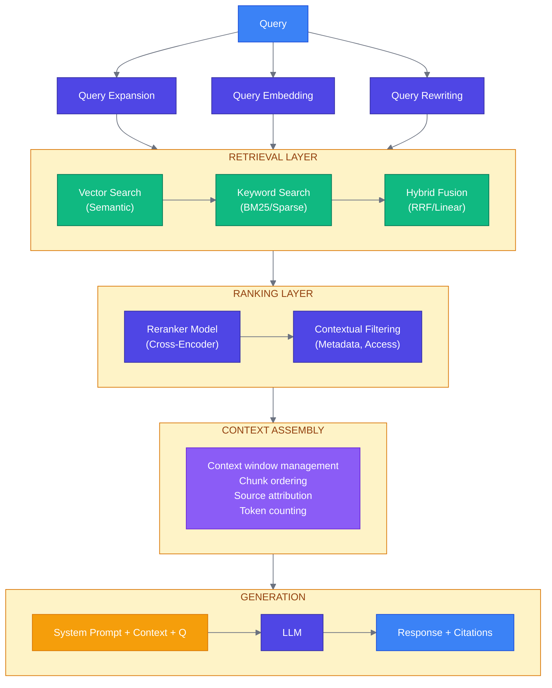
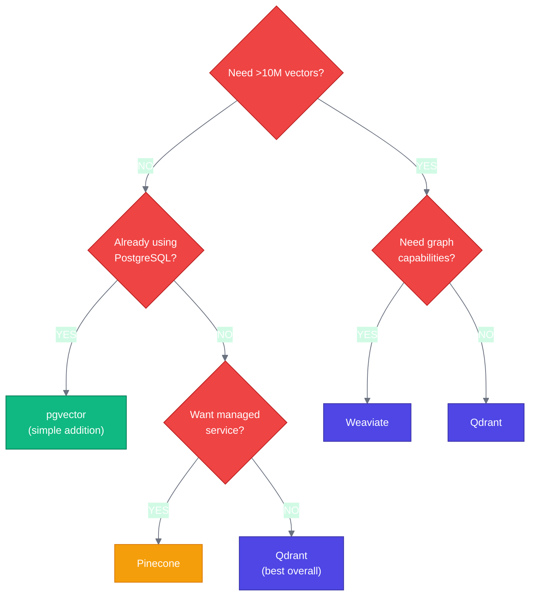

# Week 5: Midterm & RAG Systems Deep Dive

---

## Midterm Examination (Lecture 9)

The midterm covers material from Weeks 1-4:
- Production AI fundamentals and architecture
- FastAPI + Pydantic + async patterns
- AI evaluation systems and metrics
- AI security and guardrails

*See separate midterm guide for exam format and preparation*

---

## Chapter 9: RAG Systems Deep Dive (Lecture 10)

### 9.1 RAG Architecture Patterns

Retrieval-Augmented Generation (RAG) is the most common pattern for adding custom knowledge to LLMs:



**Figure 9.1:** Production RAG architecture

### 9.2 Vector Database Selection

```
┌─────────────────────────────────────────────────────────────────────────────┐
│                    VECTOR DATABASE COMPARISON                               │
└─────────────────────────────────────────────────────────────────────────────┘

   Feature          │ Qdrant      │ Weaviate    │ Pinecone    │ pgvector
   ─────────────────┼─────────────┼─────────────┼─────────────┼──────────────
   Deployment       │ Self-host   │ Self-host   │ Managed     │ Self-host
                    │ or Cloud    │ or Cloud    │ only        │ (Postgres)
   ─────────────────┼─────────────┼─────────────┼─────────────┼──────────────
   Max Vectors      │ Billions    │ Billions    │ Billions    │ Millions
   ─────────────────┼─────────────┼─────────────┼─────────────┼──────────────
   Query Latency    │ ~10-50ms    │ ~10-50ms    │ ~20-100ms   │ ~50-200ms
   ─────────────────┼─────────────┼─────────────┼─────────────┼──────────────
   Filtering        │ Rich        │ Rich        │ Basic       │ SQL
   ─────────────────┼─────────────┼─────────────┼─────────────┼──────────────
   Hybrid Search    │ Yes         │ Yes         │ Limited     │ Manual
   ─────────────────┼─────────────┼─────────────┼─────────────┼──────────────
   Best For         │ General     │ Knowledge   │ Simplicity  │ Small scale,
                    │ purpose     │ graphs      │ managed     │ existing PG
   ─────────────────┼─────────────┼─────────────┼─────────────┼──────────────
   Pricing          │ Open source │ Open source │ Managed     │ Postgres
                    │ or managed  │ or managed  │ only        │ costs
                    │ cloud       │ cloud       │             │
   (Check provider websites for current cloud pricing — rates change frequently)
```

**Decision Flowchart:**



### 9.3 Indexing Strategies

```mermaid
%%{init: {'theme': 'base', 'themeVariables': {'primaryColor': '#4F46E5', 'primaryTextColor': '#FFFFFF', 'primaryBorderColor': '#3730A3', 'secondaryColor': '#D1FAE5', 'secondaryTextColor': '#065F46', 'secondaryBorderColor': '#059669', 'tertiaryColor': '#FEF3C7', 'tertiaryTextColor': '#92400E', 'tertiaryBorderColor': '#D97706', 'lineColor': '#6B7280', 'textColor': '#1F2937', 'fontSize': '14px'}}}%%
flowchart TD
    title["INDEX TYPE COMPARISON"]:::observability

    title --> HNSW
    title --> IVF
    title --> FLAT

    subgraph HNSW ["1. HNSW #40;Hierarchical Navigable Small World#41;"]
        H_L3["Layer 3 #40;Sparse#41;"]:::service --> H_L2["Layer 2 #40;Medium#41;"]:::service --> H_L1["Layer 1 #40;Dense#41;"]:::service
        H_L1 --> H_Perf["O#40;n log n#41; build · O#40;log n#41; query · High memory"]:::external
        H_Perf --> H_Best["Best for: Most production use cases"]:::client
    end

    subgraph IVF ["2. IVFFlat #40;Inverted File Flat#41;"]
        I_C1["Cell 1"]:::service --> I_V1["Vectors"]:::data
        I_C2["Cell 2"]:::service --> I_V2["Vectors"]:::data
        I_Ck["Cell k"]:::service --> I_Vk["Vectors"]:::data
        I_V1 --> I_Perf["O#40;n#41; build · O#40;n/k#41; query · Medium memory"]:::external
        I_Perf --> I_Best["Best for: Memory-constrained, frequently rebuilt"]:::client
    end

    subgraph FLAT ["3. Flat #40;Brute Force#41;"]
        F_Perf["O#40;n#41; query · Low memory"]:::external
        F_Perf --> F_Best["Best for: less than 10K vectors or accuracy-critical"]:::client
    end

    classDef client fill:#3B82F6,stroke:#1D4ED8,color:#FFFFFF
    classDef gateway fill:#EF4444,stroke:#B91C1C,color:#FFFFFF
    classDef service fill:#4F46E5,stroke:#3730A3,color:#FFFFFF
    classDef data fill:#10B981,stroke:#047857,color:#FFFFFF
    classDef external fill:#F59E0B,stroke:#D97706,color:#FFFFFF
    classDef observability fill:#8B5CF6,stroke:#6D28D9,color:#FFFFFF
```



**HNSW Tuning Parameters:**

```
┌──────────────┬───────────────────┬─────────────────────────────────────┐
│ Parameter    │ Default           │ Effect                              │
├──────────────┼───────────────────┼─────────────────────────────────────┤
│ m            │ 16                │ Connections per node. Higher = more │
│              │                   │ accuracy, more memory               │
│ ef_construct │ 200               │ Build quality. Higher = better      │
│              │                   │ index, slower build                 │
│ ef_search    │ 100               │ Query quality. Higher = more        │
│              │                   │ accuracy, slower query              │
└──────────────┴───────────────────┴─────────────────────────────────────┘
```

### 9.4 Chunking Strategies

```python
# src/services/chunking.py
"""
Document chunking strategies for RAG.
"""

from dataclasses import dataclass
from typing import Callable
import re


@dataclass
class Chunk:
    """A document chunk."""
    content: str
    metadata: dict
    start_index: int
    end_index: int


class ChunkingStrategy:
    """Base class for chunking strategies."""

    def chunk(self, text: str, metadata: dict | None = None) -> list[Chunk]:
        raise NotImplementedError


class FixedSizeChunker(ChunkingStrategy):
    """
    Fixed-size chunking with overlap.

    Simple but effective baseline.
    """

    def __init__(
        self,
        chunk_size: int = 512,
        overlap: int = 50,
        length_fn: Callable[[str], int] | None = None,
    ):
        self.chunk_size = chunk_size
        self.overlap = overlap
        self.length_fn = length_fn or len

    def chunk(self, text: str, metadata: dict | None = None) -> list[Chunk]:
        metadata = metadata or {}
        chunks = []

        start = 0
        while start < len(text):
            end = start + self.chunk_size

            # Extend to word boundary
            if end < len(text):
                while end > start and text[end] not in " \n\t":
                    end -= 1
                if end == start:
                    end = start + self.chunk_size

            chunk_text = text[start:end].strip()
            if chunk_text:
                chunks.append(Chunk(
                    content=chunk_text,
                    metadata={
                        **metadata,
                        "chunk_index": len(chunks),
                    },
                    start_index=start,
                    end_index=end,
                ))

            start = end - self.overlap
            if start >= len(text):
                break

        return chunks


class SemanticChunker(ChunkingStrategy):
    """
    Semantic chunking based on sentence boundaries and topic shifts.

    Better for maintaining context coherence.
    """

    def __init__(
        self,
        max_chunk_size: int = 512,
        min_chunk_size: int = 100,
        sentence_splitter: Callable[[str], list[str]] | None = None,
    ):
        self.max_chunk_size = max_chunk_size
        self.min_chunk_size = min_chunk_size
        self.sentence_splitter = sentence_splitter or self._default_sentence_split

    def _default_sentence_split(self, text: str) -> list[str]:
        """Split text into sentences."""
        # Simple regex-based sentence splitting
        sentences = re.split(r'(?<=[.!?])\s+', text)
        return [s.strip() for s in sentences if s.strip()]

    def chunk(self, text: str, metadata: dict | None = None) -> list[Chunk]:
        metadata = metadata or {}
        sentences = self.sentence_splitter(text)

        chunks = []
        current_chunk = []
        current_length = 0
        current_start = 0

        for sentence in sentences:
            sentence_length = len(sentence)

            # If single sentence exceeds max, force split
            if sentence_length > self.max_chunk_size:
                # Save current chunk if exists
                if current_chunk:
                    chunk_text = " ".join(current_chunk)
                    chunks.append(Chunk(
                        content=chunk_text,
                        metadata={**metadata, "chunk_index": len(chunks)},
                        start_index=current_start,
                        end_index=current_start + len(chunk_text),
                    ))
                    current_start += len(chunk_text) + 1

                # Split the long sentence
                for i in range(0, sentence_length, self.max_chunk_size):
                    sub_sentence = sentence[i:i + self.max_chunk_size]
                    chunks.append(Chunk(
                        content=sub_sentence,
                        metadata={**metadata, "chunk_index": len(chunks)},
                        start_index=current_start,
                        end_index=current_start + len(sub_sentence),
                    ))
                    current_start += len(sub_sentence)

                current_chunk = []
                current_length = 0
                continue

            # Check if adding this sentence exceeds max
            if current_length + sentence_length > self.max_chunk_size:
                # Save current chunk
                chunk_text = " ".join(current_chunk)
                if len(chunk_text) >= self.min_chunk_size:
                    chunks.append(Chunk(
                        content=chunk_text,
                        metadata={**metadata, "chunk_index": len(chunks)},
                        start_index=current_start,
                        end_index=current_start + len(chunk_text),
                    ))
                    current_start += len(chunk_text) + 1
                    current_chunk = []
                    current_length = 0

            current_chunk.append(sentence)
            current_length += sentence_length + 1

        # Don't forget the last chunk
        if current_chunk:
            chunk_text = " ".join(current_chunk)
            chunks.append(Chunk(
                content=chunk_text,
                metadata={**metadata, "chunk_index": len(chunks)},
                start_index=current_start,
                end_index=current_start + len(chunk_text),
            ))

        return chunks


class RecursiveChunker(ChunkingStrategy):
    """
    Recursively split on different separators.

    Tries to maintain document structure.
    """

    def __init__(
        self,
        chunk_size: int = 512,
        overlap: int = 50,
        separators: list[str] | None = None,
    ):
        self.chunk_size = chunk_size
        self.overlap = overlap
        self.separators = separators or [
            "\n\n\n",   # Multiple newlines (section breaks)
            "\n\n",     # Paragraph breaks
            "\n",       # Line breaks
            ". ",       # Sentence breaks
            " ",        # Word breaks
        ]

    def chunk(self, text: str, metadata: dict | None = None) -> list[Chunk]:
        metadata = metadata or {}
        return self._recursive_split(text, self.separators, metadata)

    def _recursive_split(
        self,
        text: str,
        separators: list[str],
        metadata: dict,
    ) -> list[Chunk]:
        if not separators:
            # Fallback to fixed size
            chunker = FixedSizeChunker(self.chunk_size, self.overlap)
            return chunker.chunk(text, metadata)

        separator = separators[0]
        remaining_separators = separators[1:]

        splits = text.split(separator)

        chunks = []
        current_chunk = ""
        current_start = 0

        for split in splits:
            if len(current_chunk) + len(split) <= self.chunk_size:
                current_chunk += (separator if current_chunk else "") + split
            else:
                if current_chunk:
                    # Check if current chunk needs further splitting
                    if len(current_chunk) > self.chunk_size and remaining_separators:
                        sub_chunks = self._recursive_split(
                            current_chunk, remaining_separators, metadata
                        )
                        for sc in sub_chunks:
                            sc.metadata["chunk_index"] = len(chunks)
                            chunks.append(sc)
                    else:
                        chunks.append(Chunk(
                            content=current_chunk,
                            metadata={**metadata, "chunk_index": len(chunks)},
                            start_index=current_start,
                            end_index=current_start + len(current_chunk),
                        ))
                    current_start += len(current_chunk) + len(separator)

                current_chunk = split

        # Handle the last chunk
        if current_chunk:
            if len(current_chunk) > self.chunk_size and remaining_separators:
                sub_chunks = self._recursive_split(
                    current_chunk, remaining_separators, metadata
                )
                for sc in sub_chunks:
                    sc.metadata["chunk_index"] = len(chunks)
                    chunks.append(sc)
            else:
                chunks.append(Chunk(
                    content=current_chunk,
                    metadata={**metadata, "chunk_index": len(chunks)},
                    start_index=current_start,
                    end_index=current_start + len(current_chunk),
                ))

        return chunks
```

### 9.5 Hybrid Search Implementation

```python
# src/services/retrieval.py
"""
Hybrid retrieval combining dense and sparse search.
"""

from dataclasses import dataclass
from typing import Any
import numpy as np
from qdrant_client import QdrantClient
from qdrant_client.models import (
    Distance,
    VectorParams,
    PointStruct,
    Filter,
    FieldCondition,
    MatchValue,
    SearchRequest,
    FusionQuery,
    Prefetch,
)


@dataclass
class RetrievalResult:
    """A single retrieval result."""
    id: str
    content: str
    score: float
    metadata: dict


class HybridRetriever:
    """
    Hybrid retrieval with dense + sparse vectors.
    """

    def __init__(
        self,
        qdrant_client: QdrantClient,
        collection_name: str,
        embedding_service,
        dense_weight: float = 0.7,
        sparse_weight: float = 0.3,
    ):
        self.client = qdrant_client
        self.collection = collection_name
        self.embedder = embedding_service
        self.dense_weight = dense_weight
        self.sparse_weight = sparse_weight

    async def search(
        self,
        query: str,
        top_k: int = 10,
        filters: dict | None = None,
    ) -> list[RetrievalResult]:
        """
        Perform hybrid search combining dense and sparse retrieval.
        """
        # Get query embedding
        query_vector = await self.embedder.embed(query)

        # Build filter conditions
        qdrant_filter = None
        if filters:
            conditions = [
                FieldCondition(
                    key=key,
                    match=MatchValue(value=value)
                )
                for key, value in filters.items()
            ]
            qdrant_filter = Filter(must=conditions)

        # Perform hybrid search using Qdrant's fusion
        results = self.client.search(
            collection_name=self.collection,
            query_vector=("dense", query_vector),
            limit=top_k,
            query_filter=qdrant_filter,
        )

        return [
            RetrievalResult(
                id=str(r.id),
                content=r.payload.get("content", ""),
                score=r.score,
                metadata=r.payload,
            )
            for r in results
        ]

    async def search_with_rerank(
        self,
        query: str,
        top_k: int = 5,
        initial_k: int = 20,
        reranker=None,
    ) -> list[RetrievalResult]:
        """
        Search with reranking for improved precision.
        """
        # Get more candidates than needed
        candidates = await self.search(query, top_k=initial_k)

        if not reranker or len(candidates) <= top_k:
            return candidates[:top_k]

        # Rerank candidates
        pairs = [(query, c.content) for c in candidates]
        scores = await reranker.score(pairs)

        # Sort by reranker scores
        ranked = sorted(
            zip(candidates, scores),
            key=lambda x: x[1],
            reverse=True
        )

        return [
            RetrievalResult(
                id=r.id,
                content=r.content,
                score=score,  # Use reranker score
                metadata=r.metadata,
            )
            for r, score in ranked[:top_k]
        ]


class RRFFusion:
    """
    Reciprocal Rank Fusion for combining multiple search results.
    """

    def __init__(self, k: int = 60):
        self.k = k

    def fuse(
        self,
        *result_lists: list[RetrievalResult]
    ) -> list[RetrievalResult]:
        """
        Fuse multiple ranked lists using RRF.
        """
        scores = {}

        for results in result_lists:
            for rank, result in enumerate(results):
                if result.id not in scores:
                    scores[result.id] = {
                        "score": 0.0,
                        "result": result,
                    }
                scores[result.id]["score"] += 1.0 / (self.k + rank + 1)

        # Sort by fused score
        fused = sorted(
            scores.values(),
            key=lambda x: x["score"],
            reverse=True
        )

        return [
            RetrievalResult(
                id=item["result"].id,
                content=item["result"].content,
                score=item["score"],
                metadata=item["result"].metadata,
            )
            for item in fused
        ]
```

### 9.6 Complete RAG Pipeline

```python
# src/services/rag.py
"""
Complete RAG pipeline implementation.
"""

from dataclasses import dataclass
from typing import AsyncIterator
import json

from src.services.llm import LLMService
from src.services.retrieval import HybridRetriever, RetrievalResult
from src.services.embeddings import EmbeddingService
from src.security.system_prompts import format_rag_context_safely


@dataclass
class RAGResponse:
    """Response from RAG pipeline."""
    answer: str
    sources: list[dict]
    confidence: float


RAG_SYSTEM_PROMPT = """You are a helpful assistant that answers questions using the provided context.

## Instructions
1. Answer the question based ONLY on the provided context
2. If the context doesn't contain enough information, say so
3. Always cite your sources using [Source: X] notation
4. Be concise but complete
5. If you're uncertain, express your uncertainty

## Context
{context}

## Important
- Only use information from the context above
- Do not make up information
- If the context doesn't answer the question, say "I don't have enough information to answer this question based on the available documents."
"""


class RAGPipeline:
    """
    Production RAG pipeline with retrieval, context assembly, and generation.
    """

    def __init__(
        self,
        retriever: HybridRetriever,
        llm_service: LLMService,
        embedding_service: EmbeddingService,
        max_context_tokens: int = 4000,
        top_k: int = 5,
    ):
        self.retriever = retriever
        self.llm = llm_service
        self.embedder = embedding_service
        self.max_context_tokens = max_context_tokens
        self.top_k = top_k

    async def query(
        self,
        question: str,
        filters: dict | None = None,
        stream: bool = False,
    ) -> RAGResponse | AsyncIterator[str]:
        """
        Process a RAG query.
        """
        # Step 1: Retrieve relevant documents
        results = await self.retriever.search_with_rerank(
            query=question,
            top_k=self.top_k,
        )

        if not results:
            return RAGResponse(
                answer="I couldn't find any relevant documents to answer your question.",
                sources=[],
                confidence=0.0,
            )

        # Step 2: Assemble context
        context = self._assemble_context(results)

        # Step 3: Generate response
        system_prompt = RAG_SYSTEM_PROMPT.format(context=context)

        messages = [
            {"role": "system", "content": system_prompt},
            {"role": "user", "content": question},
        ]

        if stream:
            return self.llm.primary.stream(messages)

        response = await self.llm.generate(messages)

        # Step 4: Extract confidence and format response
        confidence = self._estimate_confidence(results)

        return RAGResponse(
            answer=response.content,
            sources=[
                {
                    "id": r.id,
                    "content": r.content[:200] + "...",
                    "score": r.score,
                    "metadata": r.metadata,
                }
                for r in results
            ],
            confidence=confidence,
        )

    def _assemble_context(self, results: list[RetrievalResult]) -> str:
        """
        Assemble retrieved documents into context string.
        """
        context_parts = []
        total_tokens = 0

        for i, result in enumerate(results):
            # Rough token estimate (4 chars per token)
            estimated_tokens = len(result.content) // 4

            if total_tokens + estimated_tokens > self.max_context_tokens:
                break

            source_info = result.metadata.get("source", f"Document {i+1}")
            context_parts.append(
                f"[Source: {source_info}]\n{result.content}"
            )
            total_tokens += estimated_tokens

        return "\n\n---\n\n".join(context_parts)

    def _estimate_confidence(self, results: list[RetrievalResult]) -> float:
        """
        Estimate confidence based on retrieval scores.
        """
        if not results:
            return 0.0

        # Use top result score as base, adjusted by score distribution
        top_score = results[0].score
        avg_score = sum(r.score for r in results) / len(results)

        # Higher confidence if top score is high and scores are similar
        confidence = (top_score + avg_score) / 2

        return min(1.0, max(0.0, confidence))


# ═══════════════════════════════════════════════════════════════════════════
# ADVANCED RAG PATTERNS
# ═══════════════════════════════════════════════════════════════════════════

class QueryExpander:
    """
    Expand query to improve retrieval recall.
    """

    def __init__(self, llm_service: LLMService):
        self.llm = llm_service

    async def expand(self, query: str, n_expansions: int = 3) -> list[str]:
        """
        Generate query expansions.
        """
        prompt = f"""Generate {n_expansions} alternative phrasings of this query.
These should capture different ways someone might ask the same question.

Original query: {query}

Return as JSON array of strings."""

        response = await self.llm.generate([
            {"role": "user", "content": prompt}
        ])

        try:
            expansions = json.loads(response.content)
            return [query] + expansions
        except json.JSONDecodeError:
            return [query]


class HyDERetriever:
    """
    Hypothetical Document Embeddings (HyDE) for improved retrieval.

    Generate a hypothetical answer, then use it to find real documents.
    """

    def __init__(
        self,
        llm_service: LLMService,
        embedder: EmbeddingService,
        base_retriever: HybridRetriever,
    ):
        self.llm = llm_service
        self.embedder = embedder
        self.retriever = base_retriever

    async def search(
        self,
        query: str,
        top_k: int = 5,
    ) -> list[RetrievalResult]:
        """
        Search using HyDE technique.
        """
        # Generate hypothetical answer
        prompt = f"""Write a detailed answer to this question as if you had access to all relevant documents.
This answer will be used to search for real documents, so include relevant terminology and concepts.

Question: {query}

Answer:"""

        response = await self.llm.generate([
            {"role": "user", "content": prompt}
        ])

        hypothetical_doc = response.content

        # Search using the hypothetical document
        results = await self.retriever.search(
            query=hypothetical_doc,
            top_k=top_k,
        )

        return results
```

---

### Summary: Week 5

In this week (Lecture 10), we covered:

1. **RAG architecture patterns**: Complete pipeline from query to response
2. **Vector database selection**: Qdrant, Weaviate, Pinecone, pgvector comparison
3. **Indexing strategies**: HNSW, IVFFlat, and their trade-offs
4. **Chunking strategies**: Fixed-size, semantic, and recursive chunking
5. **Hybrid search**: Combining dense and sparse retrieval with RRF fusion
6. **Complete RAG pipeline**: Context assembly, generation, and source attribution
7. **Advanced patterns**: Query expansion and HyDE

**Key Takeaways:**

- Chunking strategy significantly impacts retrieval quality
- Hybrid search (dense + sparse) outperforms either alone
- Reranking is worth the latency cost for quality-critical applications
- Context window management is crucial for cost and quality

---

### Exercises

**Exercise 5.1:** Implement a parent-child chunking strategy where small chunks are retrieved but their parent (larger context) is used for generation.

**Exercise 5.2:** Build a RAG evaluation pipeline that measures: retrieval precision, answer relevance, and faithfulness to sources.

**Exercise 5.3:** Create a multi-hop RAG system that can answer questions requiring information from multiple documents.

---

*Next Week: Deployment Strategies—Containers, Kubernetes, and Model Serving*
