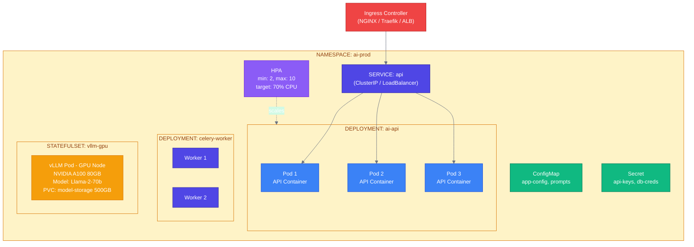
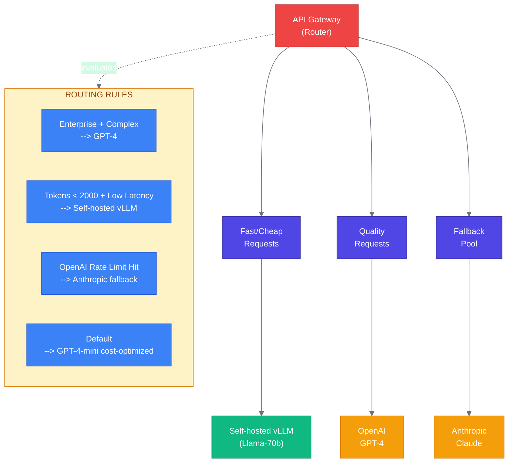
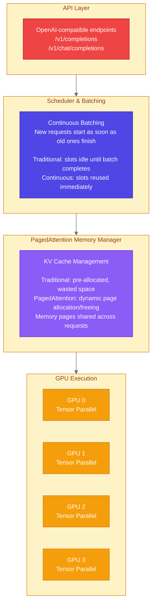
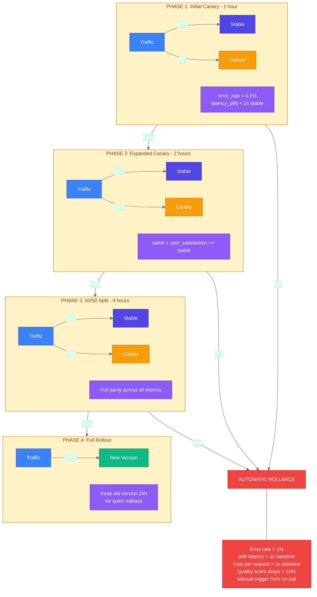

# Week 6: Deployment Strategies

---

## Chapter 10: Containerization and Orchestration

### 10.1 Docker for AI Workloads

AI containers have unique requirements: large model files, GPU support, and long-running processes:

```dockerfile
# docker/Dockerfile
# Multi-stage build for production AI service

# ═══════════════════════════════════════════════════════════════════════════
# Stage 1: Builder
# ═══════════════════════════════════════════════════════════════════════════
FROM python:3.11-slim as builder

WORKDIR /app

# Install build dependencies
RUN apt-get update && apt-get install -y --no-install-recommends \
    build-essential \
    curl \
    && rm -rf /var/lib/apt/lists/*

# Install Python dependencies
COPY pyproject.toml poetry.lock ./
RUN pip install poetry && \
    poetry config virtualenvs.create false && \
    poetry install --no-dev --no-interaction --no-ansi

# ═══════════════════════════════════════════════════════════════════════════
# Stage 2: Production
# ═══════════════════════════════════════════════════════════════════════════
FROM python:3.11-slim as production

WORKDIR /app

# Create non-root user for security
RUN useradd --create-home --shell /bin/bash appuser

# Install runtime dependencies only
RUN apt-get update && apt-get install -y --no-install-recommends \
    curl \
    && rm -rf /var/lib/apt/lists/*

# Copy Python packages from builder
COPY --from=builder /usr/local/lib/python3.11/site-packages /usr/local/lib/python3.11/site-packages
COPY --from=builder /usr/local/bin /usr/local/bin

# Copy application code
COPY src/ ./src/
COPY config/ ./config/

# Set ownership
RUN chown -R appuser:appuser /app

# Switch to non-root user
USER appuser

# Environment variables
ENV PYTHONUNBUFFERED=1 \
    PYTHONDONTWRITEBYTECODE=1 \
    PYTHONPATH=/app

# Health check
HEALTHCHECK --interval=30s --timeout=10s --start-period=5s --retries=3 \
    CMD curl -f http://localhost:8000/health || exit 1

# Expose port
EXPOSE 8000

# Run application
CMD ["uvicorn", "src.main:app", "--host", "0.0.0.0", "--port", "8000"]
```

```dockerfile
# docker/Dockerfile.gpu
# GPU-enabled container for self-hosted models

FROM nvidia/cuda:12.1-runtime-ubuntu22.04 as base

# Install Python
RUN apt-get update && apt-get install -y \
    python3.11 \
    python3.11-venv \
    python3-pip \
    curl \
    && rm -rf /var/lib/apt/lists/*

# Create symlinks
RUN ln -s /usr/bin/python3.11 /usr/bin/python

WORKDIR /app

# Install dependencies
COPY requirements.txt .
RUN pip install --no-cache-dir -r requirements.txt

# Install vLLM
RUN pip install vllm

# Copy application
COPY src/ ./src/

# Environment
ENV PYTHONUNBUFFERED=1 \
    CUDA_VISIBLE_DEVICES=0

# Default command - vLLM server
CMD ["python", "-m", "vllm.entrypoints.openai.api_server", \
     "--model", "meta-llama/Llama-2-7b-chat-hf", \
     "--port", "8000"]
```

```yaml
# docker/docker-compose.yaml
# Complete development stack

version: '3.8'

services:
  api:
    build:
      context: ..
      dockerfile: docker/Dockerfile
    ports:
      - "8000:8000"
    environment:
      - REDIS_URL=redis://redis:6379/0
      - QDRANT_URL=http://qdrant:6333
      - OPENAI_API_KEY=${OPENAI_API_KEY}
      - LOG_LEVEL=INFO
    depends_on:
      - redis
      - qdrant
    volumes:
      - ../src:/app/src:ro  # Dev mode: mount source
    healthcheck:
      test: ["CMD", "curl", "-f", "http://localhost:8000/health"]
      interval: 30s
      timeout: 10s
      retries: 3

  worker:
    build:
      context: ..
      dockerfile: docker/Dockerfile
    command: celery -A src.tasks.celery_app worker --loglevel=info
    environment:
      - REDIS_URL=redis://redis:6379/0
      - OPENAI_API_KEY=${OPENAI_API_KEY}
    depends_on:
      - redis

  redis:
    image: redis:7-alpine
    ports:
      - "6379:6379"
    volumes:
      - redis_data:/data
    command: redis-server --appendonly yes

  qdrant:
    image: qdrant/qdrant:v1.7.0
    ports:
      - "6333:6333"
      - "6334:6334"
    volumes:
      - qdrant_data:/qdrant/storage
    environment:
      - QDRANT__SERVICE__GRPC_PORT=6334

  prometheus:
    image: prom/prometheus:v2.45.0
    ports:
      - "9090:9090"
    volumes:
      - ./prometheus.yml:/etc/prometheus/prometheus.yml
      - prometheus_data:/prometheus

  grafana:
    image: grafana/grafana:10.0.0
    ports:
      - "3000:3000"
    volumes:
      - grafana_data:/var/lib/grafana
    environment:
      - GF_SECURITY_ADMIN_PASSWORD=admin

volumes:
  redis_data:
  qdrant_data:
  prometheus_data:
  grafana_data:
```

### 10.2 Kubernetes for AI Services



**Figure 10.1:** Kubernetes architecture for AI services

```yaml
# k8s/deployment.yaml
# AI API Deployment

apiVersion: apps/v1
kind: Deployment
metadata:
  name: ai-api
  namespace: ai-prod
  labels:
    app: ai-api
    version: v1
spec:
  replicas: 3
  selector:
    matchLabels:
      app: ai-api
  template:
    metadata:
      labels:
        app: ai-api
        version: v1
      annotations:
        prometheus.io/scrape: "true"
        prometheus.io/port: "8000"
    spec:
      serviceAccountName: ai-api
      containers:
        - name: api
          image: your-registry/ai-api:v1.2.3
          ports:
            - containerPort: 8000
              name: http
          env:
            - name: REDIS_URL
              valueFrom:
                secretKeyRef:
                  name: redis-credentials
                  key: url
            - name: OPENAI_API_KEY
              valueFrom:
                secretKeyRef:
                  name: api-keys
                  key: openai
            - name: LOG_LEVEL
              valueFrom:
                configMapKeyRef:
                  name: app-config
                  key: log_level
          resources:
            requests:
              cpu: "500m"
              memory: "1Gi"
            limits:
              cpu: "2"
              memory: "4Gi"
          readinessProbe:
            httpGet:
              path: /health
              port: 8000
            initialDelaySeconds: 5
            periodSeconds: 10
          livenessProbe:
            httpGet:
              path: /health
              port: 8000
            initialDelaySeconds: 15
            periodSeconds: 20
          lifecycle:
            preStop:
              exec:
                # Graceful shutdown: wait for in-flight requests
                command: ["/bin/sh", "-c", "sleep 10"]
      terminationGracePeriodSeconds: 60
      affinity:
        podAntiAffinity:
          preferredDuringSchedulingIgnoredDuringExecution:
            - weight: 100
              podAffinityTerm:
                labelSelector:
                  matchLabels:
                    app: ai-api
                topologyKey: kubernetes.io/hostname

---
apiVersion: v1
kind: Service
metadata:
  name: ai-api
  namespace: ai-prod
spec:
  selector:
    app: ai-api
  ports:
    - port: 80
      targetPort: 8000
      name: http
  type: ClusterIP

---
apiVersion: autoscaling/v2
kind: HorizontalPodAutoscaler
metadata:
  name: ai-api-hpa
  namespace: ai-prod
spec:
  scaleTargetRef:
    apiVersion: apps/v1
    kind: Deployment
    name: ai-api
  minReplicas: 2
  maxReplicas: 20
  metrics:
    - type: Resource
      resource:
        name: cpu
        target:
          type: Utilization
          averageUtilization: 70
    - type: Pods
      pods:
        metric:
          name: http_requests_per_second
        target:
          type: AverageValue
          averageValue: "100"
  behavior:
    scaleDown:
      stabilizationWindowSeconds: 300
      policies:
        - type: Percent
          value: 10
          periodSeconds: 60
    scaleUp:
      stabilizationWindowSeconds: 0
      policies:
        - type: Percent
          value: 100
          periodSeconds: 15
        - type: Pods
          value: 4
          periodSeconds: 15
      selectPolicy: Max
```

```yaml
# k8s/gpu-deployment.yaml
# GPU deployment for self-hosted models

apiVersion: apps/v1
kind: StatefulSet
metadata:
  name: vllm-server
  namespace: ai-prod
spec:
  serviceName: vllm-server
  replicas: 1
  selector:
    matchLabels:
      app: vllm-server
  template:
    metadata:
      labels:
        app: vllm-server
    spec:
      containers:
        - name: vllm
          image: your-registry/vllm-server:latest
          ports:
            - containerPort: 8000
          env:
            - name: MODEL_NAME
              value: "meta-llama/Llama-2-70b-chat-hf"
            - name: TENSOR_PARALLEL_SIZE
              value: "4"  # Use 4 GPUs
            - name: MAX_MODEL_LEN
              value: "4096"
          resources:
            limits:
              nvidia.com/gpu: 4  # Request 4 GPUs
              memory: "320Gi"
            requests:
              nvidia.com/gpu: 4
              memory: "320Gi"
          volumeMounts:
            - name: model-cache
              mountPath: /root/.cache/huggingface
            - name: shm
              mountPath: /dev/shm
      nodeSelector:
        nvidia.com/gpu.product: NVIDIA-A100-SXM4-80GB
      tolerations:
        - key: "nvidia.com/gpu"
          operator: "Exists"
          effect: "NoSchedule"
      volumes:
        - name: shm
          emptyDir:
            medium: Memory
            sizeLimit: 16Gi
  volumeClaimTemplates:
    - metadata:
        name: model-cache
      spec:
        accessModes: ["ReadWriteOnce"]
        storageClassName: fast-ssd
        resources:
          requests:
            storage: 500Gi
```

### 10.3 Hybrid Routing Architecture



**Figure 10.2:** Hybrid routing for cost and quality optimization

```python
# src/services/routing.py
"""
Intelligent model routing for hybrid deployments.
"""

from dataclasses import dataclass
from enum import Enum
from typing import Callable
import asyncio
import time


class ModelProvider(Enum):
    OPENAI_GPT4 = "openai-gpt4"
    OPENAI_GPT4_MINI = "openai-gpt4-mini"
    ANTHROPIC_CLAUDE = "anthropic-claude"
    VLLM_LLAMA = "vllm-llama"


@dataclass
class RoutingContext:
    """Context for routing decisions."""
    user_tier: str  # "free", "paid", "enterprise"
    task_type: str  # "chat", "analysis", "code", "summarization"
    estimated_tokens: int
    latency_budget_ms: int
    quality_requirement: str  # "low", "medium", "high"


@dataclass
class ProviderStatus:
    """Current status of a model provider."""
    provider: ModelProvider
    available: bool
    current_latency_ms: float
    error_rate: float
    rate_limit_remaining: int
    cost_per_1k_tokens: float


class ModelRouter:
    """
    Intelligent router for model selection.
    """

    def __init__(self):
        self.provider_status: dict[ModelProvider, ProviderStatus] = {}
        self.routing_rules: list[Callable] = []
        self._setup_default_rules()

    def _setup_default_rules(self):
        """Set up default routing rules."""

        # Rule 1: Enterprise users get best quality
        def enterprise_rule(ctx: RoutingContext, status: dict) -> ModelProvider | None:
            if ctx.user_tier == "enterprise" and ctx.quality_requirement == "high":
                return ModelProvider.OPENAI_GPT4
            return None

        # Rule 2: Latency-sensitive requests go to self-hosted
        def latency_rule(ctx: RoutingContext, status: dict) -> ModelProvider | None:
            if ctx.latency_budget_ms < 500:
                vllm = status.get(ModelProvider.VLLM_LLAMA)
                if vllm and vllm.available and vllm.current_latency_ms < 300:
                    return ModelProvider.VLLM_LLAMA
            return None

        # Rule 3: Small requests use cheap models
        def cost_rule(ctx: RoutingContext, status: dict) -> ModelProvider | None:
            if ctx.estimated_tokens < 1000 and ctx.quality_requirement != "high":
                return ModelProvider.OPENAI_GPT4_MINI
            return None

        # Rule 4: Fallback based on availability
        def fallback_rule(ctx: RoutingContext, status: dict) -> ModelProvider | None:
            # Try providers in order of preference
            preferences = [
                ModelProvider.OPENAI_GPT4_MINI,
                ModelProvider.VLLM_LLAMA,
                ModelProvider.ANTHROPIC_CLAUDE,
                ModelProvider.OPENAI_GPT4,
            ]
            for provider in preferences:
                pstatus = status.get(provider)
                if pstatus and pstatus.available and pstatus.error_rate < 0.1:
                    return provider
            return ModelProvider.OPENAI_GPT4_MINI  # Last resort

        self.routing_rules = [
            enterprise_rule,
            latency_rule,
            cost_rule,
            fallback_rule,
        ]

    def route(self, context: RoutingContext) -> ModelProvider:
        """
        Select the best model provider for the given context.
        """
        for rule in self.routing_rules:
            result = rule(context, self.provider_status)
            if result is not None:
                return result

        return ModelProvider.OPENAI_GPT4_MINI

    def update_provider_status(
        self,
        provider: ModelProvider,
        latency_ms: float,
        success: bool,
    ):
        """Update provider status after a request."""
        if provider not in self.provider_status:
            self.provider_status[provider] = ProviderStatus(
                provider=provider,
                available=True,
                current_latency_ms=latency_ms,
                error_rate=0.0,
                rate_limit_remaining=1000,
                cost_per_1k_tokens=0.0,
            )

        status = self.provider_status[provider]

        # Exponential moving average for latency
        alpha = 0.3
        status.current_latency_ms = (
            alpha * latency_ms +
            (1 - alpha) * status.current_latency_ms
        )

        # Update error rate
        if not success:
            status.error_rate = min(1.0, status.error_rate + 0.1)
        else:
            status.error_rate = max(0.0, status.error_rate - 0.01)

        # Mark unavailable if error rate too high
        status.available = status.error_rate < 0.5
```

---

## Chapter 11: Model Serving Engines

### 11.1 vLLM Architecture



**Performance Characteristics:**

```
┌─────────────────┬──────────────────────────────────────────────────────┐
│ Metric          │ vLLM vs Baseline                                     │
├─────────────────┼──────────────────────────────────────────────────────┤
│ Throughput      │ 2-24x higher (depending on workload)*                │
│ Memory Usage    │ Near-optimal GPU memory utilization*                 │
│ Latency (p50)   │ Similar or better                                    │
│ Latency (p99)   │ Significantly better due to less queuing            │
│                 │                                                      │
│ * Per the vLLM paper: Kwon et al., "Efficient Memory Management      │
│   for Large Language Model Serving with PagedAttention" (2023)        │
│   https://arxiv.org/abs/2309.06180                                    │
└─────────────────┴──────────────────────────────────────────────────────┘
```

**Figure 11.1:** vLLM architecture with PagedAttention

```python
# scripts/deploy_vllm.py
"""
Deploy vLLM server with optimal configuration.
"""

import subprocess
import os


def deploy_vllm(
    model: str = "meta-llama/Llama-2-7b-chat-hf",
    tensor_parallel_size: int = 1,
    max_model_len: int = 4096,
    port: int = 8000,
    gpu_memory_utilization: float = 0.9,
):
    """
    Deploy a vLLM server with production settings.
    """
    cmd = [
        "python", "-m", "vllm.entrypoints.openai.api_server",
        "--model", model,
        "--tensor-parallel-size", str(tensor_parallel_size),
        "--max-model-len", str(max_model_len),
        "--port", str(port),
        "--gpu-memory-utilization", str(gpu_memory_utilization),
        # Production settings
        "--disable-log-requests",  # Reduce logging overhead
        "--enable-prefix-caching",  # Cache common prefixes
        "--max-num-batched-tokens", "8192",  # Batch size
        "--max-num-seqs", "256",  # Max concurrent sequences
    ]

    print(f"Starting vLLM server: {' '.join(cmd)}")
    subprocess.run(cmd)


# Usage
if __name__ == "__main__":
    deploy_vllm(
        model="meta-llama/Llama-2-70b-chat-hf",
        tensor_parallel_size=4,  # Use 4 GPUs
        max_model_len=4096,
    )
```

### 11.2 Staged Rollouts and Canary Deployments



**Figure 11.2:** Canary deployment strategy for AI services

```yaml
# k8s/canary/canary-deployment.yaml
# Argo Rollouts canary deployment

apiVersion: argoproj.io/v1alpha1
kind: Rollout
metadata:
  name: ai-api
  namespace: ai-prod
spec:
  replicas: 10
  strategy:
    canary:
      steps:
        # Phase 1: 1% canary
        - setWeight: 1
        - pause: {duration: 1h}
        - analysis:
            templates:
              - templateName: ai-api-analysis
            args:
              - name: service-name
                value: ai-api-canary

        # Phase 2: 10% canary
        - setWeight: 10
        - pause: {duration: 2h}
        - analysis:
            templates:
              - templateName: ai-api-analysis

        # Phase 3: 50% canary
        - setWeight: 50
        - pause: {duration: 4h}
        - analysis:
            templates:
              - templateName: ai-api-analysis

        # Full rollout
        - setWeight: 100

      canaryService: ai-api-canary
      stableService: ai-api-stable

      trafficRouting:
        istio:
          virtualService:
            name: ai-api-vsvc
            routes:
              - primary
  selector:
    matchLabels:
      app: ai-api
  template:
    metadata:
      labels:
        app: ai-api
    spec:
      containers:
        - name: api
          image: your-registry/ai-api:v2.0.0
          # ... rest of container spec

---
apiVersion: argoproj.io/v1alpha1
kind: AnalysisTemplate
metadata:
  name: ai-api-analysis
spec:
  metrics:
    - name: error-rate
      interval: 5m
      successCondition: result[0] < 0.01
      provider:
        prometheus:
          address: http://prometheus:9090
          query: |
            sum(rate(http_requests_total{service="{{args.service-name}}", status=~"5.."}[5m]))
            /
            sum(rate(http_requests_total{service="{{args.service-name}}"}[5m]))

    - name: latency-p99
      interval: 5m
      successCondition: result[0] < 3000
      provider:
        prometheus:
          address: http://prometheus:9090
          query: |
            histogram_quantile(0.99,
              sum(rate(http_request_duration_seconds_bucket{service="{{args.service-name}}"}[5m]))
              by (le)
            ) * 1000

    - name: quality-score
      interval: 30m
      successCondition: result[0] > 0.85
      provider:
        job:
          spec:
            template:
              spec:
                containers:
                  - name: quality-check
                    image: your-registry/quality-checker:latest
                    command: ["python", "check_quality.py"]
                restartPolicy: Never
            backoffLimit: 1
```

---

### Summary: Week 6

In this week, we covered:

1. **Docker for AI**: Multi-stage builds, GPU support, compose stacks
2. **Kubernetes architecture**: Deployments, services, HPAs for AI workloads
3. **GPU scheduling**: StatefulSets, node selectors, tolerations
4. **Hybrid routing**: Mixing self-hosted and managed APIs
5. **vLLM**: PagedAttention, continuous batching, deployment
6. **Canary deployments**: Staged rollouts with automated analysis

**Key Takeaways:**

- AI containers need special attention for GPU, memory, and model files
- Kubernetes HPA can scale on custom metrics like requests per second
- Hybrid routing optimizes cost and quality across providers
- vLLM dramatically improves throughput for self-hosted models
- Canary deployments are essential for AI—gradual rollout catches quality issues

---

### Exercises

**Exercise 6.1:** Create a Kubernetes deployment that automatically scales based on queue depth in Redis.

**Exercise 6.2:** Implement a routing policy that uses GPT-4 for code generation but GPT-4-mini for summarization.

**Exercise 6.3:** Set up a canary deployment that rolls back automatically if the LLM-judge quality score drops.

**Exercise 6.4:** Configure vLLM with tensor parallelism across 2 GPUs and measure the throughput improvement.

---

*Next Week: Optimization Techniques—Making AI systems faster and cheaper*
