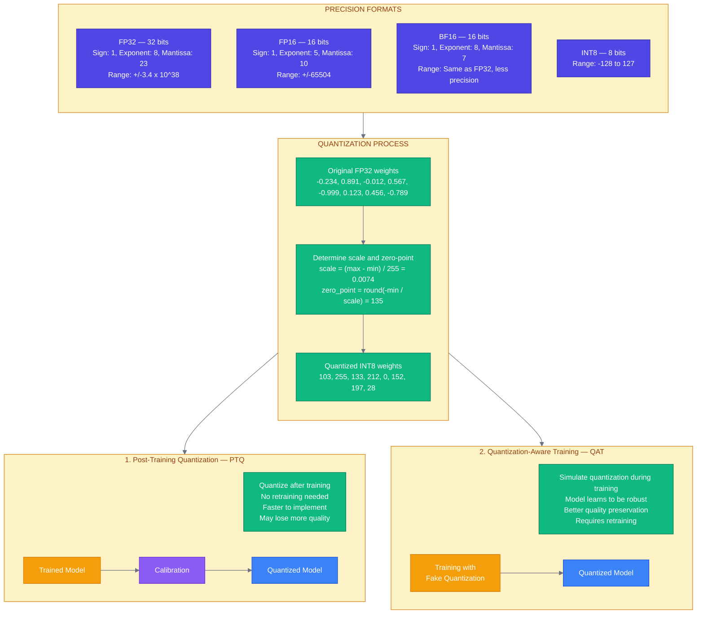
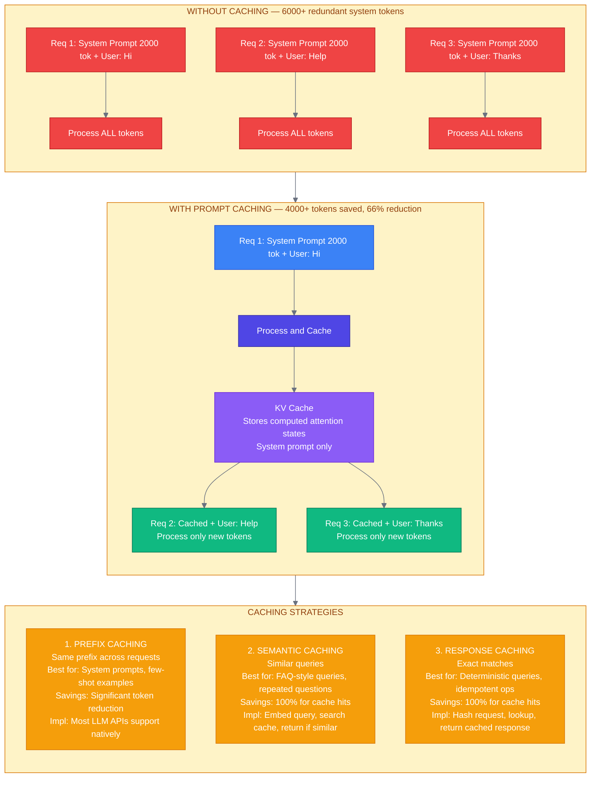
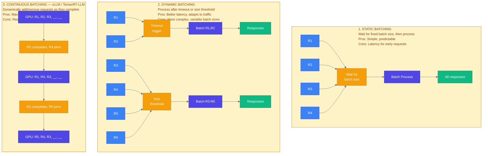

# Week 7: Optimization Techniques

---

## Chapter 12: Model Optimization

### 12.1 The Optimization Landscape


TECHNIQUE COMPARISON (approximate ranges -- actual results vary by model and workload):

| Technique       | Speedup        | Memory   | Quality Loss | Effort  |
|-----------------|----------------|----------|--------------|---------|
| FP16/BF16       | ~2x            | ~50%     | Negligible   | Trivial |
| INT8 (PTQ)      | ~2-4x          | ~75%     | Low          | Low     |
| INT8 (QAT)      | ~2-4x          | ~75%     | Minimal      | Medium  |
| INT4 (GPTQ/AWQ) | ~3-4x          | ~87%     | Moderate     | Medium  |
| Pruning         | ~1.5-3x        | 40-80%   | Variable     | High    |
| Distillation    | Varies*        | Varies*  | Moderate     | High    |
| Flash Attention | ~2-4x**        | O(N)->attn | None (exact) | Trivial |
| Prompt Caching  | Prefix only*** | -        | None         | Low     |

\* Distillation speedup depends entirely on student model size vs teacher
\*\* Flash Attention speedup per Dao et al. (2022), applies to attention computation specifically, not full model inference
\*\*\* Prompt caching eliminates re-computation of cached prefixes; overall request speedup depends on the ratio of cached to new tokens

**Figure 12.1:** Optimization techniques comparison

### 12.2 Quantization Deep Dive



**Figure 12.2:** Quantization fundamentals

```python
# src/optimization/quantization.py
"""
Model quantization utilities.
"""

from typing import Optional
import torch
from transformers import AutoModelForCausalLM, AutoTokenizer, BitsAndBytesConfig


def load_quantized_model(
    model_name: str,
    quantization: str = "int8",  # "int8", "int4", "fp16", "none"
    device_map: str = "auto",
) -> tuple:
    """
    Load a model with the specified quantization.

    Args:
        model_name: HuggingFace model name or path
        quantization: Quantization level
        device_map: Device placement strategy

    Returns:
        (model, tokenizer) tuple
    """
    tokenizer = AutoTokenizer.from_pretrained(model_name)

    # Configure quantization
    quantization_config = None

    if quantization == "int8":
        quantization_config = BitsAndBytesConfig(
            load_in_8bit=True,
            llm_int8_threshold=6.0,  # Outlier threshold
            llm_int8_has_fp16_weight=False,
        )
    elif quantization == "int4":
        quantization_config = BitsAndBytesConfig(
            load_in_4bit=True,
            bnb_4bit_quant_type="nf4",  # Normalized float 4-bit
            bnb_4bit_compute_dtype=torch.float16,
            bnb_4bit_use_double_quant=True,  # Nested quantization
        )
    elif quantization == "fp16":
        pass  # Will use torch_dtype below

    # Load model
    model = AutoModelForCausalLM.from_pretrained(
        model_name,
        quantization_config=quantization_config,
        device_map=device_map,
        torch_dtype=torch.float16 if quantization in ["fp16", "none"] else None,
        trust_remote_code=True,
    )

    return model, tokenizer


def measure_memory_usage(model) -> dict:
    """
    Measure model memory usage.
    """
    if not torch.cuda.is_available():
        return {"error": "CUDA not available"}

    torch.cuda.reset_peak_memory_stats()

    # Get model size
    param_size = sum(p.numel() * p.element_size() for p in model.parameters())
    buffer_size = sum(b.numel() * b.element_size() for b in model.buffers())

    return {
        "parameter_memory_mb": param_size / (1024 ** 2),
        "buffer_memory_mb": buffer_size / (1024 ** 2),
        "total_mb": (param_size + buffer_size) / (1024 ** 2),
        "gpu_allocated_mb": torch.cuda.memory_allocated() / (1024 ** 2),
        "gpu_reserved_mb": torch.cuda.memory_reserved() / (1024 ** 2),
    }


# GPTQ Quantization for maximum compression
def load_gptq_model(
    model_name: str,
    bits: int = 4,
    group_size: int = 128,
):
    """
    Load a GPTQ-quantized model.

    GPTQ provides better quality than naive INT4 by using
    second-order information during quantization.
    """
    from auto_gptq import AutoGPTQForCausalLM

    model = AutoGPTQForCausalLM.from_quantized(
        model_name,
        use_safetensors=True,
        device_map="auto",
        use_triton=False,  # Set True for faster inference with Triton
    )

    tokenizer = AutoTokenizer.from_pretrained(model_name)

    return model, tokenizer
```

### 12.3 Knowledge Distillation

```mermaid
%%{init: {'theme': 'base', 'themeVariables': {'primaryColor': '#4F46E5', 'primaryTextColor': '#FFFFFF', 'primaryBorderColor': '#3730A3', 'secondaryColor': '#D1FAE5', 'secondaryTextColor': '#065F46', 'secondaryBorderColor': '#059669', 'tertiaryColor': '#FEF3C7', 'tertiaryTextColor': '#92400E', 'tertiaryBorderColor': '#D97706', 'lineColor': '#6B7280', 'textColor': '#1F2937', 'fontSize': '14px'}}}%%
flowchart TB
    subgraph concept ["KNOWLEDGE DISTILLATION — CONCEPT"]
        direction LR
        teacher["Teacher Model — Large<br/>GPT-4 / Claude<br/>175B params<br/><br/>Complex reasoning<br/>Broad knowledge<br/>High accuracy<br/>Cost: $$$$$<br/>Latency: 2000ms"]
        student["Student Model — Small<br/>GPT-4-mini<br/>8B params<br/><br/>Simpler reasoning<br/>Focused knowledge<br/>Good accuracy<br/>Cost: $<br/>Latency: 200ms"]
        teacher -- "Transfer<br/>Knowledge" --> student
    end

    subgraph process ["DISTILLATION PROCESS"]
        direction TB
        step1["Step 1: Generate training data"]
        query["Query"] --> teacherLLM["Teacher"] --> response["High-quality response"]
        step2["Step 2: Train student on teacher outputs<br/>Input: Query<br/>Target: Teacher response — soft labels<br/>Loss: KL divergence + task loss"]
        step3["Step 3: Evaluate and iterate<br/>Compare student vs teacher on eval set<br/>Add hard examples where student fails<br/>Repeat until quality target met"]
        step1 --> query
        response --> step2 --> step3
    end

    subgraph strategies ["DISTILLATION STRATEGIES"]
        direction TB
        s1["Response Distill<br/>Train on teacher final outputs"]
        s2["Logit Distillation<br/>Match teacher probability distributions"]
        s3["Feature Distillation<br/>Match intermediate representations"]
        s4["Chain-of-Thought<br/>Include teacher reasoning in training"]
        s5["Selective Distill<br/>Focus on hard/important examples"]
    end

    concept --> process --> strategies

    classDef client fill:#3B82F6,stroke:#1D4ED8,color:#FFFFFF
    classDef gateway fill:#EF4444,stroke:#B91C1C,color:#FFFFFF
    classDef service fill:#4F46E5,stroke:#3730A3,color:#FFFFFF
    classDef data fill:#10B981,stroke:#047857,color:#FFFFFF
    classDef external fill:#F59E0B,stroke:#D97706,color:#FFFFFF
    classDef observability fill:#8B5CF6,stroke:#6D28D9,color:#FFFFFF

    class teacher gateway
    class student data
    class query client
    class teacherLLM service
    class response data
    class step1,step2,step3 service
    class s1,s2,s3,s4,s5 external
```

**Figure 12.3:** Knowledge distillation overview

```python
# src/optimization/distillation.py
"""
Knowledge distillation for creating efficient models.
"""

import asyncio
from dataclasses import dataclass
from typing import Iterator
import json
from pathlib import Path

from src.services.llm import LLMService


@dataclass
class DistillationExample:
    """A single distillation training example."""
    input: str
    teacher_output: str
    teacher_reasoning: str | None = None
    metadata: dict = None


class TeacherDataGenerator:
    """
    Generate training data from a teacher model.
    """

    def __init__(
        self,
        teacher_service: LLMService,
        teacher_model: str = "gpt-4o",
    ):
        self.teacher = teacher_service
        self.model = teacher_model

    async def generate_example(
        self,
        prompt: str,
        include_reasoning: bool = True,
    ) -> DistillationExample:
        """
        Generate a single training example.
        """
        if include_reasoning:
            # Use chain-of-thought prompting
            system_prompt = """You are a helpful assistant. When answering:
1. First, explain your reasoning step by step in <reasoning> tags
2. Then provide your final answer in <answer> tags

Example:
<reasoning>
The user is asking about X. I need to consider Y and Z...
</reasoning>
<answer>
The answer is...
</answer>"""

            messages = [
                {"role": "system", "content": system_prompt},
                {"role": "user", "content": prompt},
            ]
        else:
            messages = [{"role": "user", "content": prompt}]

        response = await self.teacher.generate(
            messages=messages,
            model=self.model,
            temperature=0.3,  # Lower temperature for consistency
        )

        # Parse reasoning and answer
        content = response.content
        reasoning = None
        answer = content

        if include_reasoning:
            if "<reasoning>" in content and "</reasoning>" in content:
                reasoning_start = content.find("<reasoning>") + len("<reasoning>")
                reasoning_end = content.find("</reasoning>")
                reasoning = content[reasoning_start:reasoning_end].strip()

            if "<answer>" in content and "</answer>" in content:
                answer_start = content.find("<answer>") + len("<answer>")
                answer_end = content.find("</answer>")
                answer = content[answer_start:answer_end].strip()

        return DistillationExample(
            input=prompt,
            teacher_output=answer,
            teacher_reasoning=reasoning,
            metadata={
                "model": self.model,
                "tokens_used": response.input_tokens + response.output_tokens,
            }
        )

    async def generate_dataset(
        self,
        prompts: list[str],
        output_path: Path,
        include_reasoning: bool = True,
        max_concurrent: int = 5,
    ):
        """
        Generate a full distillation dataset.
        """
        semaphore = asyncio.Semaphore(max_concurrent)

        async def bounded_generate(prompt: str) -> DistillationExample:
            async with semaphore:
                return await self.generate_example(prompt, include_reasoning)

        # Generate all examples
        tasks = [bounded_generate(p) for p in prompts]
        examples = await asyncio.gather(*tasks, return_exceptions=True)

        # Filter out errors and save
        valid_examples = [e for e in examples if isinstance(e, DistillationExample)]

        # Save as JSONL
        with output_path.open("w") as f:
            for ex in valid_examples:
                f.write(json.dumps({
                    "input": ex.input,
                    "output": ex.teacher_output,
                    "reasoning": ex.teacher_reasoning,
                    "metadata": ex.metadata,
                }) + "\n")

        return len(valid_examples)


# Training data format for fine-tuning
def format_for_openai_finetuning(
    examples: list[DistillationExample],
    include_reasoning: bool = False,
) -> list[dict]:
    """
    Format distillation examples for OpenAI fine-tuning.
    """
    formatted = []

    for ex in examples:
        if include_reasoning and ex.teacher_reasoning:
            assistant_content = f"Let me think through this:\n{ex.teacher_reasoning}\n\nAnswer: {ex.teacher_output}"
        else:
            assistant_content = ex.teacher_output

        formatted.append({
            "messages": [
                {"role": "user", "content": ex.input},
                {"role": "assistant", "content": assistant_content},
            ]
        })

    return formatted
```

---

## Chapter 13: Inference Optimization

### 13.1 Prompt Caching



**Figure 13.1:** Prompt caching strategies

```python
# src/optimization/caching.py
"""
Caching strategies for LLM inference.
"""

import hashlib
import json
from typing import Any
from dataclasses import dataclass
import time
import numpy as np
from redis.asyncio import Redis


@dataclass
class CacheEntry:
    """A cached response."""
    response: str
    model: str
    created_at: float
    hit_count: int = 0
    tokens_saved: int = 0


class ResponseCache:
    """
    Exact-match response caching.
    """

    def __init__(
        self,
        redis: Redis,
        ttl_seconds: int = 3600,
        prefix: str = "llm_cache:",
    ):
        self.redis = redis
        self.ttl = ttl_seconds
        self.prefix = prefix

    def _hash_request(self, messages: list[dict], model: str, **kwargs) -> str:
        """Create deterministic hash of request."""
        content = json.dumps({
            "messages": messages,
            "model": model,
            "temperature": kwargs.get("temperature", 0.7),
            "max_tokens": kwargs.get("max_tokens", 1024),
        }, sort_keys=True)
        return hashlib.sha256(content.encode()).hexdigest()

    async def get(
        self,
        messages: list[dict],
        model: str,
        **kwargs
    ) -> CacheEntry | None:
        """Get cached response if exists."""
        key = self.prefix + self._hash_request(messages, model, **kwargs)
        data = await self.redis.get(key)

        if data:
            entry = CacheEntry(**json.loads(data))
            # Update hit count
            entry.hit_count += 1
            await self.redis.setex(
                key,
                self.ttl,
                json.dumps(entry.__dict__)
            )
            return entry

        return None

    async def set(
        self,
        messages: list[dict],
        model: str,
        response: str,
        tokens_used: int,
        **kwargs
    ):
        """Cache a response."""
        key = self.prefix + self._hash_request(messages, model, **kwargs)
        entry = CacheEntry(
            response=response,
            model=model,
            created_at=time.time(),
            tokens_saved=tokens_used,
        )
        await self.redis.setex(
            key,
            self.ttl,
            json.dumps(entry.__dict__)
        )


class SemanticCache:
    """
    Semantic similarity-based caching.

    Returns cached responses for semantically similar queries.
    """

    def __init__(
        self,
        redis: Redis,
        embedding_service,
        similarity_threshold: float = 0.95,
        ttl_seconds: int = 3600,
    ):
        self.redis = redis
        self.embedder = embedding_service
        self.threshold = similarity_threshold
        self.ttl = ttl_seconds

    async def get(
        self,
        query: str,
        context_hash: str = "",  # Hash of system prompt/context
    ) -> tuple[str, float] | None:
        """
        Get semantically similar cached response.

        Returns (response, similarity_score) or None.
        """
        # Get query embedding
        query_embedding = await self.embedder.embed(query)

        # Search cache for similar queries
        # In production, use vector DB for this
        cache_key = f"semantic_cache:{context_hash}:*"
        keys = await self.redis.keys(cache_key)

        best_match = None
        best_score = 0.0

        for key in keys:
            data = await self.redis.get(key)
            if not data:
                continue

            entry = json.loads(data)
            cached_embedding = np.array(entry["embedding"])

            # Cosine similarity
            similarity = np.dot(query_embedding, cached_embedding) / (
                np.linalg.norm(query_embedding) * np.linalg.norm(cached_embedding)
            )

            if similarity > self.threshold and similarity > best_score:
                best_match = entry["response"]
                best_score = similarity

        if best_match:
            return best_match, best_score

        return None

    async def set(
        self,
        query: str,
        response: str,
        context_hash: str = "",
    ):
        """Cache a query-response pair with embedding."""
        query_embedding = await self.embedder.embed(query)

        # Use query hash as key
        query_hash = hashlib.sha256(query.encode()).hexdigest()[:16]
        key = f"semantic_cache:{context_hash}:{query_hash}"

        entry = {
            "query": query,
            "response": response,
            "embedding": query_embedding.tolist(),
            "created_at": time.time(),
        }

        await self.redis.setex(key, self.ttl, json.dumps(entry))


class CachedLLMService:
    """
    LLM service with multi-layer caching.
    """

    def __init__(
        self,
        llm_service,
        response_cache: ResponseCache,
        semantic_cache: SemanticCache | None = None,
    ):
        self.llm = llm_service
        self.response_cache = response_cache
        self.semantic_cache = semantic_cache

    async def generate(
        self,
        messages: list[dict],
        model: str = "gpt-4o-mini",
        use_cache: bool = True,
        **kwargs
    ):
        """Generate with caching."""

        # Layer 1: Exact match cache
        if use_cache:
            cached = await self.response_cache.get(messages, model, **kwargs)
            if cached:
                return type('CachedResponse', (), {
                    'content': cached.response,
                    'model': model,
                    'from_cache': True,
                    'tokens_saved': cached.tokens_saved,
                })()

        # Layer 2: Semantic cache (for user message)
        if use_cache and self.semantic_cache and len(messages) > 0:
            last_user_msg = next(
                (m["content"] for m in reversed(messages) if m["role"] == "user"),
                None
            )
            if last_user_msg:
                # Hash context (all messages except last user message)
                context_hash = hashlib.sha256(
                    json.dumps(messages[:-1]).encode()
                ).hexdigest()[:16]

                semantic_hit = await self.semantic_cache.get(
                    last_user_msg,
                    context_hash
                )
                if semantic_hit:
                    response, similarity = semantic_hit
                    return type('SemanticCacheResponse', (), {
                        'content': response,
                        'model': model,
                        'from_cache': True,
                        'semantic_similarity': similarity,
                    })()

        # Cache miss - call LLM
        response = await self.llm.generate(messages, model=model, **kwargs)

        # Store in caches
        if use_cache:
            await self.response_cache.set(
                messages,
                model,
                response.content,
                response.input_tokens + response.output_tokens,
                **kwargs
            )

            if self.semantic_cache and len(messages) > 0:
                last_user_msg = next(
                    (m["content"] for m in reversed(messages) if m["role"] == "user"),
                    None
                )
                if last_user_msg:
                    context_hash = hashlib.sha256(
                        json.dumps(messages[:-1]).encode()
                    ).hexdigest()[:16]
                    await self.semantic_cache.set(
                        last_user_msg,
                        response.content,
                        context_hash
                    )

        response.from_cache = False
        return response
```

### 13.2 Batching Strategies



**Figure 13.2:** Batching strategies comparison

```python
# src/optimization/batching.py
"""
Request batching for LLM inference.
"""

import asyncio
from dataclasses import dataclass, field
from typing import Any
import time
from collections import deque


@dataclass
class BatchRequest:
    """A request waiting to be batched."""
    id: str
    messages: list[dict]
    kwargs: dict
    future: asyncio.Future
    submitted_at: float = field(default_factory=time.time)


class DynamicBatcher:
    """
    Dynamic batching for LLM requests.
    """

    def __init__(
        self,
        llm_service,
        max_batch_size: int = 8,
        max_wait_ms: int = 50,
    ):
        self.llm = llm_service
        self.max_batch_size = max_batch_size
        self.max_wait_ms = max_wait_ms
        self.queue: deque[BatchRequest] = deque()
        self.lock = asyncio.Lock()
        self._running = False

    async def start(self):
        """Start the batching loop."""
        self._running = True
        asyncio.create_task(self._batch_loop())

    async def stop(self):
        """Stop the batching loop."""
        self._running = False

    async def generate(
        self,
        messages: list[dict],
        **kwargs
    ) -> Any:
        """
        Submit a request for batched processing.
        """
        future = asyncio.Future()
        request = BatchRequest(
            id=f"req_{time.time_ns()}",
            messages=messages,
            kwargs=kwargs,
            future=future,
        )

        async with self.lock:
            self.queue.append(request)

        return await future

    async def _batch_loop(self):
        """Main batching loop."""
        while self._running:
            batch = await self._collect_batch()

            if batch:
                # Process batch
                results = await self._process_batch(batch)

                # Resolve futures
                for request, result in zip(batch, results):
                    if isinstance(result, Exception):
                        request.future.set_exception(result)
                    else:
                        request.future.set_result(result)
            else:
                await asyncio.sleep(0.01)  # Small sleep if no requests

    async def _collect_batch(self) -> list[BatchRequest]:
        """Collect requests into a batch."""
        batch = []
        start_time = time.time()

        while len(batch) < self.max_batch_size:
            # Check timeout
            elapsed_ms = (time.time() - start_time) * 1000
            if elapsed_ms > self.max_wait_ms and batch:
                break

            # Try to get a request
            async with self.lock:
                if self.queue:
                    batch.append(self.queue.popleft())
                elif batch:
                    break  # No more requests, process what we have
                else:
                    break  # Nothing to process

            if not batch:
                await asyncio.sleep(0.001)

        return batch

    async def _process_batch(
        self,
        batch: list[BatchRequest]
    ) -> list[Any]:
        """
        Process a batch of requests.

        In production, this would call a batched inference endpoint.
        For API-based LLMs, we run them concurrently.
        """
        tasks = [
            self.llm.generate(req.messages, **req.kwargs)
            for req in batch
        ]

        return await asyncio.gather(*tasks, return_exceptions=True)


class EmbeddingBatcher:
    """
    Specialized batcher for embedding requests.

    Embeddings benefit greatly from batching because:
    1. Single API call for multiple texts
    2. Better GPU utilization
    3. Lower per-item latency
    """

    def __init__(
        self,
        embedding_service,
        max_batch_size: int = 100,
        max_wait_ms: int = 100,
    ):
        self.embedder = embedding_service
        self.max_batch_size = max_batch_size
        self.max_wait_ms = max_wait_ms
        self.queue: list[tuple[str, asyncio.Future]] = []
        self.lock = asyncio.Lock()
        self._task = None

    async def embed(self, text: str) -> list[float]:
        """Embed a single text with batching."""
        future = asyncio.Future()

        async with self.lock:
            self.queue.append((text, future))

            # Start batch task if not running
            if self._task is None or self._task.done():
                self._task = asyncio.create_task(self._process_after_wait())

        return await future

    async def _process_after_wait(self):
        """Wait then process batch."""
        await asyncio.sleep(self.max_wait_ms / 1000)

        async with self.lock:
            if not self.queue:
                return

            # Take up to max_batch_size
            batch = self.queue[:self.max_batch_size]
            self.queue = self.queue[self.max_batch_size:]

        texts = [t for t, _ in batch]
        futures = [f for _, f in batch]

        try:
            # Batch embed
            embeddings = await self.embedder.embed_batch(texts)

            # Resolve futures
            for future, embedding in zip(futures, embeddings):
                future.set_result(embedding)

        except Exception as e:
            for future in futures:
                future.set_exception(e)
```

---

### Summary: Week 7

In this week, we covered:

1. **Quantization**: FP16, INT8, INT4, GPTQ techniques
2. **Knowledge distillation**: Creating smaller models from larger ones
3. **Prompt caching**: Prefix, semantic, and response caching
4. **Batching strategies**: Static, dynamic, and continuous batching
5. **Optimization trade-offs**: When optimization hurts quality

**Key Takeaways:**

- Quantization offers easy wins: INT8 is often "free" quality-wise
- Distillation enables custom small models for specific tasks
- Caching can significantly reduce costs for repetitive workloads (savings depend on prefix reuse ratio)
- Batching is essential for throughput but adds latency complexity

---

### Exercises

**Exercise 7.1:** Measure the quality difference between FP16 and INT8 quantized versions of a model on your evaluation set.

**Exercise 7.2:** Implement a semantic cache with a 0.92 similarity threshold and measure the hit rate on production-like queries.

**Exercise 7.3:** Build a dynamic batcher and measure the throughput improvement vs. individual requests.

---

*Next Week: Observability and Operations—Making AI systems understandable*
