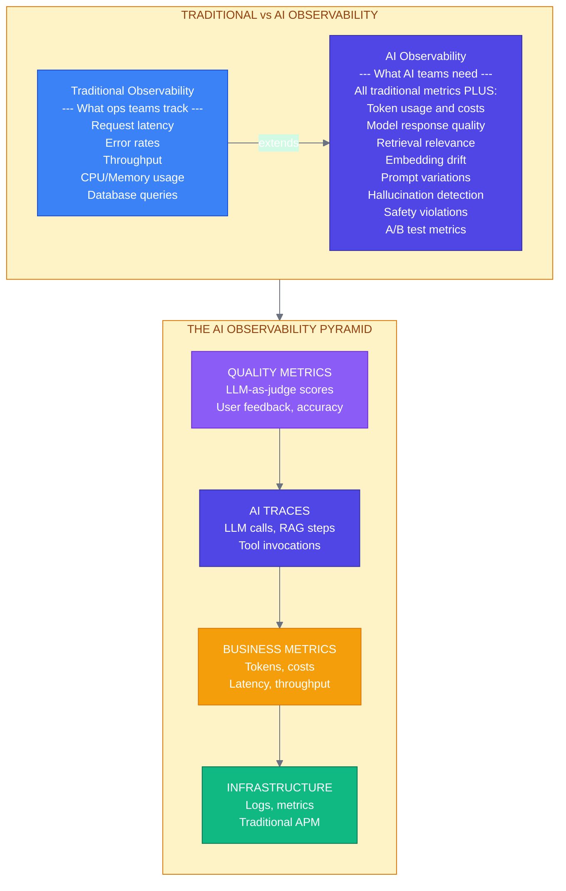
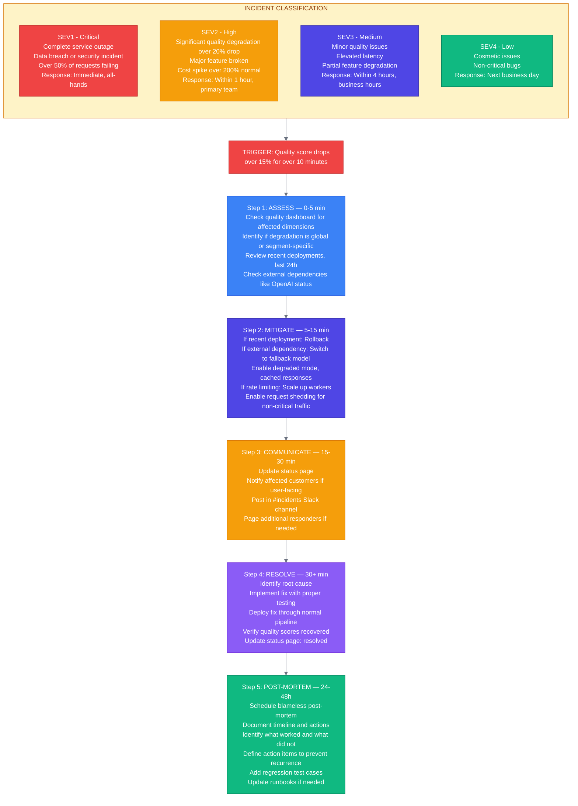

# Week 8: Observability and Operations

---

## Chapter 14: Distributed Tracing for AI

### 14.1 Why AI Systems Need Specialized Observability

> **🔥 War Story: Silent Degradation in Production AI**
>
> A 2025 empirical study of 156 high-impact production AI incidents at a major tech company found that the majority of failures were **silent** — systems appeared healthy by traditional metrics (latency, error rates, uptime) while producing wrong outputs. Approximately 75% of incidents involved non-reasoning LLMs, with the remainder affecting embedding models used for retrieval and ranking. ([Source](https://arxiv.org/abs/2511.07424))
>
> Separately, researchers have documented that 91% of ML models degrade over time in production due to data drift, feature mismatches between training and serving, and stale retrieval layers. A poisoned or stale retrieval pipeline can be worse than no retrieval at all — it feeds the model the wrong context with high confidence. ([Source](https://www.montecarlodata.com/blog-top-5-ai-reliability-pitfalls/))
>
> Traditional observability misses these failures because there are no errors, timeouts, or obvious crashes. Only AI-specific observability — tracking embedding dimensions, retrieval relevance scores, response quality metrics, and data lineage across the full pipeline — catches silent degradation before users do.



**Figure 14.1:** The AI observability pyramid

### 14.2 OpenTelemetry for AI Workloads

```python
# src/observability/tracing.py
"""
OpenTelemetry tracing for AI systems.
"""

from opentelemetry import trace
from opentelemetry.sdk.trace import TracerProvider
from opentelemetry.sdk.trace.export import BatchSpanProcessor
from opentelemetry.exporter.otlp.proto.grpc.trace_exporter import OTLPSpanExporter
from opentelemetry.sdk.resources import Resource
from opentelemetry.trace import Status, StatusCode
from opentelemetry.trace.propagation.tracecontext import TraceContextTextMapPropagator
from functools import wraps
from typing import Callable, Any
import time


def setup_tracing(
    service_name: str = "ai-service",
    otlp_endpoint: str = "localhost:4317",
):
    """
    Configure OpenTelemetry tracing.
    """
    resource = Resource.create({
        "service.name": service_name,
        "service.version": "1.0.0",
    })

    provider = TracerProvider(resource=resource)
    exporter = OTLPSpanExporter(endpoint=otlp_endpoint, insecure=True)
    processor = BatchSpanProcessor(exporter)
    provider.add_span_processor(processor)

    trace.set_tracer_provider(provider)

    return trace.get_tracer(__name__)


# Global tracer
tracer = trace.get_tracer(__name__)


# ═══════════════════════════════════════════════════════════════════════════
# AI-SPECIFIC TRACE DECORATORS
# ═══════════════════════════════════════════════════════════════════════════

def trace_llm_call(model: str | None = None):
    """
    Decorator for tracing LLM calls.

    Captures:
    - Model name
    - Input/output tokens
    - Latency
    - Cost
    """
    def decorator(func: Callable) -> Callable:
        @wraps(func)
        async def wrapper(*args, **kwargs):
            with tracer.start_as_current_span(
                "llm.generate",
                kind=trace.SpanKind.CLIENT,
            ) as span:
                # Set model attribute
                span.set_attribute("llm.model", model or kwargs.get("model", "unknown"))
                span.set_attribute("llm.provider", "openai")  # Or detect from model

                start_time = time.perf_counter()

                try:
                    result = await func(*args, **kwargs)

                    # Record token usage
                    if hasattr(result, "input_tokens"):
                        span.set_attribute("llm.tokens.input", result.input_tokens)
                    if hasattr(result, "output_tokens"):
                        span.set_attribute("llm.tokens.output", result.output_tokens)
                    if hasattr(result, "cost_usd"):
                        span.set_attribute("llm.cost_usd", result.cost_usd)

                    # Record latency
                    latency_ms = (time.perf_counter() - start_time) * 1000
                    span.set_attribute("llm.latency_ms", latency_ms)

                    span.set_status(Status(StatusCode.OK))
                    return result

                except Exception as e:
                    span.set_status(Status(StatusCode.ERROR, str(e)))
                    span.record_exception(e)
                    raise

        return wrapper
    return decorator


def trace_retrieval(index_name: str | None = None):
    """
    Decorator for tracing retrieval operations.

    Captures:
    - Index/collection name
    - Query
    - Number of results
    - Top relevance score
    """
    def decorator(func: Callable) -> Callable:
        @wraps(func)
        async def wrapper(*args, **kwargs):
            with tracer.start_as_current_span(
                "retrieval.search",
                kind=trace.SpanKind.CLIENT,
            ) as span:
                span.set_attribute("retrieval.index", index_name or "unknown")

                # Capture query if available
                query = kwargs.get("query") or (args[0] if args else "")
                if isinstance(query, str):
                    span.set_attribute("retrieval.query", query[:500])  # Truncate

                try:
                    result = await func(*args, **kwargs)

                    # Record retrieval metrics
                    if isinstance(result, list):
                        span.set_attribute("retrieval.num_results", len(result))
                        if result and hasattr(result[0], "score"):
                            span.set_attribute("retrieval.top_score", result[0].score)

                    span.set_status(Status(StatusCode.OK))
                    return result

                except Exception as e:
                    span.set_status(Status(StatusCode.ERROR, str(e)))
                    span.record_exception(e)
                    raise

        return wrapper
    return decorator


def trace_embedding(model: str | None = None):
    """
    Decorator for tracing embedding operations.
    """
    def decorator(func: Callable) -> Callable:
        @wraps(func)
        async def wrapper(*args, **kwargs):
            with tracer.start_as_current_span(
                "embedding.generate",
                kind=trace.SpanKind.CLIENT,
            ) as span:
                span.set_attribute("embedding.model", model or "unknown")

                # Count inputs
                inputs = kwargs.get("texts") or kwargs.get("input") or args[0] if args else []
                if isinstance(inputs, str):
                    span.set_attribute("embedding.num_inputs", 1)
                elif isinstance(inputs, list):
                    span.set_attribute("embedding.num_inputs", len(inputs))

                try:
                    result = await func(*args, **kwargs)
                    span.set_status(Status(StatusCode.OK))
                    return result
                except Exception as e:
                    span.set_status(Status(StatusCode.ERROR, str(e)))
                    raise

        return wrapper
    return decorator


# ═══════════════════════════════════════════════════════════════════════════
# CONTEXT MANAGER FOR COMPLEX TRACES
# ═══════════════════════════════════════════════════════════════════════════

class AITraceContext:
    """
    Context manager for tracing complex AI operations.
    """

    def __init__(
        self,
        operation_name: str,
        user_id: str | None = None,
        session_id: str | None = None,
    ):
        self.operation_name = operation_name
        self.user_id = user_id
        self.session_id = session_id
        self.span = None
        self.start_time = None
        self._metrics = {}

    def __enter__(self):
        self.span = tracer.start_span(
            self.operation_name,
            kind=trace.SpanKind.SERVER,
        )
        self.span.__enter__()

        if self.user_id:
            self.span.set_attribute("user.id", self.user_id)
        if self.session_id:
            self.span.set_attribute("session.id", self.session_id)

        self.start_time = time.perf_counter()
        return self

    def __exit__(self, exc_type, exc_val, exc_tb):
        if exc_type:
            self.span.set_status(Status(StatusCode.ERROR, str(exc_val)))
            self.span.record_exception(exc_val)
        else:
            self.span.set_status(Status(StatusCode.OK))

        # Record all collected metrics
        for key, value in self._metrics.items():
            self.span.set_attribute(key, value)

        # Record total latency
        latency_ms = (time.perf_counter() - self.start_time) * 1000
        self.span.set_attribute("operation.latency_ms", latency_ms)

        self.span.__exit__(exc_type, exc_val, exc_tb)
        return False

    def record_metric(self, name: str, value: Any):
        """Record a custom metric."""
        self._metrics[name] = value

    def record_quality_score(self, score: float):
        """Record quality score from evaluation."""
        self._metrics["ai.quality_score"] = score

    def record_tokens(self, input_tokens: int, output_tokens: int):
        """Record token usage."""
        self._metrics["ai.tokens.input"] = input_tokens
        self._metrics["ai.tokens.output"] = output_tokens
        self._metrics["ai.tokens.total"] = input_tokens + output_tokens

    def record_cost(self, cost_usd: float):
        """Record cost."""
        self._metrics["ai.cost_usd"] = cost_usd
```

### 14.3 LangSmith Integration

```python
# src/observability/langsmith.py
"""
LangSmith integration for AI observability.
"""

from langsmith import Client
from langsmith.wrappers import wrap_openai
from langsmith.run_trees import RunTree
from functools import wraps
from typing import Callable
import os


def setup_langsmith(
    api_key: str | None = None,
    project_name: str = "production-ai",
):
    """
    Configure LangSmith for tracing.
    """
    if api_key:
        os.environ["LANGSMITH_API_KEY"] = api_key
    os.environ["LANGSMITH_PROJECT"] = project_name
    os.environ["LANGSMITH_TRACING"] = "true"

    return Client()


class LangSmithTracer:
    """
    LangSmith-based tracing for AI operations.
    """

    def __init__(self, project_name: str = "production-ai"):
        self.client = Client()
        self.project = project_name

    def trace_chain(self, name: str):
        """
        Decorator for tracing chain/pipeline executions.
        """
        def decorator(func: Callable) -> Callable:
            @wraps(func)
            async def wrapper(*args, **kwargs):
                run = RunTree(
                    name=name,
                    run_type="chain",
                    project_name=self.project,
                )

                try:
                    run.inputs = {"args": str(args)[:1000], "kwargs": str(kwargs)[:1000]}
                    result = await func(*args, **kwargs)
                    run.outputs = {"result": str(result)[:1000]}
                    run.end()
                    return result
                except Exception as e:
                    run.error = str(e)
                    run.end()
                    raise

            return wrapper
        return decorator

    async def log_feedback(
        self,
        run_id: str,
        score: float,
        feedback_type: str = "user_rating",
        comment: str | None = None,
    ):
        """
        Log user feedback for a run.
        """
        self.client.create_feedback(
            run_id=run_id,
            key=feedback_type,
            score=score,
            comment=comment,
        )

    async def get_run_url(self, run_id: str) -> str:
        """Get the LangSmith URL for a run."""
        return f"https://smith.langchain.com/runs/{run_id}"


# Example usage with LangGraph
def create_traced_graph():
    """
    Example of creating a LangGraph with LangSmith tracing.
    """
    from langgraph.graph import StateGraph
    from langchain_openai import ChatOpenAI

    # LangSmith automatically traces LangChain/LangGraph
    llm = ChatOpenAI(model="gpt-4o-mini")

    # Build graph...
    # All nodes automatically traced in LangSmith
```

### 14.4 Cost Tracking and Attribution

```python
# src/observability/cost_tracking.py
"""
Cost tracking and attribution for AI systems.
"""

from dataclasses import dataclass, field
from datetime import datetime, timedelta
from typing import Dict, List
import json
from redis.asyncio import Redis


@dataclass
class CostEvent:
    """A single cost event."""
    timestamp: datetime
    model: str
    input_tokens: int
    output_tokens: int
    cost_usd: float
    user_id: str | None = None
    feature: str | None = None
    request_id: str | None = None


# Cost rates per 1K tokens (mid-2025)
# Check https://openai.com/api/pricing/ and https://www.anthropic.com/pricing
COST_RATES = {
    "gpt-4o": {"input": 0.0025, "output": 0.010},
    "gpt-4o-mini": {"input": 0.00015, "output": 0.0006},
    "gpt-4-turbo": {"input": 0.01, "output": 0.03},
    "claude-3-opus": {"input": 0.015, "output": 0.075},
    "claude-3-5-sonnet": {"input": 0.003, "output": 0.015},
    "claude-3-haiku": {"input": 0.00025, "output": 0.00125},
    "text-embedding-3-small": {"input": 0.00002, "output": 0},
    "text-embedding-3-large": {"input": 0.00013, "output": 0},
}


def calculate_cost(
    model: str,
    input_tokens: int,
    output_tokens: int,
) -> float:
    """Calculate cost for a request."""
    rates = COST_RATES.get(model, {"input": 0.01, "output": 0.03})
    return (
        (input_tokens / 1000) * rates["input"] +
        (output_tokens / 1000) * rates["output"]
    )


class CostTracker:
    """
    Track and attribute AI costs.
    """

    def __init__(self, redis: Redis):
        self.redis = redis

    async def record(self, event: CostEvent):
        """Record a cost event."""
        # Store in time-series
        key = f"costs:{event.timestamp.strftime('%Y-%m-%d')}"
        await self.redis.lpush(key, json.dumps({
            "timestamp": event.timestamp.isoformat(),
            "model": event.model,
            "input_tokens": event.input_tokens,
            "output_tokens": event.output_tokens,
            "cost_usd": event.cost_usd,
            "user_id": event.user_id,
            "feature": event.feature,
            "request_id": event.request_id,
        }))
        await self.redis.expire(key, 60 * 60 * 24 * 30)  # 30 days

        # Update aggregates
        await self._update_aggregates(event)

    async def _update_aggregates(self, event: CostEvent):
        """Update cost aggregates."""
        date = event.timestamp.strftime('%Y-%m-%d')

        # Daily total
        await self.redis.incrbyfloat(f"costs:daily:{date}", event.cost_usd)

        # By model
        await self.redis.incrbyfloat(
            f"costs:model:{event.model}:{date}",
            event.cost_usd
        )

        # By user
        if event.user_id:
            await self.redis.incrbyfloat(
                f"costs:user:{event.user_id}:{date}",
                event.cost_usd
            )

        # By feature
        if event.feature:
            await self.redis.incrbyfloat(
                f"costs:feature:{event.feature}:{date}",
                event.cost_usd
            )

    async def get_daily_cost(self, date: datetime) -> float:
        """Get total cost for a day."""
        key = f"costs:daily:{date.strftime('%Y-%m-%d')}"
        value = await self.redis.get(key)
        return float(value) if value else 0.0

    async def get_cost_by_model(
        self,
        start_date: datetime,
        end_date: datetime,
    ) -> Dict[str, float]:
        """Get costs broken down by model."""
        costs = {}
        current = start_date

        while current <= end_date:
            date_str = current.strftime('%Y-%m-%d')

            # Get all model keys for this date
            pattern = f"costs:model:*:{date_str}"
            keys = await self.redis.keys(pattern)

            for key in keys:
                model = key.decode().split(":")[2]
                value = await self.redis.get(key)
                if value:
                    costs[model] = costs.get(model, 0) + float(value)

            current += timedelta(days=1)

        return costs

    async def get_cost_by_user(
        self,
        user_id: str,
        start_date: datetime,
        end_date: datetime,
    ) -> float:
        """Get total cost for a user."""
        total = 0.0
        current = start_date

        while current <= end_date:
            key = f"costs:user:{user_id}:{current.strftime('%Y-%m-%d')}"
            value = await self.redis.get(key)
            if value:
                total += float(value)
            current += timedelta(days=1)

        return total

    async def check_budget(
        self,
        user_id: str | None = None,
        daily_limit: float = 100.0,
    ) -> tuple[bool, float]:
        """
        Check if within budget.

        Returns (within_budget, current_spend)
        """
        today = datetime.utcnow()

        if user_id:
            key = f"costs:user:{user_id}:{today.strftime('%Y-%m-%d')}"
        else:
            key = f"costs:daily:{today.strftime('%Y-%m-%d')}"

        current = await self.redis.get(key)
        current_spend = float(current) if current else 0.0

        return current_spend < daily_limit, current_spend
```

---

## Chapter 15: Quality Monitoring and Incident Response

### 15.1 Quality Monitoring Dashboard

```
┌─────────────────────────────────────────────────────────────────────────────┐
│                      AI QUALITY DASHBOARD                                   │
│                                                                             │
│  Time Range: [Last 24h ▼]    Refresh: [Auto ▼]    Compare: [Previous ▼]   │
├─────────────────────────────────────────────────────────────────────────────┤
│                                                                             │
│  ┌─────────────────────────────────────────────────────────────────────┐   │
│  │  HEALTH SCORE                                                       │   │
│  │                                                                     │   │
│  │    [████████████████████░░░░░] 87/100  (↓3 from yesterday)         │   │
│  │                                                                     │   │
│  │    Components:                                                      │   │
│  │    • Response Quality:  92/100 ✓                                   │   │
│  │    • Latency Score:     85/100 ⚠                                   │   │
│  │    • Error Rate:        95/100 ✓                                   │   │
│  │    • Cost Efficiency:   78/100 ⚠                                   │   │
│  └─────────────────────────────────────────────────────────────────────┘   │
│                                                                             │
│  ┌───────────────────────────────┬─────────────────────────────────────┐   │
│  │  RESPONSE QUALITY TREND       │  ERROR DISTRIBUTION                │   │
│  │                               │                                     │   │
│  │  Score                        │  ┌────────────┐                     │   │
│  │   100│     ╭─╮   ╭───╮       │  │ Timeout    │████████ 34%        │   │
│  │    90│╭───╯  ╰───╯    ╰──    │  │ Rate Limit │██████ 28%          │   │
│  │    80│                        │  │ Quality    │████ 22%            │   │
│  │    70│                        │  │ Other      │██ 16%              │   │
│  │      └────────────────────    │  └────────────┘                     │   │
│  │       6h  12h  18h  24h       │                                     │   │
│  └───────────────────────────────┴─────────────────────────────────────┘   │
│                                                                             │
│  ┌───────────────────────────────┬─────────────────────────────────────┐   │
│  │  TOP ISSUES (Last 24h)        │  COST BREAKDOWN                    │   │
│  │                               │                                     │   │
│  │  1. Slow retrieval (p99: 2.3s)│  Total: $847.23                    │   │
│  │     23 occurrences            │  ┌─────────────────────────────┐   │   │
│  │                               │  │ gpt-4o    │████████ $412    │   │   │
│  │  2. Quality drop in RAG       │  │ gpt-4o-mini│████ $234       │   │   │
│  │     "refund policy" queries   │  │ embeddings │██ $89          │   │   │
│  │     12 low scores             │  │ other     │█ $112          │   │   │
│  │                               │  └─────────────────────────────┘   │   │
│  │  3. Rate limiting spikes      │                                     │   │
│  │     Peak: 14:00 UTC           │  Budget: $1000/day                  │   │
│  │                               │  Remaining: $152.77                 │   │
│  └───────────────────────────────┴─────────────────────────────────────┘   │
│                                                                             │
│  ┌─────────────────────────────────────────────────────────────────────┐   │
│  │  RECENT ALERTS                                                      │   │
│  │                                                                     │   │
│  │  🔴 14:23 UTC  Quality score dropped below 80% for 5 minutes       │   │
│  │  🟡 12:45 UTC  Latency p99 exceeded 3s threshold                   │   │
│  │  🟢 10:30 UTC  Rate limit warning resolved                         │   │
│  │  🔴 08:15 UTC  Daily cost exceeded 80% of budget                   │   │
│  └─────────────────────────────────────────────────────────────────────┘   │
└─────────────────────────────────────────────────────────────────────────────┘
```

**Figure 15.1:** AI quality monitoring dashboard

```python
# src/observability/quality_monitor.py
"""
Quality monitoring for AI systems.
"""

from dataclasses import dataclass
from datetime import datetime, timedelta
from typing import List, Dict, Optional
import asyncio
from redis.asyncio import Redis

from src.evals.llm_judge import LLMJudge, SingleRatingResult


@dataclass
class QualitySnapshot:
    """Point-in-time quality measurement."""
    timestamp: datetime
    overall_score: float
    correctness: float
    relevance: float
    helpfulness: float
    safety: float
    sample_size: int


@dataclass
class QualityAlert:
    """Quality alert definition."""
    name: str
    severity: str  # "critical", "warning", "info"
    threshold: float
    window_minutes: int
    metric: str  # "overall", "correctness", "relevance", etc.


class QualityMonitor:
    """
    Continuous quality monitoring for AI systems.
    """

    def __init__(
        self,
        redis: Redis,
        judge: LLMJudge,
        sample_rate: float = 0.01,  # Sample 1% of requests
    ):
        self.redis = redis
        self.judge = judge
        self.sample_rate = sample_rate
        self.alerts: List[QualityAlert] = []

    def add_alert(self, alert: QualityAlert):
        """Add a quality alert."""
        self.alerts.append(alert)

    async def should_sample(self) -> bool:
        """Determine if this request should be sampled."""
        import random
        return random.random() < self.sample_rate

    async def evaluate_and_record(
        self,
        query: str,
        response: str,
        request_id: str,
        reference: str | None = None,
    ):
        """
        Evaluate a response and record the quality score.
        """
        # Run LLM-as-judge evaluation
        result = await self.judge.single_rating(
            query=query,
            response=response,
            reference=reference,
        )

        # Store in Redis
        timestamp = datetime.utcnow()
        await self._store_score(timestamp, result, request_id)

        # Check alerts
        await self._check_alerts(result)

        return result

    async def _store_score(
        self,
        timestamp: datetime,
        result: SingleRatingResult,
        request_id: str,
    ):
        """Store quality score in Redis."""
        key = f"quality:{timestamp.strftime('%Y-%m-%d:%H')}"

        score_data = {
            "timestamp": timestamp.isoformat(),
            "request_id": request_id,
            "overall": result.overall,
            "correctness": result.correctness,
            "relevance": result.relevance,
            "helpfulness": result.helpfulness,
            "safety": result.safety,
        }

        await self.redis.lpush(key, str(score_data))
        await self.redis.expire(key, 60 * 60 * 24 * 7)  # 7 days

        # Update running averages
        await self._update_averages(result)

    async def _update_averages(self, result: SingleRatingResult):
        """Update running average scores."""
        window_key = f"quality:avg:{datetime.utcnow().strftime('%Y-%m-%d:%H')}"

        # Use Redis sorted sets for efficient percentile calculation
        pipe = self.redis.pipeline()
        pipe.lpush(f"{window_key}:overall", result.overall)
        pipe.lpush(f"{window_key}:correctness", result.correctness)
        pipe.lpush(f"{window_key}:relevance", result.relevance)
        pipe.lpush(f"{window_key}:helpfulness", result.helpfulness)
        pipe.lpush(f"{window_key}:safety", result.safety)

        # Set expiry
        for metric in ["overall", "correctness", "relevance", "helpfulness", "safety"]:
            pipe.expire(f"{window_key}:{metric}", 60 * 60 * 25)  # 25 hours

        await pipe.execute()

    async def _check_alerts(self, result: SingleRatingResult):
        """Check if any alerts should fire."""
        for alert in self.alerts:
            score = getattr(result, alert.metric, result.overall)

            if score < alert.threshold:
                await self._fire_alert(alert, score)

    async def _fire_alert(self, alert: QualityAlert, current_score: float):
        """Fire a quality alert."""
        alert_key = f"alert:quality:{alert.name}"

        # Debounce: don't fire same alert within window
        if await self.redis.exists(alert_key):
            return

        # Record alert
        await self.redis.setex(
            alert_key,
            alert.window_minutes * 60,
            str({
                "name": alert.name,
                "severity": alert.severity,
                "threshold": alert.threshold,
                "current_score": current_score,
                "fired_at": datetime.utcnow().isoformat(),
            })
        )

        # In production: send to PagerDuty, Slack, etc.
        print(f"🚨 ALERT: {alert.name} - Score {current_score} < {alert.threshold}")

    async def get_quality_trend(
        self,
        hours: int = 24,
    ) -> List[QualitySnapshot]:
        """Get quality trend over time."""
        snapshots = []
        now = datetime.utcnow()

        for hour_offset in range(hours):
            timestamp = now - timedelta(hours=hour_offset)
            window_key = f"quality:avg:{timestamp.strftime('%Y-%m-%d:%H')}"

            # Get scores for this hour
            overall_scores = await self.redis.lrange(f"{window_key}:overall", 0, -1)

            if not overall_scores:
                continue

            # Calculate averages
            overall = [float(s) for s in overall_scores]

            snapshots.append(QualitySnapshot(
                timestamp=timestamp,
                overall_score=sum(overall) / len(overall),
                correctness=await self._get_avg(f"{window_key}:correctness"),
                relevance=await self._get_avg(f"{window_key}:relevance"),
                helpfulness=await self._get_avg(f"{window_key}:helpfulness"),
                safety=await self._get_avg(f"{window_key}:safety"),
                sample_size=len(overall),
            ))

        return sorted(snapshots, key=lambda s: s.timestamp)

    async def _get_avg(self, key: str) -> float:
        """Get average from Redis list."""
        values = await self.redis.lrange(key, 0, -1)
        if not values:
            return 0.0
        floats = [float(v) for v in values]
        return sum(floats) / len(floats)
```

### 15.2 Incident Response Playbooks



**Figure 15.2:** Incident response playbook

---

### Summary: Week 8

In this week, we covered:

1. **AI-specific observability**: Why traditional monitoring isn't enough
2. **OpenTelemetry for AI**: Tracing LLM calls, retrieval, and embeddings
3. **LangSmith integration**: Full-featured AI observability platform
4. **Cost tracking**: Attribution by user, feature, and model
5. **Quality monitoring**: Continuous evaluation with LLM-as-judge
6. **Incident response**: Playbooks for AI-specific failures

**Key Takeaways:**

- Traditional observability misses AI-specific failures
- Track tokens, costs, and quality scores alongside traditional metrics
- Sample production traffic for continuous quality evaluation
- Have playbooks ready for AI-specific incidents
- Post-mortems are essential for learning from failures

---

### Exercises

**Exercise 8.1:** Implement an OpenTelemetry span that tracks the complete RAG pipeline from query to response.

**Exercise 8.2:** Build a cost alert that fires when spending exceeds $X in a 1-hour window.

**Exercise 8.3:** Create a quality monitoring job that samples 1% of requests and stores scores in Redis.

**Exercise 8.4:** Write an incident response playbook for "Model provider API is down."

---

*Next Week: Project Development (Office Hours) and Final Preparations*
