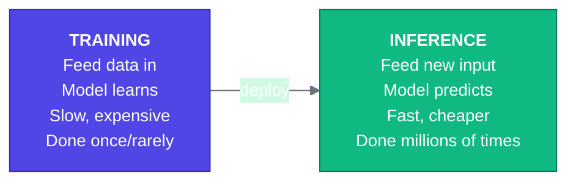
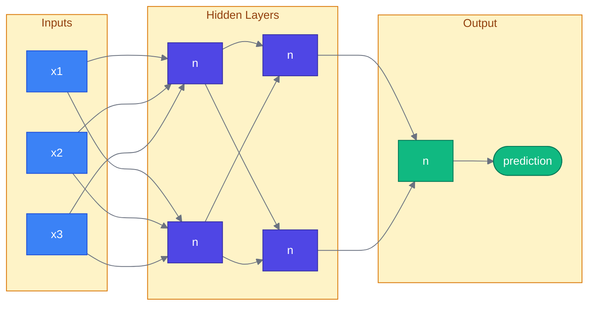
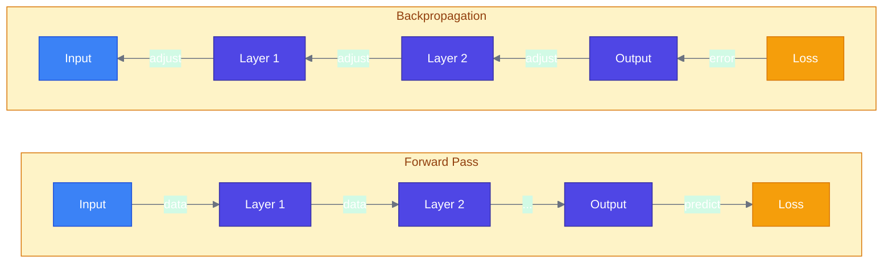
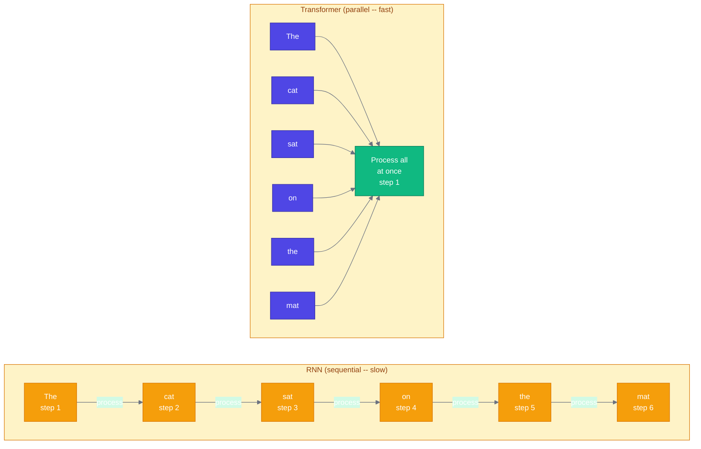
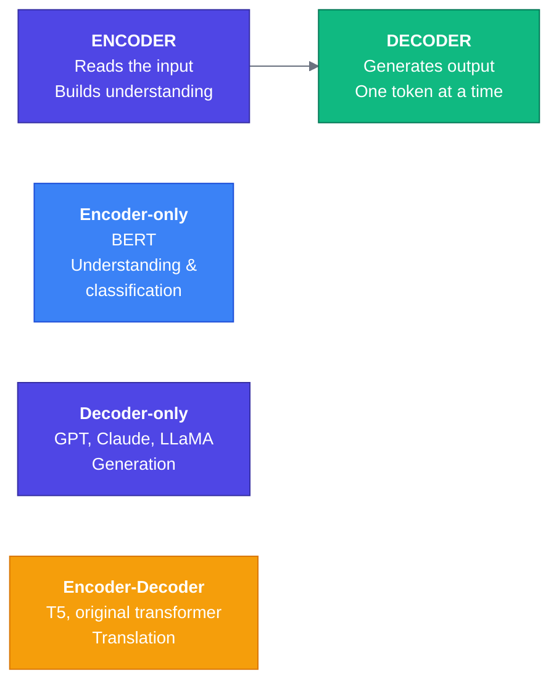
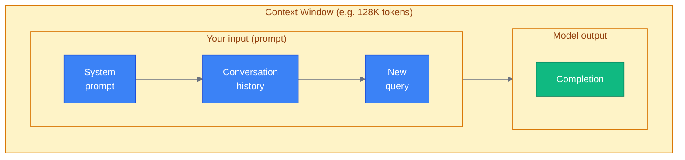

# Prerequisite 2: ML/AI Fundamentals

> **Reading time:** 15-20 minutes
> **Goal:** Build enough conceptual understanding of ML, neural networks, transformers, and LLMs to follow the rest of this course. No math required.
> **Note:** The appendix covers deep technical details. This document focuses on intuition and vocabulary.

---

## Table of Contents

1. [What is Machine Learning](#1-what-is-machine-learning)
2. [Neural Networks in 60 Seconds](#2-neural-networks-in-60-seconds)
3. [What are Transformers](#3-what-are-transformers)
4. [How LLMs Work](#4-how-llms-work)
5. [Key Vocabulary](#5-key-vocabulary)
6. [API-Based vs Self-Hosted](#6-api-based-vs-self-hosted)
7. [Cheat Sheet](#7-cheat-sheet)

---

## 1. What is Machine Learning

Machine learning is software that learns patterns from data instead of being explicitly programmed. Rather than writing rules by hand ("if the email contains 'free money', mark it as spam"), you give the system thousands of examples and let it figure out the rules on its own.

### Three Flavors of Learning

**Supervised Learning** -- You give the model labeled examples: inputs paired with correct outputs. "Here are 10,000 photos labeled 'cat' or 'dog' -- learn to tell them apart." The model finds patterns in the inputs that predict the labels. This is the most common type of ML in production and covers most business use cases: spam detection, recommendation systems, medical diagnosis, and more.

**Unsupervised Learning** -- You give the model data with no labels and ask it to find structure on its own. "Here are 100,000 customer purchase histories -- find natural groupings." The model might discover that customers cluster into segments (bargain hunters, brand loyalists, impulse buyers) without being told those categories exist. Common uses include clustering, anomaly detection, and dimensionality reduction.

**Reinforcement Learning** -- The model learns by trial and error in an environment, receiving rewards or penalties for its actions. Think of training a dog: it tries something, gets a treat or a correction, and adjusts. This is how game-playing AIs (like AlphaGo) are trained, and it plays a key role in making LLMs more helpful (more on RLHF later).

### Classification vs Regression

These are the two main types of supervised learning tasks:

```
Classification: "Which category does this belong to?"
  - Is this email spam or not spam?          (binary)
  - Is this image a cat, dog, or bird?       (multi-class)
  Output: a category label

Regression: "What number should this be?"
  - What will this house sell for?            ($425,000)
  - How many minutes until the bus arrives?   (7.3 min)
  Output: a continuous number
```

### Training vs Inference

Two distinct phases in the life of any ML model:



- **Training** is the learning phase. You feed the model data, it adjusts itself, and this typically takes hours to months on expensive hardware.
- **Inference** is the using phase. You send the trained model a new input and it produces a prediction. This is what happens every time you call an API.

### Overfitting and Underfitting

Two common failure modes:

- **Overfitting** -- The model memorized the training data instead of learning general patterns. It performs great on data it has seen but poorly on new data. Like a student who memorizes answers to practice problems but cannot solve new ones.
- **Underfitting** -- The model is too simple to capture the patterns in the data. It performs poorly on everything. Like trying to draw a curve with a straight line.

The goal is the sweet spot: a model that generalizes well to new, unseen data.

---

## 2. Neural Networks in 60 Seconds

Neural networks are the architecture behind modern AI. Here is just enough vocabulary to follow conversations about them.

### The Building Blocks



- **Neuron** -- A tiny function that takes numbers in, multiplies them by weights, adds them up, and passes the result through an activation function. It is loosely inspired by biological neurons but the analogy should not be taken too far.
- **Weights** -- The knobs the model adjusts during training. A model with "70 billion parameters" has 70 billion of these knobs.
- **Layer** -- A group of neurons operating at the same stage. The input layer receives data, hidden layers process it, and the output layer produces the result.
- **Activation function** -- A function applied after the weighted sum that introduces non-linearity. Without it, stacking layers would be pointless (a stack of linear functions is just another linear function). Common ones: ReLU, sigmoid, softmax.

### Forward Pass and Backpropagation



- **Forward pass** -- Data flows through the network, layer by layer, producing a prediction.
- **Loss** -- A number measuring how wrong the prediction was (lower is better).
- **Backpropagation** -- The error signal flows backward through the network, and each weight is nudged slightly to reduce the error. Repeat this millions of times with lots of data and the model learns.

That is it. Everything else in deep learning -- CNNs, RNNs, transformers -- is variations on this basic loop: forward pass, measure error, adjust weights, repeat.

---

## 3. What are Transformers

The transformer is the architecture behind GPT, Claude, LLaMA, and virtually every modern LLM. Introduced in the 2017 paper "Attention Is All You Need," it replaced older architectures (RNNs/LSTMs) and unlocked the current AI wave.

### Why Transformers Replaced RNNs

Older models (RNNs) processed text one word at a time, left to right, like reading a sentence sequentially:



Transformers process all words simultaneously, as shown above.

This parallelization is why transformers can be trained on massive datasets using hundreds of GPUs. RNNs could not scale this way.

### The Attention Mechanism (Intuitive Explanation)

Attention is the core innovation. The idea is simple: **when processing a word, the model looks at every other word in the sentence to figure out what is relevant.**

Consider: *"The animal didn't cross the street because it was too tired."*

What does "it" refer to? A human knows "it" = "the animal." The attention mechanism lets the model figure this out by computing a relevance score between "it" and every other word:

```
                         Attention scores for "it"
  +-----------------------------------------------------------------+
  | The    | animal | didn't | cross | the  | street | because | it |
  |  0.02  |  0.71  |  0.01  | 0.01  | 0.02 |  0.08  |  0.01   | -- |
  +-----------------------------------------------------------------+
                ^
                |
        highest score -- "it" attends most strongly to "animal"
```

This is called **self-attention**: every token looks at every other token in the sequence to understand context. It happens across multiple "attention heads" in parallel, each potentially capturing different relationships (one head might track grammar, another might track meaning, another might track position).

### Encoder vs Decoder

The original transformer had two halves:



**For this course, the models that matter most are decoder-only** -- these are the LLMs you will be building with. They generate text one token at a time, left to right.

---

## 4. How LLMs Work

Large Language Models (LLMs) are transformer-based models trained on enormous amounts of text. Here is how they are built and what makes them tick.

### Pre-Training: Next Token Prediction

The core training objective is deceptively simple: **predict the next word.**

```
Input:   "The capital of France is"
Target:  "Paris"

Input:   "def fibonacci(n):\n    if n <= 1:\n        return"
Target:  "n"
```

The model sees trillions of tokens from books, websites, code, and more. At each position, it predicts the next token, gets told the right answer, and adjusts its weights. Through billions of these tiny lessons, the model learns grammar, facts, reasoning patterns, coding conventions, and much more.

This is the pre-training phase. It produces a **base model** -- a powerful text predictor that is not yet tuned for conversation.

### Scale: Parameters, Data, and Compute

What makes LLMs "large" is scale across three dimensions:

```
+------------------+-------------------+---------------------+
| Parameters       | Training Data     | Compute             |
+------------------+-------------------+---------------------+
| GPT-2:    1.5B   | ~40 GB text       | Days on 1 machine   |
| GPT-3:    175B   | ~570 GB text      | Weeks on clusters   |
| GPT-4:    ~1T+   | ~13T tokens (est) | Months on thousands |
|                  |                   |   of GPUs           |
+------------------+-------------------+---------------------+
```

A rough intuition: more parameters = more capacity to store patterns, more data = more patterns to learn, more compute = more time to absorb them. Scaling all three together is what unlocked modern LLM capabilities.

### Emergent Abilities

As models scale, they develop capabilities that were not explicitly trained for. Smaller models cannot do them at all, then at some threshold they suddenly can:

- Few-shot learning (learning from examples in the prompt)
- Chain-of-thought reasoning
- Code generation
- Translation between languages never seen paired together

This is one reason LLMs surprised the field -- their abilities are not always predictable from smaller experiments.

### The Training Pipeline

Modern LLMs go through multiple stages:

```mermaid
%%{init: {'theme': 'base', 'themeVariables': {'primaryColor': '#4F46E5', 'primaryTextColor': '#FFFFFF', 'primaryBorderColor': '#3730A3', 'secondaryColor': '#D1FAE5', 'secondaryTextColor': '#065F46', 'secondaryBorderColor': '#059669', 'tertiaryColor': '#FEF3C7', 'tertiaryTextColor': '#92400E', 'tertiaryBorderColor': '#D97706', 'lineColor': '#6B7280', 'textColor': '#1F2937', 'fontSize': '14px'}}}%%
flowchart LR
    PT["<b>PRE-TRAINING</b><br/>Next-token prediction<br/>on internet text<br/><i>Raw knowledge</i><br/>&#8594; Base model"]
    FT["<b>FINE-TUNING</b><br/>Instruction following<br/>on curated Q&amp;A examples<br/><i>Learns to be a<br/>helpful assistant</i><br/>&#8594; SFT model"]
    RLHF["<b>RLHF</b><br/>Human feedback to<br/>align with human values<br/><i>Learns to be safe,<br/>honest, and useful</i><br/>&#8594; Aligned model"]
    PT --> FT --> RLHF

    classDef service fill:#4F46E5,stroke:#3730A3,color:#FFFFFF
    classDef data fill:#10B981,stroke:#047857,color:#FFFFFF
    classDef external fill:#F59E0B,stroke:#D97706,color:#FFFFFF
    class PT service
    class FT data
    class RLHF external
```



- **Pre-training** creates a powerful text predictor (base model).
- **Fine-tuning (SFT)** teaches it to follow instructions and hold conversations using curated examples.
- **RLHF (Reinforcement Learning from Human Feedback)** trains the model to produce responses that humans rate as helpful, honest, and harmless. Human raters compare pairs of outputs, and the model learns to prefer the better one.

### Tokenization

LLMs do not see words. They see **tokens** -- chunks of text that may be whole words, parts of words, or even individual characters.

```
"Tokenization is fascinating!"

Possible tokens:  ["Token", "ization", " is", " fasci", "nating", "!"]
                    (6 tokens)

"Hello"       -> ["Hello"]           (1 token)
"unbelievable"-> ["un", "believ", "able"]  (3 tokens)
"  "          -> [" ", " "]          (2 tokens)
```

Why this matters for engineers:
- **Billing** -- API pricing is per token, not per word.
- **Limits** -- Context windows are measured in tokens.
- **Behavior** -- The model "thinks" in tokens, which can cause quirks (e.g., it may struggle with character-level tasks like counting letters because "strawberry" might be two tokens, not individual letters).

### Context Windows

The context window is the total number of tokens the model can consider at once -- both your input and its output combined.



- Early GPT-3: 4K tokens (roughly 3,000 words)
- GPT-4 Turbo / Claude 3: 128K-200K tokens (a whole novel)
- Some models: 1M+ tokens

Context window size matters for production systems because it determines how much information you can feed the model per request.

### Temperature and Sampling

When an LLM predicts the next token, it assigns a probability to every possible token. **Temperature** controls how those probabilities are used:

```
Prompt: "The best programming language is"

Next token probabilities:
  "Python"     : 35%
  "JavaScript" : 20%
  "depends"    : 15%
  "Rust"       : 10%
  ...

Temperature = 0 (deterministic):
  Always picks "Python" (highest probability).
  Same input = same output every time.

Temperature = 0.7 (moderate):
  Usually picks high-probability tokens but allows variety.
  Good for creative tasks.

Temperature = 1.5 (high):
  Much more random. Might pick unlikely tokens.
  Can produce creative but incoherent output.
```

**For production systems**, low temperature (0-0.3) is typical when you want reliable, consistent results (e.g., extracting structured data). Higher temperature (0.5-1.0) is used when you want variety (e.g., creative writing, brainstorming).

Other sampling parameters you may encounter: **top-p** (nucleus sampling -- only consider tokens whose cumulative probability reaches p), **top-k** (only consider the k most likely tokens), **frequency penalty** (discourage repetition).

---

## 5. Key Vocabulary

| Term | Definition |
|------|-----------|
| **Token** | The smallest unit an LLM processes -- typically a word or word fragment, roughly 3/4 of a word in English. |
| **Embedding** | A dense vector (list of numbers) that represents a token, word, or document in a way that captures its meaning. Similar items have similar embeddings. |
| **Parameters** | The learned weights of a model. "A 70B model" has 70 billion parameters. More parameters generally means more capacity. |
| **Inference** | Running a trained model to produce output from new input. Every API call is an inference request. |
| **Fine-tuning** | Additional training of a pre-trained model on a smaller, specialized dataset to adapt it for a specific task or domain. |
| **Prompt** | The input text you send to an LLM -- including system instructions, context, and the user query. |
| **Completion** | The output text the LLM generates in response to a prompt. |
| **Context window** | The maximum number of tokens (input + output) a model can handle in a single request. |
| **Hallucination** | When the model generates text that sounds confident but is factually wrong or entirely fabricated. |
| **Grounding** | Techniques to anchor model output in verified data (documents, databases, APIs) to reduce hallucination. |
| **RAG (Retrieval-Augmented Generation)** | A pattern where you retrieve relevant documents first, then include them in the prompt so the model can answer based on real data instead of relying on training alone. |

---

## 6. API-Based vs Self-Hosted

When building with LLMs, the first architectural decision is: **call someone else's model or run your own?**

### API-Based (Managed)

You send requests to a provider's endpoint and get responses back.

```
Your App  ----HTTP request----->  Provider's API  ----->  Their GPUs
          <---HTTP response----   (OpenAI, Anthropic)     Their model
```

**Major providers:**
- **OpenAI** -- GPT-4, GPT-4o, o1, o3 series. The most widely adopted.
- **Anthropic** -- Claude 3.5, Claude 4 series. Strong on safety, long context, and code.
- **Google** -- Gemini series. Tight integration with Google Cloud.

**When it makes sense:**
- You want to get started fast with minimal infrastructure.
- You do not have ML/GPU expertise on the team.
- You need top-tier model quality and are willing to pay per token.
- Your data handling policies allow sending data to a third party.

### Self-Hosted (Open Source)

You download model weights and run them on your own hardware.

```
Your App  ----local call----->  Your GPU server  ----->  Your hardware
          <---response-------   (vLLM, TGI, Ollama)     Your model
```

**Popular open-source models:**
- **LLaMA (Meta)** -- LLaMA 3 series. Strong general-purpose performance.
- **Mistral** -- Mistral, Mixtral series. Efficient, strong for their size.
- **Others** -- Qwen, DeepSeek, Gemma, Phi, and many more.

**When it makes sense:**
- Data privacy requirements prevent sending data to external APIs.
- You need to run at very high volume where API costs become prohibitive.
- You want full control over the model (custom fine-tuning, no content filters).
- You need to run in air-gapped or edge environments.

### Quick Comparison

```
+--------------------+------------------+-------------------+
|                    |   API-Based      |   Self-Hosted     |
+--------------------+------------------+-------------------+
| Setup time         | Minutes          | Days to weeks     |
| Upfront cost       | None             | GPU hardware      |
| Per-request cost   | Pay per token    | Fixed infra cost  |
| Model quality      | Best available   | Catching up fast  |
| Data privacy       | Data leaves you  | Data stays local  |
| Maintenance        | Provider handles | You handle it     |
| Customization      | Limited          | Full control      |
| Scaling            | Automatic        | You manage it     |
+--------------------+------------------+-------------------+
```

**For this course**, we primarily work with API-based models. Self-hosting is covered in later modules where it is relevant.

---

## 7. Cheat Sheet

### ML Fundamentals

| Concept | One-Liner |
|---------|-----------|
| Supervised learning | Learn from labeled examples (input-output pairs). |
| Unsupervised learning | Find patterns in unlabeled data. |
| Reinforcement learning | Learn by trial, error, and reward signals. |
| Classification | Predict a category. |
| Regression | Predict a number. |
| Training | The model learns from data (slow, expensive, done rarely). |
| Inference | The model produces predictions (fast, done constantly). |
| Overfitting | Memorized training data, fails on new data. |
| Underfitting | Too simple to capture patterns, fails on everything. |

### Neural Network Vocabulary

| Concept | One-Liner |
|---------|-----------|
| Neuron | A function that computes a weighted sum and applies an activation. |
| Weight/Parameter | A tunable number the model adjusts during training. |
| Layer | A group of neurons at one stage of processing. |
| Activation function | Adds non-linearity so the network can learn complex patterns. |
| Forward pass | Data flows through the network to produce a prediction. |
| Backpropagation | Error flows backward to adjust weights. |
| Loss | A number measuring how wrong the prediction was. |

### Transformer and LLM Concepts

| Concept | One-Liner |
|---------|-----------|
| Transformer | The neural network architecture behind all modern LLMs. |
| Self-attention | Each token computes relevance scores with every other token. |
| Encoder | Reads and understands input (used in BERT-style models). |
| Decoder | Generates output one token at a time (used in GPT/Claude). |
| Pre-training | Learning from massive text via next-token prediction. |
| Fine-tuning (SFT) | Adapting a base model with curated instruction-following data. |
| RLHF | Using human feedback to align model behavior with human preferences. |
| Tokenization | Splitting text into sub-word chunks the model can process. |
| Context window | Max tokens (input + output) per request. |
| Temperature | Controls randomness: 0 = deterministic, higher = more random. |
| Top-p / Top-k | Alternative sampling strategies that limit token selection. |

### Key Terms for Engineers

| Term | One-Liner |
|------|-----------|
| Token | A word or sub-word chunk; the unit of LLM processing and billing. |
| Embedding | A vector of numbers representing meaning; similar things are close together. |
| Prompt | Everything you send to the model (system instructions + user input). |
| Completion | The model's generated response. |
| Hallucination | Confident-sounding output that is factually wrong or made up. |
| Grounding | Anchoring output in verified data to reduce hallucination. |
| RAG | Retrieve relevant docs, stuff them in the prompt, then generate. |
| API-based | Call a provider's model over HTTP (OpenAI, Anthropic, Google). |
| Self-hosted | Run open-source model weights on your own infrastructure. |

---

**Next:** [Prerequisite 3 >>](./03-python-environment-setup.md)
