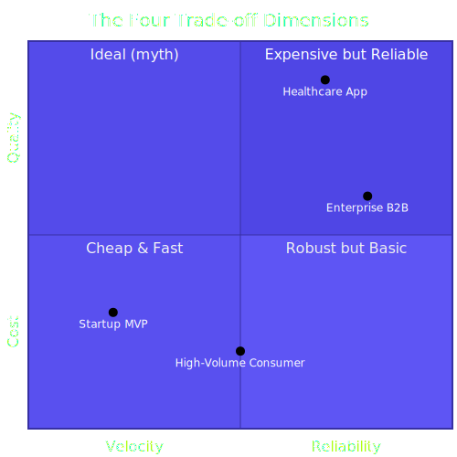

<!-- _class: lead -->

# Chapter 1
## The Production AI Landscape

Building Production AI Systems — Week 1

---

# 1.1 The Demo-to-Production Gap

Every AI project begins the same way: **excitement**.

- You prompt a model, it generates something impressive
- Your CEO wants it shipped yesterday
- Your PM asks, _"How hard could it be?"_

**Very hard, it turns out.**

---

<!-- _class: diagram -->

# The Demo-to-Production Journey


---

# Why Projects Fail

The failure rate for AI projects is **strikingly high**:

- **80%+** of AI projects fail (RAND Corporation) — 2x the rate of non-AI IT projects
- **88%** of AI proof-of-concepts never reach production (IDC)
- Only **~5%** of GenAI initiatives deliver sustained business impact (MIT, 2025)

---

# Common Failure Modes

| Failure Mode | Example |
|--------------|---------|
| **Cost Overruns** | Uncontrolled API spending, no rate limiting or cost caps |
| **Quality Regressions** | Model updates or prompt changes degrade user-facing output |
| **Security Incidents** | Prompt injection, jailbreaks, data leakage through LLM outputs |
| **Scaling Failures** | Systems that work for demos collapse under concurrent load |
| **Integration Issues** | AI components that can't connect to existing data and workflows |

---

# 1.2 Anatomy of Production AI Systems

A production AI system is **not just a model** — it's an ecosystem of components working together.

**Six critical layers:**
1. **Edge Layer** — Protects from internet chaos
2. **API Gateway** — Enforces policies, validates requests
3. **Application Layer** — Orchestrates business logic
4. **Service Layer** — Implements AI capabilities
5. **Data Layer** — Stores and retrieves information
6. **Observability Layer** — Makes the system understandable

---

<!-- _class: diagram -->

# Production AI System Architecture



---

# 1.3 War Story: When AI Costs Spiral

> **Klarna's AI Customer Service Pivot (2024-2025)**

**The promise:** AI assistant replaced 700 customer service agents. Handled 2/3 of chats in month one. Projected **$40M annual savings**.

**The reality:** Users encountered:
- Inaccurate answers
- Robotic tone and circular interactions
- Inability to escalate to a human

**The outcome:** Klarna began **rehiring human agents** in 2025.

---

# Lessons from Klarna

1. **Cost optimization without quality monitoring is dangerous**
   Savings mean nothing if users leave

2. **AI needs guardrails and escalation paths**
   Not every request can be handled by a model

3. **Evaluation systems are essential**
   You can't improve what you don't measure

4. **Human-in-the-loop matters**
   Hybrid systems often outperform pure AI or pure human

5. **Observability is not optional**
   Detect quality regressions before users do

---

<!-- _class: diagram -->

# 1.4 The Trade-off Framework

Production AI engineering is fundamentally about **trade-offs**.



---

# Trade-off Decisions in Practice

| Scenario | Priority Order |
|----------|---------------|
| **Startup MVP** | Velocity > Reliability > Cost > Quality |
| **Healthcare Application** | Quality > Reliability > Cost > Velocity |
| **High-Volume Consumer App** | Cost > Reliability > Velocity > Quality |
| **Enterprise B2B** | Reliability > Quality > Cost > Velocity |

> Every team must **consciously choose** their trade-off priorities. The worst systems are those where trade-offs are made accidentally.

---

# Latency vs. Cost: Model Selection

```python
from enum import Enum
from dataclasses import dataclass

class ModelTier(Enum):
    FAST_CHEAP = "gpt-4o-mini"        # ~500ms, $0.15/$0.60 per 1M tokens
    BALANCED   = "gpt-4o"             # ~800ms, $2.50/$10 per 1M tokens
    QUALITY    = "claude-3-5-sonnet"  # ~1200ms, $3/$15 per 1M tokens
    MAXIMUM    = "claude-3-opus"      # ~2000ms, $15/$75 per 1M tokens

@dataclass
class RequestContext:
    user_tier: str          # "free", "paid", "enterprise"
    task_complexity: str    # "simple", "moderate", "complex"
    latency_budget_ms: int  # Maximum acceptable latency

def select_model(context: RequestContext) -> ModelTier:
    if context.user_tier == "enterprise":
        return ModelTier.QUALITY
    if context.task_complexity == "simple":
        return ModelTier.FAST_CHEAP
    if context.latency_budget_ms < 1000:
        return ModelTier.FAST_CHEAP
    return ModelTier.BALANCED
```

---

# Reliability vs. Velocity

| HIGH RELIABILITY REQUIRED | VELOCITY ACCEPTABLE |
|--------------------------|---------------------|
| User-facing features | Internal tools |
| Financial transactions | Experiments |
| Healthcare / safety-critical | Non-critical features |
| Data that can't be recovered | Features with easy rollback |
| Large blast radius changes | Small, isolated changes |

**Reliability practices:** Extensive testing, staged rollouts, manual review gates, runbooks

**Velocity practices:** Ship and iterate, feature flags, automated deployment, quick rollback

---

# 1.5 Modern AI Architecture Patterns

Three dominant patterns for production AI systems:

1. **Direct LLM Integration** — Simplest, direct API calls
2. **RAG** (Retrieval-Augmented Generation) — LLM + external knowledge
3. **Agentic Systems** — AI that takes actions and uses tools

Each pattern has distinct trade-offs in complexity, cost, and capability.

---

<!-- _class: diagram -->

# Pattern 1: Direct LLM Integration


**Use when:** Simple chatbots, content generation, straightforward Q&A

**Avoid when:** Need for custom knowledge, complex reasoning, high reliability

> The simplest pattern. Start here, add complexity only when needed.

---

<!-- _class: diagram -->

# Pattern 2: RAG (Retrieval-Augmented Generation)



**Use when:** Customer support, documentation Q&A, knowledge bases
**Avoid when:** Real-time data needs, highly creative tasks

---

<!-- _class: diagram -->

# Pattern 3: Agentic Systems



**Use when:** Complex multi-step tasks, code generation, research
**Avoid when:** Simple queries, latency-critical applications

---

<!-- _class: lead -->

# Key Takeaways — Chapter 1

- Production AI is **fundamentally different** from demo AI
- Every decision involves **trade-offs** — make them consciously
- Architecture patterns: **Direct → RAG → Agentic** (increasing complexity)
- Build **observability** in from day one
