<!-- _class: lead -->

# Chapter 2
## Generative AI Technical Review

Building Production AI Systems — Week 1

---

# 2.1 Transformer Architecture Refresher

Before building production systems, let's ensure a solid understanding of **what we're deploying**.

Key stages of a forward pass:

1. **Tokenization** — Text → Token IDs
2. **Embedding + Positional Encoding** — Token IDs → Vectors
3. **Transformer Blocks** (x N) — Self-Attention → Feed-Forward
4. **Output Head + Softmax** — Predict next token

---

<!-- _class: diagram -->

# Transformer Architecture



---

# 2.2 Key Concepts for Production

## Context Windows and Token Limits

Understanding token limits is **critical** for production systems:

- **Context window** = total tokens allowed (input + output)
- **Output limit** = max tokens the model can generate
- Exceeding limits → truncated context or API errors
- Unexpected token counts are often the **first sign** of prompt injection or bugs

---

# Token Costs by Model

```python
from dataclasses import dataclass

@dataclass
class ModelContext:
    name: str
    context_window: int
    output_limit: int
    cost_per_1k_input: float
    cost_per_1k_output: float

MODELS = {
    "gpt-4o": ModelContext("gpt-4o", 128_000, 16_384, 0.0025, 0.010),
    "claude-3-5-sonnet": ModelContext(
        "claude-3-5-sonnet", 200_000, 8_192, 0.003, 0.015
    ),
    "gpt-4o-mini": ModelContext(
        "gpt-4o-mini", 128_000, 16_384, 0.00015, 0.0006
    ),
}

def estimate_cost(model: str, input_tokens: int, output_tokens: int) -> float:
    config = MODELS[model]
    return (
        (input_tokens / 1000) * config.cost_per_1k_input +
        (output_tokens / 1000) * config.cost_per_1k_output
    )

# Typical RAG query: 2500 input tokens, 1000 output tokens
cost = estimate_cost("gpt-4o", 2500, 1000)  # ~$0.0163
```

---

# API-Based vs. Self-Hosted Models

| Dimension | API-Based | Self-Hosted |
|-----------|-----------|-------------|
| **Setup Time** | Minutes | Days to Weeks |
| **Upfront Cost** | $0 | $10K-$500K (GPUs) |
| **Marginal Cost** | $0.00015-$0.015 / 1K tok | Compute + Ops |
| **Latency** | 500ms-3s | 100ms-1s |
| **Data Privacy** | Data leaves your infra | Data stays local |
| **Customization** | Prompting, some fine-tuning | Full control |
| **Reliability** | Provider SLA (99.9%) | Your responsibility |
| **Best For** | Most use cases, MVPs | High volume, privacy reqs |

---

<!-- _class: diagram -->

# Decision Flowchart: API vs. Self-Hosted



> **Rule of thumb:** Start with APIs. Consider self-hosting when scale demands it.

---

# 2.3 Development Environment Setup

## Application Settings with Pydantic

```python
# src/config/settings.py
from functools import lru_cache
from pydantic_settings import BaseSettings, SettingsConfigDict
from pydantic import Field, SecretStr

class Settings(BaseSettings):
    model_config = SettingsConfigDict(
        env_file=".env", env_file_encoding="utf-8", case_sensitive=False,
    )
    # Application
    app_name: str = "Production AI System"
    debug: bool = False
    log_level: str = "INFO"
    # LLM Providers
    openai_api_key: SecretStr = Field(..., description="OpenAI API key")
    anthropic_api_key: SecretStr | None = None
    # Defaults
    default_model: str = "gpt-4o-mini"
    default_temperature: float = 0.7
    default_max_tokens: int = 1024
    # Cost controls
    max_tokens_per_request: int = 4096
    daily_cost_limit_usd: float = 100.0

@lru_cache
def get_settings() -> Settings:
    return Settings()
```

---

# LLM Service: Provider Abstraction

```python
# src/services/llm.py — Core abstractions
@dataclass
class LLMResponse:
    content: str
    model: str
    input_tokens: int
    output_tokens: int
    latency_ms: float
    cost_usd: float = field(default=0.0)

class LLMProvider(ABC):
    @abstractmethod
    async def generate(self, messages, model=None, **kwargs) -> LLMResponse:
        ...
    @abstractmethod
    async def stream(self, messages, model=None, **kwargs) -> AsyncIterator[str]:
        ...
```

Key design decisions:
- **Standardized response** with cost tracking built in
- **Abstract provider** — swap OpenAI / Anthropic without changing app code
- **Async-first** — production systems need non-blocking I/O

---

# LLM Service: Retries and Fallback

```python
class LLMService:
    def __init__(self, primary: LLMProvider, fallback: LLMProvider | None = None,
                 max_retries: int = 3):
        self.primary = primary
        self.fallback = fallback
        self.max_retries = max_retries

    async def generate(self, messages, **kwargs) -> LLMResponse:
        last_error = None
        for attempt in range(self.max_retries):
            try:
                return await self.primary.generate(messages, **kwargs)
            except RateLimitError as e:
                last_error = e
                await asyncio.sleep(2 ** attempt)  # Exponential backoff
            except APIError as e:
                last_error = e
                if attempt == self.max_retries - 1 and self.fallback:
                    return await self.fallback.generate(messages, **kwargs)
                await asyncio.sleep(1)
        raise last_error
```

**Production patterns:** Retry with backoff → Fallback provider → Raise

---

# 2.4 Hands-On: First Production Endpoint

## Request / Response Models

```python
# src/api/chat.py
from pydantic import BaseModel, Field, field_validator

class ChatMessage(BaseModel):
    role: str = Field(..., pattern="^(system|user|assistant)$")
    content: str = Field(..., min_length=1, max_length=32000)

class ChatRequest(BaseModel):
    messages: list[ChatMessage] = Field(..., min_length=1, max_length=100)
    model: str | None = None
    temperature: float = Field(default=0.7, ge=0.0, le=2.0)
    max_tokens: int = Field(default=1024, ge=1, le=4096)
    stream: bool = False

    @field_validator("messages")
    @classmethod
    def validate_messages(cls, v):
        if v[0].role not in ("system", "user"):
            raise ValueError("First message must be system or user")
        return v

class ChatResponse(BaseModel):
    content: str
    model: str
    usage: dict[str, int]
    latency_ms: float
```

---

# Chat Completion Endpoint

```python
router = APIRouter(prefix="/chat", tags=["chat"])

@router.post("/completions", response_model=ChatResponse)
async def create_chat_completion(
    request: ChatRequest,
    llm_service: LLMService = Depends(get_llm_service),
) -> ChatResponse:
    settings = get_settings()
    if request.max_tokens > settings.max_tokens_per_request:
        raise HTTPException(400, f"max_tokens exceeds {settings.max_tokens_per_request}")

    messages = [{"role": m.role, "content": m.content} for m in request.messages]
    response = await llm_service.generate(
        messages=messages,
        model=request.model,
        temperature=request.temperature,
        max_tokens=request.max_tokens,
    )
    return ChatResponse(
        content=response.content,
        model=response.model,
        usage={
            "input_tokens": response.input_tokens,
            "output_tokens": response.output_tokens,
            "total_tokens": response.input_tokens + response.output_tokens,
        },
        latency_ms=response.latency_ms,
    )
```

---

# Streaming Endpoint

```python
@router.post("/completions/stream")
async def create_chat_completion_stream(
    request: ChatRequest,
    llm_service: LLMService = Depends(get_llm_service),
) -> StreamingResponse:
    async def event_generator():
        messages = [{"role": m.role, "content": m.content}
                    for m in request.messages]
        async for token in llm_service.primary.stream(
            messages=messages,
            model=request.model,
            temperature=request.temperature,
            max_tokens=request.max_tokens,
        ):
            yield f"data: {token}\n\n"
        yield "data: [DONE]\n\n"

    return StreamingResponse(event_generator(), media_type="text/event-stream")
```

> Server-Sent Events (SSE) — the standard for real-time LLM streaming.

---

# Application Entry Point

```python
# src/main.py
from fastapi import FastAPI
from fastapi.middleware.cors import CORSMiddleware

app = FastAPI(title=settings.app_name, debug=settings.debug)

app.add_middleware(
    CORSMiddleware,
    allow_origins=["*"],  # Tighten for production
    allow_credentials=True,
    allow_methods=["*"],
    allow_headers=["*"],
)

app.include_router(chat.router, prefix="/api/v1")

@app.get("/health")
async def health_check():
    return {"status": "healthy"}
```

**What this sets up:**
- Health check for load balancer probes
- CORS for frontend integration
- Versioned API prefix (`/api/v1`)

---

<!-- _class: lead -->

# Week 1 Summary

---

# What We Covered

1. **The production gap** — Demos ≠ Products
2. **System architecture** — The 6 layers of production AI
3. **Trade-off frameworks** — Cost, latency, quality, reliability
4. **Architecture patterns** — Direct, RAG, Agentic
5. **Technical foundations** — Transformers, tokens, model selection
6. **Practical setup** — Production-ready FastAPI application

## Key Takeaways

- Production AI is fundamentally different from demo AI
- Every decision involves trade-offs — **make them consciously**
- Start with APIs, consider self-hosting when scale demands it
- Build **observability** in from day one
