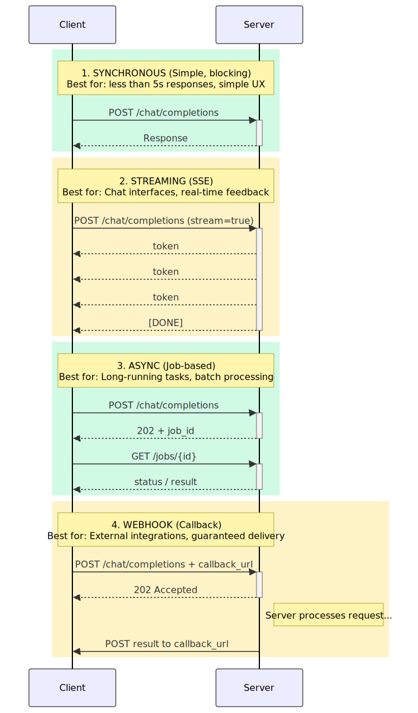

<!-- _class: lead -->

# Chapter 3
## The FastAPI + Pydantic Stack
### Building Production AI Backends

---

## 3.1 Why FastAPI for AI Systems

FastAPI has become the **de facto standard** for AI application backends.

**Key advantages for AI workloads:**

1. **Native async support** -- Essential for parallel LLM calls
2. **Automatic OpenAPI documentation** -- Self-documenting APIs
3. **Pydantic integration** -- Type-safe request/response handling
4. **Dependency injection** -- Clean architecture patterns
5. **WebSocket support** -- Real-time streaming

---

## FastAPI Performance Comparison

| Framework | Requests/sec | Latency (p99) | Async Support |
|---|---|---|---|
| **FastAPI** | ~15,000 | ~10ms | Native |
| Flask | ~4,000 | ~40ms | Limited |
| Django | ~3,500 | ~50ms | Django 4.0+ |
| Express (Node.js) | ~12,000 | ~15ms | Native |

> Approximate figures for simple JSON responses on modern hardware.
> AI workloads are typically **I/O bound**, making async support more important than raw throughput.

---

## 3.2 Pydantic v2: Validation at Rust Speed

Pydantic v2 was **rewritten in Rust** -- 5-50x faster than v1.

This matters for AI systems where you validate many requests per second.

**Core features we will use:**

- `Field` constraints (`ge`, `le`, `max_length`, `pattern`)
- `field_validator` -- single-field validation
- `model_validator` -- cross-field validation
- `computed_field` -- derived properties
- `ConfigDict` -- model-level behavior

---

## Request Model: Message

```python
from pydantic import BaseModel, Field, field_validator, ConfigDict
from typing import Literal

class Message(BaseModel):
    """A chat message with role-based validation."""

    model_config = ConfigDict(
        str_strip_whitespace=True,  # Auto-strip whitespace
        str_min_length=1,           # No empty strings
    )

    role: Literal["system", "user", "assistant"]
    content: str = Field(..., max_length=100_000)
    name: str | None = Field(default=None, max_length=64)

    @field_validator("content")
    @classmethod
    def validate_content(cls, v: str) -> str:
        if "\x00" in v:
            raise ValueError("Content cannot contain null bytes")
        return v
```

---

## Request Model: ChatCompletionRequest (1/2)

```python
from pydantic import BaseModel, Field, model_validator, ConfigDict
from typing import Annotated

class ChatCompletionRequest(BaseModel):
    model_config = ConfigDict(extra="forbid")  # Reject unknown fields

    messages: list[Message] = Field(
        ..., min_length=1, max_length=1000,
        description="List of messages in the conversation"
    )
    model: str = Field(
        default="gpt-4o-mini",
        pattern=r"^[a-zA-Z0-9\-_.]+$",
    )
    temperature: Annotated[float, Field(ge=0.0, le=2.0, default=0.7)]
    max_tokens: Annotated[int, Field(ge=1, le=16384, default=1024)]
    top_p: Annotated[float, Field(ge=0.0, le=1.0, default=1.0)]
    stream: bool = Field(default=False)
    user: str | None = Field(default=None, max_length=256)
```

---

## Request Model: ChatCompletionRequest (2/2)

**Cross-field validation** catches problems early:

```python
    @model_validator(mode="after")
    def validate_request(self) -> "ChatCompletionRequest":
        """Cross-field validation."""
        total_content_length = sum(
            len(m.content) for m in self.messages
        )
        # Rough estimate: 4 chars per token
        estimated_tokens = total_content_length // 4 + self.max_tokens

        if estimated_tokens > 128_000:
            raise ValueError(
                "Request too large: estimated tokens exceed context window"
            )
        return self
```

> Validate early, fail fast -- don't waste LLM tokens on bad input.

---

## Request Model: EmbeddingRequest

```python
class EmbeddingRequest(BaseModel):
    model_config = ConfigDict(extra="forbid")

    input: str | list[str] = Field(..., description="Text(s) to embed")
    model: str = Field(
        default="text-embedding-3-small",
        pattern=r"^[a-zA-Z0-9\-_.]+$"
    )
    encoding_format: Literal["float", "base64"] = "float"
    dimensions: int | None = Field(default=None, ge=1, le=3072)

    @field_validator("input")
    @classmethod
    def validate_input(cls, v: str | list[str]) -> str | list[str]:
        if isinstance(v, str):
            if len(v) > 100_000:
                raise ValueError("Input text too long")
        else:
            if len(v) > 2048:
                raise ValueError("Too many texts in batch")
            if any(len(text) > 100_000 for text in v):
                raise ValueError("Individual text too long")
        return v
```

---

## Response Models: Usage and Choice

```python
from pydantic import BaseModel, Field, computed_field
from typing import Literal

class Usage(BaseModel):
    """Token usage statistics."""
    prompt_tokens: int
    completion_tokens: int

    @computed_field
    @property
    def total_tokens(self) -> int:
        return self.prompt_tokens + self.completion_tokens


class Choice(BaseModel):
    """A completion choice."""
    index: int
    message: dict[str, str]
    finish_reason: Literal["stop", "length", "content_filter", "null"]
```

---

## Response Model: ChatCompletionResponse

```python
class ChatCompletionResponse(BaseModel):
    """OpenAI-compatible chat completion response."""
    id: str = Field(..., pattern=r"^chatcmpl-[a-zA-Z0-9]+$")
    object: Literal["chat.completion"] = "chat.completion"
    created: int
    model: str
    choices: list[Choice]
    usage: Usage

    @computed_field
    @property
    def cost_usd(self) -> float:
        """Estimated cost in USD."""
        input_rates = {"gpt-4o": 0.0025, "gpt-4o-mini": 0.00015}
        output_rates = {"gpt-4o": 0.010, "gpt-4o-mini": 0.0006}
        in_rate = input_rates.get(self.model, 0.0025)
        out_rate = output_rates.get(self.model, 0.010)
        return (
            (self.usage.prompt_tokens / 1000) * in_rate +
            (self.usage.completion_tokens / 1000) * out_rate
        )
```

---

## Response Model: ErrorResponse

```python
class ErrorResponse(BaseModel):
    """Standardized error response."""
    error: str
    code: str
    request_id: str | None = None
    details: dict | None = None
```

> Every AI API should have a **consistent error format** -- clients need predictable structures to handle failures gracefully.

---

## 3.3 Request/Response Patterns for AI Endpoints

AI endpoints differ fundamentally from traditional CRUD APIs:

| Aspect | Traditional REST API | AI API |
|---|---|---|
| Example | `GET /users/123` | `POST /chat/completions` |
| Speed | Fast (10-50ms) | Slow (500-5000ms) |
| Behavior | Deterministic | Non-deterministic |
| Caching | Cacheable | Rarely cacheable |
| Payload size | Small (1-10KB) | Large (10-500KB) |
| Response shape | Fixed | Variable length |

---

<!-- _class: diagram -->

## Four API Patterns for AI Workloads



---

## Pattern Summary

| Pattern | Best For | Latency |
|---|---|---|
| **Synchronous** | Simple requests < 5s | Blocking |
| **Streaming (SSE)** | Chat UIs, real-time feedback | Progressive |
| **Async (Job-based)** | Long-running tasks, batch | Non-blocking |
| **Webhook** | External integrations | Callback-based |

> Most production AI systems use **streaming** for chat and **async jobs** for batch processing.

---

## 3.4 Dependency Injection Patterns

FastAPI's DI enables **clean, testable code**.

```python
from functools import lru_cache
from typing import Annotated
from fastapi import Depends

# Settings dependency
SettingsDep = Annotated[Settings, Depends(get_settings)]

# LLM Service (cached singleton)
@lru_cache
def get_llm_service() -> LLMService:
    return LLMService(primary_provider=OpenAIProvider())

LLMServiceDep = Annotated[LLMService, Depends(get_llm_service)]
```

> `Annotated` type aliases make dependencies **reusable and readable**.

---

## Dependency: Redis Connection

```python
from redis.asyncio import Redis
from typing import AsyncGenerator

async def get_redis(settings: SettingsDep) -> AsyncGenerator[Redis, None]:
    """Get Redis connection with automatic cleanup."""
    redis = Redis.from_url(settings.redis_url)
    try:
        yield redis
    finally:
        await redis.close()

RedisDep = Annotated[Redis, Depends(get_redis)]
```

> Generator-based dependencies handle **setup and teardown** automatically.

---

## Dependency: Rate Limiter

```python
class RateLimiter:
    """Token bucket rate limiter using Redis."""
    def __init__(self, requests: int = 100, window_seconds: int = 60):
        self.requests = requests
        self.window = window_seconds

    async def __call__(self, request: Request, redis: RedisDep,
                       settings: SettingsDep) -> None:
        client_id = request.client.host if request.client else "unknown"
        user_id = request.headers.get("X-User-ID", client_id)
        key = f"rate_limit:{user_id}"
        current = await redis.get(key)

        if current is not None and int(current) >= self.requests:
            raise HTTPException(status_code=429, detail="Rate limit exceeded",
                                headers={"Retry-After": str(self.window)})

        pipe = redis.pipeline()
        pipe.incr(key)
        pipe.expire(key, self.window)
        await pipe.execute()
```

---

## Dependency: Request Context

```python
class RequestContext:
    """Context for the current request."""
    def __init__(self, request: Request):
        self.request_id = request.headers.get(
            "X-Request-ID", f"req_{int(time.time() * 1000)}"
        )
        self.user_id = request.headers.get("X-User-ID")
        self.start_time = time.perf_counter()

    @property
    def elapsed_ms(self) -> float:
        return (time.perf_counter() - self.start_time) * 1000

RequestContextDep = Annotated[RequestContext, Depends(get_request_context)]

# Pre-configured rate limiters
default_rate_limit = RateLimiter(requests=100, window_seconds=60)
strict_rate_limit = RateLimiter(requests=10, window_seconds=60)
```

---

## 3.5 Error Handling Strategies

AI systems fail in **unique ways**. Define domain-specific error codes:

```python
class ErrorCode(str, Enum):
    VALIDATION_ERROR = "validation_error"
    RATE_LIMIT_EXCEEDED = "rate_limit_exceeded"
    MODEL_ERROR = "model_error"
    CONTEXT_LENGTH_EXCEEDED = "context_length_exceeded"
    CONTENT_FILTERED = "content_filtered"
    SERVICE_UNAVAILABLE = "service_unavailable"
    INTERNAL_ERROR = "internal_error"
    TIMEOUT = "timeout"
```

> These map to **specific failure modes** in LLM systems -- each requires a different recovery strategy.

---

## Custom Exception Hierarchy

```python
class AIError(Exception):
    """Base exception for AI-related errors."""
    def __init__(self, message: str, code: ErrorCode,
                 status_code: int = 500, details: dict | None = None):
        self.message = message
        self.code = code
        self.status_code = status_code
        self.details = details or {}

class ModelOverloadedError(AIError):
    def __init__(self, retry_after: int = 60):
        super().__init__(message="Model is currently overloaded.",
            code=ErrorCode.SERVICE_UNAVAILABLE, status_code=503,
            details={"retry_after": retry_after})

class ContextLengthError(AIError):
    def __init__(self, tokens_used: int, max_tokens: int):
        super().__init__(
            message=f"Context length exceeded: {tokens_used} > {max_tokens}",
            code=ErrorCode.CONTEXT_LENGTH_EXCEEDED, status_code=400,
            details={"tokens_used": tokens_used, "max_tokens": max_tokens})
```

---

## Error Handler Registration

```python
def setup_error_handlers(app):
    """Register error handlers with FastAPI app."""

    @app.exception_handler(AIError)
    async def handle_ai_error(request: Request, exc: AIError):
        return await ai_error_handler(request, exc)

    @app.exception_handler(HTTPException)
    async def handle_http_error(request: Request, exc: HTTPException):
        request_id = request.headers.get("X-Request-ID")
        return JSONResponse(status_code=exc.status_code,
            content=ErrorResponseBody(error=exc.detail,
                code="http_error", request_id=request_id).model_dump())

    @app.exception_handler(Exception)
    async def handle_unexpected_error(request: Request, exc: Exception):
        logger.exception("Unexpected error",
            extra={"request_id": request.headers.get("X-Request-ID")})
        return JSONResponse(status_code=500,
            content=ErrorResponseBody(error="An unexpected error occurred",
                code=ErrorCode.INTERNAL_ERROR).model_dump())
```

---

## Error Response Handler

```python
async def ai_error_handler(request: Request, exc: AIError) -> JSONResponse:
    """Handle AI-specific errors."""
    request_id = request.headers.get("X-Request-ID")

    logger.error(f"AI Error: {exc.code}", extra={
        "request_id": request_id,
        "error_code": exc.code,
        "details": exc.details,
    })

    return JSONResponse(
        status_code=exc.status_code,
        content=ErrorResponseBody(
            error=exc.message, code=exc.code,
            request_id=request_id, details=exc.details,
        ).model_dump(),
        headers={"X-Request-ID": request_id or "unknown"},
    )
```

> Always propagate `X-Request-ID` for **end-to-end traceability**.

---

<!-- _class: lead -->

# Key Takeaways -- Chapter 3

- **FastAPI** is the ideal framework for AI backends: async-native, Pydantic-integrated, self-documenting
- **Pydantic v2** (Rust-powered) gives you strict validation at minimal performance cost
- AI APIs need **four patterns**: sync, streaming, async jobs, and webhooks
- **Dependency injection** keeps services testable and composable
- Design **AI-specific error hierarchies** -- LLMs fail in ways CRUD apps never do
- Always validate early, fail fast, and return **structured error responses**
