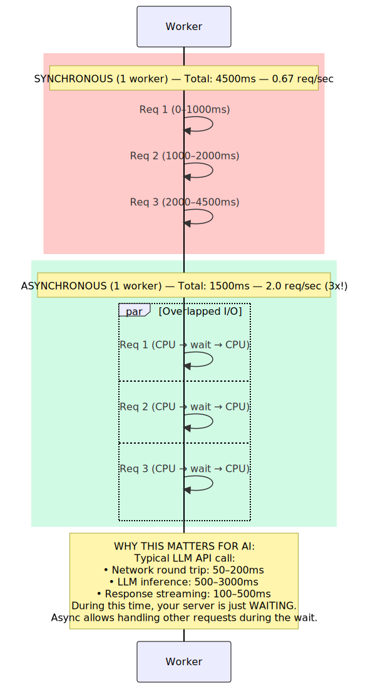

<!-- _class: lead -->

# Chapter 4
## Asynchronous AI Workloads
### Concurrency, Background Tasks, and Resilience

---

## 4.1 Understanding Async/Await in Python

AI workloads are **I/O-bound**. While waiting for an LLM response, your server could handle other requests.

**Typical LLM API call breakdown:**

| Phase | Duration |
|---|---|
| Network round trip | 50-200ms |
| LLM inference | 500-3000ms |
| Response streaming | 100-500ms |

During this time, your server is **just waiting**. Async allows handling other requests during the wait.

---

<!-- _class: diagram -->

## Synchronous vs Asynchronous Processing



---

## The Impact of Async

| Mode | Total Time (3 reqs) | Throughput |
|---|---|---|
| Synchronous | 4500ms | 0.67 req/sec |
| Asynchronous | 1500ms | 2.0 req/sec |

**3x throughput improvement** -- with the same single worker.

> For AI workloads where 90%+ of time is spent waiting on I/O, async is not optional -- it is **essential**.

---

## 4.2 Async Patterns for AI

### Pattern 1: Concurrent LLM Calls with Semaphore

```python
async def parallel_llm_calls(
    prompts: list[str],
    llm_service,
    max_concurrent: int = 5
) -> list[str]:
    """Run multiple LLM calls concurrently with limited parallelism."""
    semaphore = asyncio.Semaphore(max_concurrent)

    async def bounded_call(prompt: str) -> str:
        async with semaphore:
            messages = [{"role": "user", "content": prompt}]
            response = await llm_service.generate(messages)
            return response.content

    tasks = [bounded_call(prompt) for prompt in prompts]
    return await asyncio.gather(*tasks)
```

> The **semaphore** prevents overwhelming the LLM API with too many concurrent requests.

---

### Pattern 2: Timeout with Fallback

```python
async def with_timeout_fallback(
    primary: Coroutine[Any, Any, T],
    fallback: Callable[[], Coroutine[Any, Any, T]],
    timeout_seconds: float = 5.0
) -> T:
    """Try primary coroutine with timeout, fall back if needed."""
    try:
        return await asyncio.wait_for(primary, timeout=timeout_seconds)
    except asyncio.TimeoutError:
        return await fallback()

# Usage:
result = await with_timeout_fallback(
    expensive_gpt4_call(),
    lambda: cheap_gpt35_call(),
    timeout_seconds=3.0
)
```

> Use expensive models first; **fall back** to cheaper/faster ones on timeout.

---

### Pattern 3: Retry with Exponential Backoff

```python
async def retry_with_backoff(
    func: Callable[[], Coroutine[Any, Any, T]],
    max_retries: int = 3,
    base_delay: float = 1.0,
    max_delay: float = 60.0,
    exponential_base: float = 2.0,
    retryable_exceptions: tuple = (Exception,),
) -> T:
    """Retry an async function with exponential backoff."""
    last_exception = None

    for attempt in range(max_retries):
        try:
            return await func()
        except retryable_exceptions as e:
            last_exception = e
            if attempt == max_retries - 1:
                raise
            delay = min(
                base_delay * (exponential_base ** attempt), max_delay
            )
            await asyncio.sleep(delay)

    raise last_exception
```

---

### Pattern 4: Circuit Breaker

```python
class CircuitBreaker:
    """
    States:
    - CLOSED: Normal operation, requests pass through
    - OPEN: Failing fast, requests rejected immediately
    - HALF_OPEN: Testing if service recovered
    """
    def __init__(self, failure_threshold: int = 5,
                 recovery_timeout: float = 30.0,
                 half_open_max_calls: int = 3):
        self.failure_threshold = failure_threshold
        self.recovery_timeout = recovery_timeout
        self.failures = 0
        self.state = "CLOSED"
        self.last_failure_time = 0.0
```

> The circuit breaker **prevents cascading failures** when an upstream service is down.

---

### Circuit Breaker: Call Logic

```python
    async def call(self, func) -> T:
        """Execute function with circuit breaker protection."""
        if self.state == "OPEN":
            if time.time() - self.last_failure_time > self.recovery_timeout:
                self.state = "HALF_OPEN"
                self.half_open_calls = 0
            else:
                raise CircuitBreakerOpenError("Circuit breaker is OPEN")

        if self.state == "HALF_OPEN":
            if self.half_open_calls >= self.half_open_max_calls:
                raise CircuitBreakerOpenError("HALF_OPEN limit reached")
            self.half_open_calls += 1

        try:
            result = await func()
            self._on_success()  # Reset failures, close circuit
            return result
        except Exception:
            self._on_failure()  # Increment failures, maybe open
            raise
```

---

### Pattern 5: Streaming with Backpressure

```python
async def stream_with_backpressure(
    source,
    process_chunk: Callable[[str], Coroutine[Any, Any, None]],
    max_buffer: int = 100
):
    """Prevents memory issues when producer is faster than consumer."""
    buffer = asyncio.Queue(maxsize=max_buffer)

    async def producer():
        async for chunk in source:
            await buffer.put(chunk)  # Blocks if buffer full
        await buffer.put(None)       # Signal completion

    async def consumer():
        while True:
            chunk = await buffer.get()
            if chunk is None:
                break
            await process_chunk(chunk)
            buffer.task_done()

    await asyncio.gather(producer(), consumer())
```

> **Backpressure** keeps memory bounded when streaming LLM tokens to slow consumers.

---

## 4.3 Celery + Redis for Background AI Tasks

Long-running AI tasks should be processed **asynchronously** via a task queue.

<!-- _class: diagram -->



---

<!-- _class: diagram -->

## Task State Machine



**States:** PENDING --> STARTED --> RUNNING --> SUCCESS / FAILURE

---

## Celery Configuration

```python
celery_app = Celery("ai_tasks", broker=settings.redis_url,
                    backend=settings.redis_url)

celery_app.conf.update(
    task_serializer="json",
    task_track_started=True,
    task_time_limit=600,           # 10 minutes max
    task_soft_time_limit=540,      # Soft limit 9 minutes
    worker_prefetch_multiplier=1,  # One task at a time for AI
    worker_concurrency=4,
    result_expires=3600,           # 1 hour
    task_queues={
        "high": {"exchange": "high", "routing_key": "high"},
        "default": {"exchange": "default", "routing_key": "default"},
        "low": {"exchange": "low", "routing_key": "low"},
    },
    task_acks_late=True,           # Ack after completion
    task_reject_on_worker_lost=True,
)
```

> `worker_prefetch_multiplier=1` prevents workers from grabbing multiple AI tasks (which are heavy).

---

## AI Task: Chat Completion

```python
@celery_app.task(
    bind=True,
    autoretry_for=(Exception,),
    retry_backoff=True,
    retry_backoff_max=600,
    retry_jitter=True,
    max_retries=3,
)
def process_chat_completion(self, messages, model="gpt-4o-mini",
                            temperature=0.7, max_tokens=1024):
    try:
        self.update_state(state="PROCESSING",
                          meta={"status": "Calling LLM..."})
        llm_service = LLMService(primary_provider=OpenAIProvider())
        response = run_async(llm_service.generate(
            messages=messages, model=model,
            temperature=temperature, max_tokens=max_tokens))
        return {"status": "success", "content": response.content,
                "usage": {"input_tokens": response.input_tokens,
                          "output_tokens": response.output_tokens}}
    except SoftTimeLimitExceeded:
        return {"status": "timeout", "error": "Task exceeded time limit"}
```

---

## AI Task: Batch Embedding with Progress

```python
@celery_app.task(bind=True)
def batch_embed_documents(self, documents: list[str],
                          model="text-embedding-3-small",
                          batch_size: int = 100):
    total = len(documents)
    embeddings, errors = [], []
    embedding_service = EmbeddingService()

    for i in range(0, total, batch_size):
        batch = documents[i:i + batch_size]
        self.update_state(state="PROCESSING", meta={
            "current": i, "total": total,
            "status": f"Processing batch {i // batch_size + 1}"
        })
        try:
            batch_embeddings = run_async(
                embedding_service.embed_batch(batch, model=model))
            embeddings.extend(batch_embeddings)
        except Exception as e:
            errors.append({"batch_start": i, "error": str(e)})

    return {"status": "success" if not errors else "partial_success",
            "embeddings_count": len(embeddings), "errors": errors}
```

---

## Task Management API

```python
router = APIRouter(prefix="/tasks", tags=["tasks"])

@router.post("/chat/completions", response_model=TaskResponse)
async def create_async_chat(request: AsyncChatRequest) -> TaskResponse:
    """Returns immediately with task ID."""
    task = process_chat_completion.apply_async(
        kwargs={"messages": request.messages, "model": request.model,
                "temperature": request.temperature,
                "max_tokens": request.max_tokens},
        queue=request.priority)
    return TaskResponse(task_id=task.id, status="PENDING")

@router.get("/{task_id}", response_model=TaskStatusResponse)
async def get_task_status(task_id: str) -> TaskStatusResponse:
    result = AsyncResult(task_id, app=celery_app)
    response = TaskStatusResponse(task_id=task_id, status=result.status)
    if result.ready():
        response.result = result.get()
    elif result.info:
        response.progress = result.info
    return response
```

---

## 4.4 Dead Letter Handling and Retry Strategies

### Exponential Backoff Formula

> `delay = base_delay * (2 ^ attempt) + jitter`

| Attempt | Wait | Action |
|---|---|---|
| 1 | 1s | Retry |
| 2 | 2s | Retry |
| 3 | 4s | Retry |
| 4 | 8s | Give up (Dead Letter Queue) |

> **Jitter** prevents thundering herd -- all retries hitting the service at the same time.

---

<!-- _class: diagram -->

## Circuit Breaker State Machine



**Transitions:** CLOSED --5 failures--> OPEN --30s--> HALF_OPEN --success--> CLOSED

---

<!-- _class: diagram -->

## Dead Letter Queue Pattern



Failed tasks flow: **Primary Queue --> Retry Queue --> Dead Letter Queue --> Manual Review / Alerts**

---

## DeadLetterTask Base Class

```python
class DeadLetterTask(Task):
    """Base task class with dead letter queue support."""
    abstract = True
    max_retries = 3

    def on_failure(self, exc, task_id, args, kwargs, einfo):
        redis_client = Redis.from_url(settings.redis_url)
        dead_letter = {
            "task_id": task_id, "task_name": self.name,
            "args": args, "kwargs": kwargs,
            "exception": str(exc), "traceback": str(einfo),
            "failed_at": datetime.utcnow().isoformat(),
            "retries": self.request.retries,
        }
        redis_client.lpush("dead_letter_queue", json.dumps(dead_letter))

        # Alert on repeated failures
        failure_key = f"task_failures:{self.name}"
        failures = redis_client.incr(failure_key)
        redis_client.expire(failure_key, 3600)
        if failures >= 10:
            logger.critical(f"Task {self.name}: {failures} failures in 1h")
```

---

## Resilient Task and DLQ Processing

```python
@celery_app.task(
    base=DeadLetterTask, bind=True,
    autoretry_for=(Exception,),
    retry_backoff=True, retry_backoff_max=300, retry_jitter=True,
)
def resilient_llm_task(self, prompt: str) -> dict:
    """Task with full resilience: retry + dead letter on final failure."""
    try:
        pass  # Task implementation
    except Exception as e:
        if self.request.retries >= self.max_retries:
            raise MaxRetriesExceededError()
        raise

def process_dead_letters(batch_size: int = 10) -> list[dict]:
    """Process items from DLQ. Called manually or by scheduled job."""
    redis_client = Redis.from_url(settings.redis_url)
    processed = []
    for _ in range(batch_size):
        item = redis_client.rpop("dead_letter_queue")
        if not item:
            break
        dead_letter = json.loads(item)
        processed.append(dead_letter)
    return processed
```

---

<!-- _class: lead -->

# Key Takeaways -- Chapter 4

- **Async is essential** for I/O-bound AI workloads -- 3x+ throughput gains
- Five core async patterns: **semaphore concurrency, timeout fallback, retry backoff, circuit breaker, backpressure streaming**
- **Celery + Redis** provides robust background task processing with priority queues
- Use **exponential backoff with jitter** for retries -- never retry in a tight loop
- **Circuit breakers** prevent cascading failures when upstream services degrade
- **Dead letter queues** catch permanently failed tasks for manual review and alerting
- Design for failure: every LLM call can timeout, rate-limit, or error out
