<!-- _class: lead -->

# Chapter 6
## Advanced Evaluation Techniques

Building Production AI Systems — Week 3

---

# 6.1 LLM-as-Judge

When human evaluation is too slow or expensive, we can **use LLMs to evaluate LLM outputs**.

**Why?**
- Human evaluation is the gold standard but does not scale
- Automated metrics (BLEU, ROUGE) miss semantic quality
- LLM judges offer a **middle ground**: faster than humans, more nuanced than metrics

**Key question:** Can we trust a model to judge another model?

---

<!-- _class: diagram -->

# LLM-as-Judge Architecture



---

# Judge Modes

| Mode | Description |
|------|-------------|
| **Single Rating** | Rate one response on a 1-5 scale with justification |
| **Pairwise** | Compare response A vs B, pick the better one with reasoning |
| **Reference-based** | Compare response to a gold-standard reference |
| **Criteria-based** | Score on multiple dimensions independently |

Each mode requires a carefully designed **rubric template**.

---

# Evaluation Rubric: Single Rating

```python
SINGLE_RATING_RUBRIC = """You are evaluating an AI assistant's response.

## Criteria
- **Correctness (1-5)**: Is the information factually accurate?
- **Relevance (1-5)**: Does it answer the user's actual question?
- **Helpfulness (1-5)**: Is the response useful and actionable?
- **Safety (1-5)**: Is the response free from harmful content?

## Input
User Query: {query}
Assistant Response: {response}
{reference_section}

## Output Format
Respond with JSON:
{{"correctness": <1-5>, "relevance": <1-5>,
  "helpfulness": <1-5>, "safety": <1-5>,
  "overall": <1-5>, "reasoning": "<explanation>"}}"""
```

---

# Evaluation Rubric: Pairwise Comparison

```python
PAIRWISE_RUBRIC = """You are comparing two AI assistant responses.

## Task
Determine which response is better for the given query.

## Criteria
Consider: correctness, relevance, helpfulness, clarity, safety.

## Input
User Query: {query}
Response A: {response_a}
Response B: {response_b}

## Output Format
Respond with JSON:
{{"winner": "A" or "B" or "tie",
  "reasoning": "<explanation>",
  "a_strengths": [...], "b_strengths": [...],
  "a_weaknesses": [...], "b_weaknesses": [...]}}"""
```

---

# Evaluation Rubric: Factuality Check

```python
FACTUALITY_RUBRIC = """You are checking factual accuracy.

## Task
Verify if the response contains accurate information
based on the reference.

## Input
User Query: {query}
Response to Evaluate: {response}
Reference Information: {reference}

## Output Format
Respond with JSON:
{{"is_factual": true or false,
  "supported_claims": ["<claim 1>", ...],
  "unsupported_claims": ["<claim 1>", ...],
  "contradictions": ["<contradiction 1>", ...],
  "score": <0.0-1.0>}}"""
```

---

# Structured Output with Pydantic

```python
class SingleRatingResult(BaseModel):
    correctness: int = Field(ge=1, le=5)
    relevance: int = Field(ge=1, le=5)
    helpfulness: int = Field(ge=1, le=5)
    safety: int = Field(ge=1, le=5)
    overall: int = Field(ge=1, le=5)
    reasoning: str

class PairwiseResult(BaseModel):
    winner: Literal["A", "B", "tie"]
    reasoning: str
    a_strengths: list[str]
    b_strengths: list[str]
    a_weaknesses: list[str]
    b_weaknesses: list[str]

class FactualityResult(BaseModel):
    is_factual: bool
    supported_claims: list[str]
    unsupported_claims: list[str]
    contradictions: list[str]
    score: float = Field(ge=0.0, le=1.0)
```

---

# The LLMJudge Class

```python
class LLMJudge:
    def __init__(self, llm_service: LLMService,
                 judge_model: str = "gpt-4o"):
        self.llm = llm_service
        self.model = judge_model

    async def single_rating(self, query, response,
                            reference=None) -> SingleRatingResult:
        prompt = SINGLE_RATING_RUBRIC.format(
            query=query, response=response,
            reference_section=f"Reference: {reference}"
                              if reference else "")
        result = await self.llm.generate(
            messages=[{"role": "user", "content": prompt}],
            model=self.model, temperature=0.0)
        json_str = self._extract_json(result.content)
        return SingleRatingResult(**json.loads(json_str))

    async def pairwise_compare(self, query, response_a,
                               response_b) -> PairwiseResult:
        ...  # Same pattern with PAIRWISE_RUBRIC

    async def check_factuality(self, query, response,
                               reference) -> FactualityResult:
        ...  # Same pattern with FACTUALITY_RUBRIC
```

---

# Guardrails for LLM Judges

LLM judges have **known failure modes** that need mitigation:

| Problem | Solution |
|---------|----------|
| **Inconsistency** | Run multiple evaluations, check variance |
| **Position bias** | Swap response order, compare results |
| **Verbosity bias** | Longer responses rated higher unfairly |
| **Self-preference** | Models prefer their own outputs |

---

# Consistency Check

```python
class JudgeWithGuardrails:
    def __init__(self, base_judge: LLMJudge):
        self.judge = base_judge

    async def evaluate_with_consistency_check(
        self, query, response, n_evaluations=3
    ) -> SingleRatingResult:
        """Run multiple evaluations and check consistency."""
        results = []
        for _ in range(n_evaluations):
            result = await self.judge.single_rating(query, response)
            results.append(result)
        # Check consistency
        overalls = [r.overall for r in results]
        variance = sum((x - sum(overalls)/len(overalls))**2
                       for x in overalls) / len(overalls)
        if variance > 1.0:
            print(f"Warning: High variance in scores: {overalls}")
        # Return average
        return SingleRatingResult(
            correctness=round(sum(r.correctness for r in results)
                              / n_evaluations),
            ...)
```

---

# Position Bias Detection

```python
async def pairwise_with_position_swap(
    self, query, response_a, response_b
) -> PairwiseResult:
    """Run comparison twice with swapped positions."""
    # First comparison: A vs B
    result1 = await self.judge.pairwise_compare(
        query, response_a, response_b)

    # Second comparison: B vs A (swapped)
    result2 = await self.judge.pairwise_compare(
        query, response_b, response_a)

    # Map result2 back to original positions
    result2_mapped = ("A" if result2.winner == "B"
                      else "B" if result2.winner == "A"
                      else "tie")

    # If results disagree, flag position bias
    if result1.winner != result2_mapped:
        print(f"Position bias detected! "
              f"Original: {result1.winner}, Swapped: {result2_mapped}")
        return PairwiseResult(winner="tie",
            reasoning="Inconsistent across position swaps", ...)
    return result1
```

---

# 6.2 Building an Evaluation Pipeline

The pipeline orchestrates: **dataset loading, model inference, metric computation, judge evaluation, and reporting**.

```python
@dataclass
class EvalResult:
    """Result for a single evaluation example."""
    example_id: str
    input: str
    expected: str | None
    actual: str
    metrics: dict[str, MetricResult]
    judge_result: SingleRatingResult | None
    latency_ms: float
    passed: bool
    error: str | None = None
```

---

# EvalReport: Aggregated Results

```python
@dataclass
class EvalReport:
    dataset_name: str
    model: str
    total_examples: int
    passed: int
    failed: int
    errors: int
    avg_latency_ms: float
    metrics_summary: dict[str, float]
    judge_summary: dict[str, float] | None
    results: list[EvalResult]

    @property
    def pass_rate(self) -> float:
        return (self.passed / self.total_examples
                if self.total_examples > 0 else 0.0)

    def to_json(self, path: Path) -> None:
        """Save report to JSON for CI/CD integration."""
        ...
```

---

# EvalPipeline: Core Logic

```python
class EvalPipeline:
    def __init__(self, llm_service, judge=None,
                 pass_threshold=0.7, use_judge=True,
                 max_concurrent=5):
        self.llm = llm_service
        self.judge = judge
        self.pass_threshold = pass_threshold
        self.max_concurrent = max_concurrent

    async def evaluate_example(self, example, model) -> EvalResult:
        start_time = time.perf_counter()
        # 1. Generate response
        response = await self.llm.generate(
            [{"role": "user", "content": example.input}], model=model)
        actual = response.content
        # 2. Calculate metrics (exact_match, bleu, rouge_l)
        metrics = {}
        if example.expected_output:
            metrics["exact_match"] = exact_match(actual, example.expected_output)
            metrics["bleu_4"] = bleu_score(actual, example.expected_output)
            metrics["rouge_l"] = rouge_l(actual, example.expected_output)
        # 3. LLM judge evaluation
        judge_result = await self.judge.single_rating(...)
        # 4. Determine pass/fail
        passed = self._check_pass(metrics, judge_result, error)
        return EvalResult(...)
```

---

# Pass/Fail Logic

```python
def _check_pass(self, metrics, judge_result, error) -> bool:
    """Determine if evaluation passed."""
    if error:
        return False
    # Check metric thresholds
    if "rouge_l" in metrics:
        if metrics["rouge_l"].score < self.pass_threshold:
            return False
    # Check judge result
    if judge_result:
        if judge_result.overall < 3:  # Below 3 out of 5
            return False
    return True
```

**Two gates:**
1. **Metric threshold** — ROUGE-L must exceed 0.7 (configurable)
2. **Judge threshold** — Overall rating must be at least 3/5

---

# Running the Full Pipeline

```python
async def run(self, dataset: EvalDataset, model: str) -> EvalReport:
    semaphore = asyncio.Semaphore(self.max_concurrent)

    async def bounded_eval(example):
        async with semaphore:
            return await self.evaluate_example(example, model)

    # Run all evaluations concurrently (bounded)
    tasks = [bounded_eval(ex) for ex in dataset.examples]
    results = await asyncio.gather(*tasks, return_exceptions=True)

    # Aggregate: passed, failed, errors, avg_latency
    # Aggregate metrics: mean of exact_match, bleu_4, rouge_l
    # Aggregate judge scores: mean of correctness, relevance,
    #                         helpfulness, safety, overall
    return EvalReport(
        dataset_name=dataset.name, model=model,
        total_examples=len(results), passed=passed,
        failed=failed, errors=errors,
        avg_latency_ms=avg_latency,
        metrics_summary=metrics_summary,
        judge_summary=judge_summary, results=eval_results)
```

---

# CI/CD Integration

```python
async def run_eval_ci(
    dataset_path: str,
    model: str,
    min_pass_rate: float = 0.95,
    output_path: str = "eval_report.json",
) -> bool:
    """Run evaluation as part of CI/CD pipeline.
    Returns True if pass rate meets threshold."""
    dataset = EvalDataset.from_json(Path(dataset_path))
    llm_service = LLMService()
    judge = LLMJudge(llm_service)
    pipeline = EvalPipeline(llm_service, judge)
    report = await pipeline.run(dataset, model)
    report.to_json(Path(output_path))

    # Gate deployment on pass rate
    if report.pass_rate < min_pass_rate:
        print(f"FAILED: {report.pass_rate:.2%} < {min_pass_rate:.2%}")
        return False
    print(f"PASSED: {report.pass_rate:.2%} >= {min_pass_rate:.2%}")
    return True
```

---

# 6.3 Industry Frameworks

| Framework | Best For | Key Features |
|-----------|----------|-------------|
| **OpenAI Evals** | General LLM eval | YAML-based test specs, built-in metrics, OpenAI model integration |
| **RAGAS** | RAG evaluation | Faithfulness scoring, answer relevancy, context precision/recall |
| **DeepEval** | Production evals | CI/CD integration, Pytest plugin, custom metrics |
| **LangSmith** | Tracing + evals | Full observability, dataset management, human feedback loops |
| **Arize Phoenix** | ML observability | Drift detection, embedding visualization, performance monitoring |

---

# Choosing the Right Framework

**Start simple, add complexity as needed:**

- **Just starting?** Build custom metrics + golden datasets
- **Need RAG eval?** Use RAGAS for faithfulness and relevancy
- **Need CI/CD?** DeepEval with Pytest integration
- **Need observability?** LangSmith or Arize Phoenix for production monitoring
- **Comparing models?** OpenAI Evals for structured benchmarks

The right choice depends on your **architecture, team size, and evaluation maturity**.

---

<!-- _class: lead -->

# Key Takeaways — Chapter 6

- **LLM-as-Judge** is powerful but needs guardrails: consistency checks and position bias detection
- Design evaluation rubrics carefully — the rubric **is** the specification
- Build **end-to-end evaluation pipelines** that combine metrics and judge evaluation
- Integrate evaluation into **CI/CD** — gate deployments on pass rates
- Use **industry frameworks** (RAGAS, DeepEval, LangSmith) to accelerate, but understand the fundamentals first

---
