<!-- _class: lead -->

# Chapter 9: RAG Systems Deep Dive
## Building Production AI Systems

---

## What is RAG?

**Retrieval-Augmented Generation** is the most common pattern for adding custom knowledge to LLMs.

Instead of fine-tuning, RAG:
- **Retrieves** relevant documents from a knowledge base
- **Augments** the LLM prompt with retrieved context
- **Generates** a grounded response with citations

Key advantages:
- No model retraining needed
- Knowledge can be updated in real time
- Source attribution and traceability
- Reduced hallucination

---

### 9.1 RAG Architecture Patterns

A production RAG pipeline has four major layers:

1. **Query Processing** -- expansion, embedding, rewriting
2. **Retrieval Layer** -- vector search, keyword search, hybrid fusion
3. **Ranking Layer** -- reranker models, contextual filtering
4. **Generation** -- context assembly, LLM call, citation extraction

---

<!-- _class: diagram -->

### Production RAG Architecture



---

### RAG Pipeline Stages (Detail)

| Stage | Purpose | Key Techniques |
|---|---|---|
| **Query Processing** | Improve retrieval recall | Expansion, rewriting, embedding |
| **Retrieval** | Find candidate documents | Dense (vector), sparse (BM25), hybrid |
| **Ranking** | Improve precision | Cross-encoder reranking, metadata filtering |
| **Context Assembly** | Fit context window | Token counting, chunk ordering, attribution |
| **Generation** | Produce final answer | System prompt, LLM call, citations |

---

### 9.2 Vector Database Selection

| Feature | Qdrant | Weaviate | Pinecone | pgvector |
|---|---|---|---|---|
| **Deployment** | Self-host or Cloud | Self-host or Cloud | Managed only | Self-host (Postgres) |
| **Max Vectors** | Billions | Billions | Billions | Millions |
| **Query Latency** | ~10-50ms | ~10-50ms | ~20-100ms | ~50-200ms |
| **Filtering** | Rich | Rich | Basic | SQL |
| **Hybrid Search** | Yes | Yes | Limited | Manual |
| **Best For** | General purpose | Knowledge graphs | Simplicity, managed | Small scale, existing PG |
| **Pricing** | Open source or managed | Open source or managed | Managed only | Postgres costs |

*Check provider websites for current cloud pricing -- rates change frequently.*

---

<!-- _class: diagram -->

### Vector DB Decision Flowchart



---

### Choosing a Vector Database -- Summary

- **< 1M vectors + already on Postgres?** Use **pgvector**
- **Want zero ops?** Use **Pinecone** (managed)
- **Need graph relationships?** Use **Weaviate**
- **General purpose / best performance?** Use **Qdrant**
- **> 10M vectors?** Qdrant or Weaviate (not pgvector)

---

### 9.3 Indexing Strategies

Three main index types for approximate nearest-neighbor search:

| Index | Build | Query | Memory | Best For |
|---|---|---|---|---|
| **HNSW** | O(n log n) | O(log n) | High | Most production use cases |
| **IVFFlat** | O(n) | O(n/k) | Medium | Memory-constrained, frequent rebuilds |
| **Flat** | -- | O(n) | Low | < 10K vectors or accuracy-critical |

---

<!-- _class: diagram -->

### Index Type Comparison



---

### HNSW Tuning Parameters

| Parameter | Default | Effect |
|---|---|---|
| `m` | 16 | Connections per node. Higher = more accuracy, more memory |
| `ef_construct` | 200 | Build quality. Higher = better index, slower build |
| `ef_search` | 100 | Query quality. Higher = more accuracy, slower query |

**Tuning guidance:**
- Start with defaults for most workloads
- Increase `m` for high-dimensional embeddings
- Tune `ef_search` at query time for latency/accuracy trade-off
- Rebuild index when changing `m` or `ef_construct`

---

### 9.4 Chunking Strategies

Chunking strategy **significantly impacts** retrieval quality.

Three approaches:

| Strategy | Approach | Pros | Cons |
|---|---|---|---|
| **Fixed-size** | Split at N chars with overlap | Simple, predictable | May split mid-sentence |
| **Semantic** | Split at sentence/topic boundaries | Coherent chunks | More complex logic |
| **Recursive** | Try separators in priority order | Preserves structure | Implementation complexity |

---

### Fixed-Size Chunking

```python
class FixedSizeChunker(ChunkingStrategy):
    def __init__(
        self,
        chunk_size: int = 512,
        overlap: int = 50,
        length_fn: Callable[[str], int] | None = None,
    ):
        self.chunk_size = chunk_size
        self.overlap = overlap
        self.length_fn = length_fn or len

    def chunk(self, text: str, metadata: dict | None = None) -> list[Chunk]:
        metadata = metadata or {}
        chunks = []
        start = 0
        while start < len(text):
            end = start + self.chunk_size
            # Extend to word boundary
            if end < len(text):
                while end > start and text[end] not in " \n\t":
                    end -= 1
                if end == start:
                    end = start + self.chunk_size
            chunk_text = text[start:end].strip()
            if chunk_text:
                chunks.append(Chunk(
                    content=chunk_text,
                    metadata={**metadata, "chunk_index": len(chunks)},
                    start_index=start, end_index=end,
                ))
            start = end - self.overlap
        return chunks
```

---

### Semantic Chunking

```python
class SemanticChunker(ChunkingStrategy):
    def __init__(
        self,
        max_chunk_size: int = 512,
        min_chunk_size: int = 100,
        sentence_splitter: Callable[[str], list[str]] | None = None,
    ):
        self.max_chunk_size = max_chunk_size
        self.min_chunk_size = min_chunk_size
        self.sentence_splitter = (
            sentence_splitter or self._default_sentence_split
        )

    def _default_sentence_split(self, text: str) -> list[str]:
        sentences = re.split(r'(?<=[.!?])\s+', text)
        return [s.strip() for s in sentences if s.strip()]
```

Key design decisions:
- Respects sentence boundaries
- Enforces min/max chunk sizes
- Falls back to splitting long sentences

---

### Semantic Chunking -- Core Loop

```python
def chunk(self, text, metadata=None):
    metadata = metadata or {}
    sentences = self.sentence_splitter(text)
    chunks, current_chunk, current_length = [], [], 0

    for sentence in sentences:
        sentence_length = len(sentence)
        # If single sentence exceeds max, force split
        if sentence_length > self.max_chunk_size:
            if current_chunk:
                self._save_chunk(current_chunk, chunks, metadata)
            for i in range(0, sentence_length, self.max_chunk_size):
                sub = sentence[i:i + self.max_chunk_size]
                chunks.append(Chunk(content=sub, ...))
            current_chunk, current_length = [], 0
            continue
        # Check if adding sentence exceeds max
        if current_length + sentence_length > self.max_chunk_size:
            self._save_chunk(current_chunk, chunks, metadata)
            current_chunk, current_length = [], 0
        current_chunk.append(sentence)
        current_length += sentence_length + 1

    if current_chunk:
        self._save_chunk(current_chunk, chunks, metadata)
    return chunks
```

---

### Recursive Chunking

```python
class RecursiveChunker(ChunkingStrategy):
    def __init__(
        self,
        chunk_size: int = 512,
        overlap: int = 50,
        separators: list[str] | None = None,
    ):
        self.chunk_size = chunk_size
        self.overlap = overlap
        self.separators = separators or [
            "\n\n\n",   # Section breaks
            "\n\n",     # Paragraph breaks
            "\n",       # Line breaks
            ". ",       # Sentence breaks
            " ",        # Word breaks
        ]
```

**Strategy:** Try the coarsest separator first. If a chunk is still too large, recurse with the next finer separator. Falls back to fixed-size as last resort.

---

### Recursive Chunking -- Split Logic

```python
def _recursive_split(self, text, separators, metadata):
    if not separators:
        return FixedSizeChunker(self.chunk_size, self.overlap).chunk(text, metadata)

    separator = separators[0]
    remaining = separators[1:]
    splits = text.split(separator)

    chunks, current_chunk = [], ""
    for split in splits:
        if len(current_chunk) + len(split) <= self.chunk_size:
            current_chunk += (separator if current_chunk else "") + split
        else:
            if current_chunk:
                if len(current_chunk) > self.chunk_size and remaining:
                    sub = self._recursive_split(current_chunk, remaining, metadata)
                    chunks.extend(sub)
                else:
                    chunks.append(Chunk(content=current_chunk, ...))
            current_chunk = split
    # Handle last chunk similarly
    return chunks
```

---

### 9.5 Hybrid Search Implementation

Combining **dense** (vector) and **sparse** (keyword) retrieval:

```python
class HybridRetriever:
    def __init__(
        self,
        qdrant_client: QdrantClient,
        collection_name: str,
        embedding_service,
        dense_weight: float = 0.7,
        sparse_weight: float = 0.3,
    ):
        self.client = qdrant_client
        self.collection = collection_name
        self.embedder = embedding_service
        self.dense_weight = dense_weight
        self.sparse_weight = sparse_weight
```

Default weighting: **70% dense, 30% sparse** -- a common starting point.

---

### Hybrid Search -- Core Method

```python
async def search(
    self, query: str, top_k: int = 10, filters: dict | None = None,
) -> list[RetrievalResult]:
    query_vector = await self.embedder.embed(query)

    # Build filter conditions
    qdrant_filter = None
    if filters:
        conditions = [
            FieldCondition(key=key, match=MatchValue(value=value))
            for key, value in filters.items()
        ]
        qdrant_filter = Filter(must=conditions)

    results = self.client.search(
        collection_name=self.collection,
        query_vector=("dense", query_vector),
        limit=top_k,
        query_filter=qdrant_filter,
    )
    return [
        RetrievalResult(
            id=str(r.id), content=r.payload.get("content", ""),
            score=r.score, metadata=r.payload,
        ) for r in results
    ]
```

---

### Search with Reranking

```python
async def search_with_rerank(
    self, query: str, top_k: int = 5,
    initial_k: int = 20, reranker=None,
) -> list[RetrievalResult]:
    # Get more candidates than needed
    candidates = await self.search(query, top_k=initial_k)

    if not reranker or len(candidates) <= top_k:
        return candidates[:top_k]

    # Rerank candidates with cross-encoder
    pairs = [(query, c.content) for c in candidates]
    scores = await reranker.score(pairs)

    ranked = sorted(
        zip(candidates, scores), key=lambda x: x[1], reverse=True
    )
    return [
        RetrievalResult(id=r.id, content=r.content,
                        score=score, metadata=r.metadata)
        for r, score in ranked[:top_k]
    ]
```

**Pattern:** Retrieve 20 candidates, rerank, return top 5. Worth the latency for quality-critical applications.

---

### Reciprocal Rank Fusion (RRF)

```python
class RRFFusion:
    def __init__(self, k: int = 60):
        self.k = k

    def fuse(self, *result_lists: list[RetrievalResult]) -> list[RetrievalResult]:
        scores = {}
        for results in result_lists:
            for rank, result in enumerate(results):
                if result.id not in scores:
                    scores[result.id] = {"score": 0.0, "result": result}
                scores[result.id]["score"] += 1.0 / (self.k + rank + 1)

        fused = sorted(scores.values(), key=lambda x: x["score"], reverse=True)
        return [
            RetrievalResult(
                id=item["result"].id, content=item["result"].content,
                score=item["score"], metadata=item["result"].metadata,
            ) for item in fused
        ]
```

**RRF formula:** `score(d) = sum( 1 / (k + rank_i) )` across all result lists. Robust to score scale differences.

---

### 9.6 Complete RAG Pipeline

```python
RAG_SYSTEM_PROMPT = """You are a helpful assistant that answers
questions using the provided context.

## Instructions
1. Answer based ONLY on the provided context
2. If context is insufficient, say so
3. Cite sources using [Source: X] notation
4. Be concise but complete
5. Express uncertainty when appropriate

## Context
{context}

## Important
- Only use information from the context above
- Do not make up information
- If the context doesn't answer the question, say
  "I don't have enough information..."
"""
```

---

### RAG Pipeline -- Query Method

```python
class RAGPipeline:
    def __init__(self, retriever, llm_service, embedding_service,
                 max_context_tokens=4000, top_k=5):
        self.retriever = retriever
        self.llm = llm_service
        self.max_context_tokens = max_context_tokens
        self.top_k = top_k

    async def query(self, question, filters=None, stream=False):
        # Step 1: Retrieve relevant documents
        results = await self.retriever.search_with_rerank(
            query=question, top_k=self.top_k)
        if not results:
            return RAGResponse(answer="No relevant documents found.",
                               sources=[], confidence=0.0)
        # Step 2: Assemble context
        context = self._assemble_context(results)
        # Step 3: Generate response
        system_prompt = RAG_SYSTEM_PROMPT.format(context=context)
        messages = [{"role": "system", "content": system_prompt},
                    {"role": "user", "content": question}]
        if stream:
            return self.llm.primary.stream(messages)
        response = await self.llm.generate(messages)
        # Step 4: Estimate confidence and return
        confidence = self._estimate_confidence(results)
        return RAGResponse(answer=response.content,
                           sources=[...], confidence=confidence)
```

---

### Context Assembly and Confidence

```python
def _assemble_context(self, results: list[RetrievalResult]) -> str:
    context_parts = []
    total_tokens = 0
    for i, result in enumerate(results):
        estimated_tokens = len(result.content) // 4  # ~4 chars/token
        if total_tokens + estimated_tokens > self.max_context_tokens:
            break
        source_info = result.metadata.get("source", f"Document {i+1}")
        context_parts.append(f"[Source: {source_info}]\n{result.content}")
        total_tokens += estimated_tokens
    return "\n\n---\n\n".join(context_parts)

def _estimate_confidence(self, results: list[RetrievalResult]) -> float:
    if not results:
        return 0.0
    top_score = results[0].score
    avg_score = sum(r.score for r in results) / len(results)
    confidence = (top_score + avg_score) / 2
    return min(1.0, max(0.0, confidence))
```

Key: token budget management prevents context overflow while maximizing relevant information.

---

### Advanced RAG: Query Expansion

```python
class QueryExpander:
    def __init__(self, llm_service: LLMService):
        self.llm = llm_service

    async def expand(self, query: str, n_expansions: int = 3) -> list[str]:
        prompt = f"""Generate {n_expansions} alternative phrasings
of this query. Capture different ways someone might ask
the same question.

Original query: {query}

Return as JSON array of strings."""

        response = await self.llm.generate([
            {"role": "user", "content": prompt}
        ])
        try:
            expansions = json.loads(response.content)
            return [query] + expansions
        except json.JSONDecodeError:
            return [query]
```

**Why?** A single query phrasing may miss relevant documents. Expanding to multiple phrasings improves recall.

---

### Advanced RAG: HyDE (Hypothetical Document Embeddings)

```python
class HyDERetriever:
    """Generate a hypothetical answer, then use it
    to find real documents."""

    async def search(self, query: str, top_k: int = 5):
        # Step 1: Generate hypothetical answer
        prompt = f"""Write a detailed answer to this question
as if you had access to all relevant documents. Include
relevant terminology and concepts.

Question: {query}
Answer:"""
        response = await self.llm.generate([
            {"role": "user", "content": prompt}
        ])
        hypothetical_doc = response.content

        # Step 2: Search using the hypothetical document
        results = await self.retriever.search(
            query=hypothetical_doc, top_k=top_k)
        return results
```

**Insight:** Embedding a hypothetical *answer* often matches real documents better than embedding the *question*.

---

### Advanced RAG Patterns Summary

| Pattern | When to Use | Trade-off |
|---|---|---|
| **Query Expansion** | Low recall, diverse vocabulary | Extra LLM call per query |
| **HyDE** | Question-answer mismatch in embedding space | Extra LLM call, may drift |
| **Reranking** | Need high precision from large candidate set | Added latency (~50-200ms) |
| **Hybrid Search** | Always (dense + sparse) | Implementation complexity |
| **RRF Fusion** | Combining multiple retrieval methods | Slight overhead |

---

<!-- _class: lead -->

## Key Takeaways

1. **Chunking strategy significantly impacts retrieval quality** -- choose based on your document structure
2. **Hybrid search (dense + sparse) outperforms either alone** -- use RRF to fuse results
3. **Reranking is worth the latency cost** for quality-critical applications
4. **Context window management is crucial** for both cost and quality
5. **Advanced patterns** (query expansion, HyDE) improve recall when basic retrieval falls short
