<!-- _class: lead -->

# Chapter 10
## Containerization and Orchestration

---

## Chapter Overview

- **10.1** Docker for AI Workloads
- **10.2** Kubernetes for AI Services
- **10.3** Hybrid Routing Architecture

---

## 10.1 Docker for AI Workloads

AI containers have unique requirements compared to typical web services:

- **Large model files** -- weights can be gigabytes
- **GPU support** -- CUDA runtimes and drivers
- **Long-running processes** -- inference can take seconds, not milliseconds
- **Heavy dependencies** -- PyTorch, TensorFlow, vLLM

Multi-stage builds keep production images lean.

---

## Multi-Stage Dockerfile: Builder Stage

```dockerfile
# docker/Dockerfile -- Multi-stage build for production AI service

# Stage 1: Builder
FROM python:3.11-slim as builder
WORKDIR /app

# Install build dependencies
RUN apt-get update && apt-get install -y --no-install-recommends \
    build-essential curl \
    && rm -rf /var/lib/apt/lists/*

# Install Python dependencies
COPY pyproject.toml poetry.lock ./
RUN pip install poetry && \
    poetry config virtualenvs.create false && \
    poetry install --no-dev --no-interaction --no-ansi
```

Builder stage installs compilers and build tools -- these are **not** copied to production.

---

## Multi-Stage Dockerfile: Production Stage

```dockerfile
# Stage 2: Production
FROM python:3.11-slim as production
WORKDIR /app

RUN useradd --create-home --shell /bin/bash appuser

RUN apt-get update && apt-get install -y --no-install-recommends \
    curl && rm -rf /var/lib/apt/lists/*

# Copy only Python packages from builder
COPY --from=builder /usr/local/lib/python3.11/site-packages \
     /usr/local/lib/python3.11/site-packages
COPY --from=builder /usr/local/bin /usr/local/bin

COPY src/ ./src/
COPY config/ ./config/
RUN chown -R appuser:appuser /app
USER appuser
```

Key practices: **non-root user**, minimal runtime dependencies, copy only what is needed.

---

## Production Stage: Environment and Health

```dockerfile
# Environment variables
ENV PYTHONUNBUFFERED=1 \
    PYTHONDONTWRITEBYTECODE=1 \
    PYTHONPATH=/app

# Health check
HEALTHCHECK --interval=30s --timeout=10s \
    --start-period=5s --retries=3 \
    CMD curl -f http://localhost:8000/health || exit 1

EXPOSE 8000

CMD ["uvicorn", "src.main:app", "--host", "0.0.0.0", "--port", "8000"]
```

- `PYTHONUNBUFFERED=1` -- logs appear immediately
- `HEALTHCHECK` -- container orchestrators know when the service is ready

---

## GPU-Enabled Dockerfile

```dockerfile
# docker/Dockerfile.gpu
FROM nvidia/cuda:12.1-runtime-ubuntu22.04 as base

RUN apt-get update && apt-get install -y \
    python3.11 python3.11-venv python3-pip curl \
    && rm -rf /var/lib/apt/lists/*

RUN ln -s /usr/bin/python3.11 /usr/bin/python
WORKDIR /app

COPY requirements.txt .
RUN pip install --no-cache-dir -r requirements.txt
RUN pip install vllm

COPY src/ ./src/

ENV PYTHONUNBUFFERED=1 \
    CUDA_VISIBLE_DEVICES=0

CMD ["python", "-m", "vllm.entrypoints.openai.api_server", \
     "--model", "meta-llama/Llama-2-7b-chat-hf", \
     "--port", "8000"]
```

Base image: `nvidia/cuda` -- provides CUDA runtime for GPU inference.

---

## Docker Compose: Development Stack

```yaml
# docker/docker-compose.yaml
version: '3.8'
services:
  api:
    build:
      context: ..
      dockerfile: docker/Dockerfile
    ports: ["8000:8000"]
    environment:
      - REDIS_URL=redis://redis:6379/0
      - QDRANT_URL=http://qdrant:6333
      - OPENAI_API_KEY=${OPENAI_API_KEY}
    depends_on: [redis, qdrant]
    volumes:
      - ../src:/app/src:ro  # Dev mode: mount source
    healthcheck:
      test: ["CMD", "curl", "-f", "http://localhost:8000/health"]
      interval: 30s
```

Compose ties together API, workers, and infrastructure services.

---

## Docker Compose: Supporting Services

```yaml
  worker:
    build: { context: .., dockerfile: docker/Dockerfile }
    command: celery -A src.tasks.celery_app worker --loglevel=info
    environment:
      - REDIS_URL=redis://redis:6379/0
      - OPENAI_API_KEY=${OPENAI_API_KEY}
    depends_on: [redis]

  redis:
    image: redis:7-alpine
    ports: ["6379:6379"]
    volumes: [redis_data:/data]
    command: redis-server --appendonly yes

  qdrant:
    image: qdrant/qdrant:v1.7.0
    ports: ["6333:6333", "6334:6334"]
    volumes: [qdrant_data:/qdrant/storage]
```

---

## Docker Compose: Observability Stack

```yaml
  prometheus:
    image: prom/prometheus:v2.45.0
    ports: ["9090:9090"]
    volumes:
      - ./prometheus.yml:/etc/prometheus/prometheus.yml
      - prometheus_data:/prometheus

  grafana:
    image: grafana/grafana:10.0.0
    ports: ["3000:3000"]
    volumes: [grafana_data:/var/lib/grafana]
    environment:
      - GF_SECURITY_ADMIN_PASSWORD=admin

volumes:
  redis_data:
  qdrant_data:
  prometheus_data:
  grafana_data:
```

Full local stack: API + Worker + Redis + Qdrant + Prometheus + Grafana.

---

## 10.2 Kubernetes for AI Services

<!-- _class: diagram -->



**Figure 10.1:** Kubernetes architecture for AI services

---

## K8s Deployment: AI API (1/2)

```yaml
# k8s/deployment.yaml
apiVersion: apps/v1
kind: Deployment
metadata:
  name: ai-api
  namespace: ai-prod
spec:
  replicas: 3
  selector:
    matchLabels: { app: ai-api }
  template:
    metadata:
      labels: { app: ai-api, version: v1 }
      annotations:
        prometheus.io/scrape: "true"
        prometheus.io/port: "8000"
    spec:
      serviceAccountName: ai-api
      containers:
        - name: api
          image: your-registry/ai-api:v1.2.3
          ports: [{ containerPort: 8000, name: http }]
```

---

## K8s Deployment: AI API (2/2)

```yaml
          env:
            - name: REDIS_URL
              valueFrom:
                secretKeyRef: { name: redis-credentials, key: url }
            - name: OPENAI_API_KEY
              valueFrom:
                secretKeyRef: { name: api-keys, key: openai }
          resources:
            requests: { cpu: "500m", memory: "1Gi" }
            limits:   { cpu: "2", memory: "4Gi" }
          readinessProbe:
            httpGet: { path: /health, port: 8000 }
            initialDelaySeconds: 5
          livenessProbe:
            httpGet: { path: /health, port: 8000 }
            initialDelaySeconds: 15
          lifecycle:
            preStop:
              exec:
                command: ["/bin/sh", "-c", "sleep 10"]
      terminationGracePeriodSeconds: 60
```

Graceful shutdown: `preStop` hook waits for in-flight requests.

---

## K8s: Service and HPA

```yaml
apiVersion: v1
kind: Service
metadata:
  name: ai-api
  namespace: ai-prod
spec:
  selector: { app: ai-api }
  ports: [{ port: 80, targetPort: 8000, name: http }]
  type: ClusterIP
---
apiVersion: autoscaling/v2
kind: HorizontalPodAutoscaler
metadata:
  name: ai-api-hpa
spec:
  scaleTargetRef:
    apiVersion: apps/v1
    kind: Deployment
    name: ai-api
  minReplicas: 2
  maxReplicas: 20
  metrics:
    - type: Resource
      resource:
        name: cpu
        target: { type: Utilization, averageUtilization: 70 }
    - type: Pods
      pods:
        metric: { name: http_requests_per_second }
        target: { type: AverageValue, averageValue: "100" }
```

HPA scales on **both** CPU utilization and custom metrics (requests/sec).

---

## K8s HPA: Scaling Behavior

```yaml
  behavior:
    scaleDown:
      stabilizationWindowSeconds: 300    # Wait 5 min before scaling down
      policies:
        - type: Percent
          value: 10                       # Remove max 10% of pods per minute
          periodSeconds: 60
    scaleUp:
      stabilizationWindowSeconds: 0      # Scale up immediately
      policies:
        - type: Percent
          value: 100                      # Double pod count if needed
          periodSeconds: 15
        - type: Pods
          value: 4                        # Or add 4 pods
          periodSeconds: 15
      selectPolicy: Max                  # Use whichever adds more pods
```

**Scale up fast, scale down slow** -- avoids flapping under bursty AI workloads.

---

## GPU StatefulSet for Self-Hosted Models

```yaml
apiVersion: apps/v1
kind: StatefulSet
metadata:
  name: vllm-server
  namespace: ai-prod
spec:
  serviceName: vllm-server
  replicas: 1
  template:
    spec:
      containers:
        - name: vllm
          image: your-registry/vllm-server:latest
          env:
            - name: TENSOR_PARALLEL_SIZE
              value: "4"         # Use 4 GPUs
          resources:
            limits:
              nvidia.com/gpu: 4  # Request 4 GPUs
              memory: "320Gi"
          volumeMounts:
            - name: model-cache
              mountPath: /root/.cache/huggingface
            - name: shm
              mountPath: /dev/shm
```

---

## GPU Scheduling: Node Selection and Storage

```yaml
      nodeSelector:
        nvidia.com/gpu.product: NVIDIA-A100-SXM4-80GB
      tolerations:
        - key: "nvidia.com/gpu"
          operator: "Exists"
          effect: "NoSchedule"
      volumes:
        - name: shm
          emptyDir:
            medium: Memory
            sizeLimit: 16Gi
  volumeClaimTemplates:
    - metadata:
        name: model-cache
      spec:
        accessModes: ["ReadWriteOnce"]
        storageClassName: fast-ssd
        resources:
          requests:
            storage: 500Gi
```

- **nodeSelector** targets specific GPU hardware
- **tolerations** allow scheduling on GPU-tainted nodes
- **Shared memory** (`/dev/shm`) is critical for multi-GPU inference
- **PVC** persists model weights across pod restarts

---

## 10.3 Hybrid Routing Architecture

<!-- _class: diagram -->



**Figure 10.2:** Hybrid routing for cost and quality optimization

---

## ModelRouter: Data Classes

```python
# src/services/routing.py
class ModelProvider(Enum):
    OPENAI_GPT4 = "openai-gpt4"
    OPENAI_GPT4_MINI = "openai-gpt4-mini"
    ANTHROPIC_CLAUDE = "anthropic-claude"
    VLLM_LLAMA = "vllm-llama"

@dataclass
class RoutingContext:
    """Context for routing decisions."""
    user_tier: str          # "free", "paid", "enterprise"
    task_type: str          # "chat", "analysis", "code", "summarization"
    estimated_tokens: int
    latency_budget_ms: int
    quality_requirement: str  # "low", "medium", "high"

@dataclass
class ProviderStatus:
    provider: ModelProvider
    available: bool
    current_latency_ms: float
    error_rate: float
    rate_limit_remaining: int
    cost_per_1k_tokens: float
```

---

## Routing Rules

```python
# Rule 1: Enterprise users get best quality
def enterprise_rule(ctx, status):
    if ctx.user_tier == "enterprise" and ctx.quality_requirement == "high":
        return ModelProvider.OPENAI_GPT4
    return None

# Rule 2: Latency-sensitive requests go to self-hosted
def latency_rule(ctx, status):
    if ctx.latency_budget_ms < 500:
        vllm = status.get(ModelProvider.VLLM_LLAMA)
        if vllm and vllm.available and vllm.current_latency_ms < 300:
            return ModelProvider.VLLM_LLAMA
    return None

# Rule 3: Small requests use cheap models
def cost_rule(ctx, status):
    if ctx.estimated_tokens < 1000 and ctx.quality_requirement != "high":
        return ModelProvider.OPENAI_GPT4_MINI
    return None
```

Rules are evaluated in priority order -- first match wins.

---

## Fallback and Route Execution

```python
# Rule 4: Fallback based on availability
def fallback_rule(ctx, status):
    preferences = [
        ModelProvider.OPENAI_GPT4_MINI,
        ModelProvider.VLLM_LLAMA,
        ModelProvider.ANTHROPIC_CLAUDE,
        ModelProvider.OPENAI_GPT4,
    ]
    for provider in preferences:
        pstatus = status.get(provider)
        if pstatus and pstatus.available and pstatus.error_rate < 0.1:
            return provider
    return ModelProvider.OPENAI_GPT4_MINI  # Last resort

# The router evaluates rules in order
def route(self, context: RoutingContext) -> ModelProvider:
    for rule in self.routing_rules:
        result = rule(context, self.provider_status)
        if result is not None:
            return result
    return ModelProvider.OPENAI_GPT4_MINI
```

---

## Provider Status Tracking

```python
def update_provider_status(self, provider, latency_ms, success):
    status = self.provider_status[provider]

    # Exponential moving average for latency
    alpha = 0.3
    status.current_latency_ms = (
        alpha * latency_ms +
        (1 - alpha) * status.current_latency_ms
    )

    # Update error rate
    if not success:
        status.error_rate = min(1.0, status.error_rate + 0.1)
    else:
        status.error_rate = max(0.0, status.error_rate - 0.01)

    # Mark unavailable if error rate too high
    status.available = status.error_rate < 0.5
```

- **EMA** smooths latency spikes
- Error rate increments fast (0.1), decrements slow (0.01) -- conservative recovery
- Provider is **disabled** when error rate hits 50%

---

<!-- _class: lead -->

## Key Takeaways

- **Multi-stage Docker builds** keep production images lean and secure
- **GPU containers** need CUDA base images, shared memory, and model volume mounts
- **Docker Compose** provides a full local development stack
- **Kubernetes HPA** can scale on custom metrics like requests/sec
- **Scale up fast, scale down slow** avoids flapping under bursty traffic
- **Hybrid routing** optimizes cost/quality by mixing self-hosted and managed APIs
- **Provider status tracking** enables automatic failover and recovery

