<!-- _class: lead -->

# Chapter 11
## Model Serving Engines

---

## Chapter Overview

- **11.1** vLLM Architecture
- **11.2** Staged Rollouts and Canary Deployments

---

## 11.1 vLLM Architecture

<!-- _class: diagram -->



**Figure 11.1:** vLLM architecture with PagedAttention

---

## vLLM: Key Innovations

**PagedAttention** -- inspired by OS virtual memory

- Traditional KV cache: pre-allocated, contiguous memory blocks
- PagedAttention: dynamic page allocation and freeing
- Memory pages can be **shared** across requests (e.g., common system prompts)

**Continuous Batching**

- Traditional: all requests in a batch must finish before new ones start
- Continuous: as one request finishes, its slot is immediately reused
- Eliminates idle GPU time between batches

---

## vLLM Performance Characteristics

| Metric | vLLM vs Baseline |
|---|---|
| Throughput | 2-24x higher (depending on workload)* |
| Memory Usage | Near-optimal GPU memory utilization* |
| Latency (p50) | Similar or better |
| Latency (p99) | Significantly better due to less queuing |

\* Per the vLLM paper: Kwon et al., "Efficient Memory Management for Large Language Model Serving with PagedAttention" (2023) -- [arxiv.org/abs/2309.06180](https://arxiv.org/abs/2309.06180)

---

## Deploying vLLM: Production Configuration

```python
# scripts/deploy_vllm.py
def deploy_vllm(
    model: str = "meta-llama/Llama-2-7b-chat-hf",
    tensor_parallel_size: int = 1,
    max_model_len: int = 4096,
    port: int = 8000,
    gpu_memory_utilization: float = 0.9,
):
    cmd = [
        "python", "-m", "vllm.entrypoints.openai.api_server",
        "--model", model,
        "--tensor-parallel-size", str(tensor_parallel_size),
        "--max-model-len", str(max_model_len),
        "--port", str(port),
        "--gpu-memory-utilization", str(gpu_memory_utilization),
        "--disable-log-requests",       # Reduce logging overhead
        "--enable-prefix-caching",      # Cache common prefixes
        "--max-num-batched-tokens", "8192",
        "--max-num-seqs", "256",        # Max concurrent sequences
    ]
    subprocess.run(cmd)
```

---

## vLLM Production Settings Explained

| Flag | Purpose |
|---|---|
| `--tensor-parallel-size` | Split model across N GPUs |
| `--gpu-memory-utilization` | Use 90% of GPU memory for KV cache |
| `--disable-log-requests` | Reduce I/O overhead in production |
| `--enable-prefix-caching` | Cache shared prefixes (system prompts) |
| `--max-num-batched-tokens` | Max tokens per batch (throughput vs latency) |
| `--max-num-seqs` | Max concurrent sequences in flight |

```python
# Example: 4-GPU deployment for Llama-2-70b
deploy_vllm(
    model="meta-llama/Llama-2-70b-chat-hf",
    tensor_parallel_size=4,
    max_model_len=4096,
)
```

---

## 11.2 Staged Rollouts and Canary Deployments

<!-- _class: diagram -->


**Figure 11.2:** Canary deployment strategy for AI services

---

## Canary Phases

| Phase | Canary Traffic | Duration | Criteria |
|---|---|---|---|
| 1 -- Initial | 1% | 1 hour | error_rate < 0.1%, latency_p99 < 2x stable |
| 2 -- Expanded | 10% | 2 hours | same + user_satisfaction >= stable |
| 3 -- 50/50 | 50% | 4 hours | Full parity across all metrics |
| 4 -- Full rollout | 100% | -- | Keep old version 24h for rollback |

**Automatic rollback triggers:**
- Error rate > 1%
- p99 latency > 3x baseline
- Cost per request > 2x baseline
- Quality score drops > 10%
- Manual trigger from on-call

---

## Argo Rollouts: Canary Configuration

```yaml
# k8s/canary/canary-deployment.yaml
apiVersion: argoproj.io/v1alpha1
kind: Rollout
metadata:
  name: ai-api
  namespace: ai-prod
spec:
  replicas: 10
  strategy:
    canary:
      steps:
        - setWeight: 1           # Phase 1: 1% canary
        - pause: {duration: 1h}
        - analysis:
            templates:
              - templateName: ai-api-analysis
            args:
              - name: service-name
                value: ai-api-canary
        - setWeight: 10          # Phase 2: 10% canary
        - pause: {duration: 2h}
        - analysis:
            templates: [{ templateName: ai-api-analysis }]
        - setWeight: 50          # Phase 3: 50/50
        - pause: {duration: 4h}
        - analysis:
            templates: [{ templateName: ai-api-analysis }]
        - setWeight: 100         # Full rollout
```

---

## Argo Rollouts: Traffic Routing

```yaml
      canaryService: ai-api-canary
      stableService: ai-api-stable

      trafficRouting:
        istio:
          virtualService:
            name: ai-api-vsvc
            routes:
              - primary
  selector:
    matchLabels: { app: ai-api }
  template:
    metadata:
      labels: { app: ai-api }
    spec:
      containers:
        - name: api
          image: your-registry/ai-api:v2.0.0
```

Argo Rollouts integrates with **Istio** for precise traffic splitting between canary and stable services.

---

## AnalysisTemplate: Error Rate

```yaml
apiVersion: argoproj.io/v1alpha1
kind: AnalysisTemplate
metadata:
  name: ai-api-analysis
spec:
  metrics:
    - name: error-rate
      interval: 5m
      successCondition: result[0] < 0.01
      provider:
        prometheus:
          address: http://prometheus:9090
          query: |
            sum(rate(
              http_requests_total{
                service="{{args.service-name}}",
                status=~"5.."}[5m]))
            /
            sum(rate(
              http_requests_total{
                service="{{args.service-name}}"}[5m]))
```

Queries Prometheus every 5 minutes -- fails the canary if error rate exceeds 1%.

---

## AnalysisTemplate: Latency and Quality

```yaml
    - name: latency-p99
      interval: 5m
      successCondition: result[0] < 3000
      provider:
        prometheus:
          address: http://prometheus:9090
          query: |
            histogram_quantile(0.99,
              sum(rate(
                http_request_duration_seconds_bucket{
                  service="{{args.service-name}}"}[5m]))
              by (le)) * 1000

    - name: quality-score
      interval: 30m
      successCondition: result[0] > 0.85
      provider:
        job:
          spec:
            template:
              spec:
                containers:
                  - name: quality-check
                    image: your-registry/quality-checker:latest
                    command: ["python", "check_quality.py"]
                restartPolicy: Never
```

Quality score runs a **custom job** (e.g., LLM-judge) every 30 minutes.

---

## Why Canary Deployments Matter for AI

Traditional services: bugs cause **errors** or **crashes**

AI services: bugs can cause **subtle quality degradation**

- Model returns plausible but wrong answers
- Latency increases gradually under load
- Cost spikes from unexpected token usage
- Prompt changes shift output distribution

Canary deployments catch these issues **before** they reach all users.

---

## Week 6 Summary

1. **Docker for AI** -- Multi-stage builds, GPU support, Compose stacks
2. **Kubernetes architecture** -- Deployments, Services, HPAs for AI workloads
3. **GPU scheduling** -- StatefulSets, node selectors, tolerations
4. **Hybrid routing** -- Mixing self-hosted and managed APIs
5. **vLLM** -- PagedAttention, continuous batching, deployment
6. **Canary deployments** -- Staged rollouts with automated analysis

---

## Exercises

- **6.1:** Create a Kubernetes deployment that scales based on Redis queue depth
- **6.2:** Implement a routing policy that uses GPT-4 for code generation but GPT-4-mini for summarization
- **6.3:** Set up a canary deployment that rolls back if LLM-judge quality score drops
- **6.4:** Configure vLLM with tensor parallelism across 2 GPUs and measure throughput improvement

---

<!-- _class: lead -->

## Key Takeaways

- AI containers need special attention for **GPU, memory, and model files**
- Kubernetes HPA can scale on **custom metrics** like requests per second
- **Hybrid routing** optimizes cost and quality across providers
- vLLM **dramatically improves throughput** for self-hosted models
- **Canary deployments are essential for AI** -- gradual rollout catches quality issues that traditional monitoring misses

