<!-- _class: lead -->

# Chapter 12
## Model Optimization

Building Production AI Systems — Week 7

---

# 12.1 The Optimization Landscape

Why optimize?

- **Cost**: LLM inference is expensive at scale
- **Latency**: Users expect fast responses
- **Memory**: Large models need expensive hardware
- **Throughput**: Serve more users with the same infrastructure

The key question: **How much quality can you trade for speed and cost?**

---

<!-- _class: diagram -->

# Optimization Techniques: Quality vs Cost


---

# Technique Comparison

| Technique       | Speedup        | Memory   | Quality Loss | Effort  |
|-----------------|----------------|----------|--------------|---------|
| FP16/BF16       | ~2x            | ~50%     | Negligible   | Trivial |
| INT8 (PTQ)      | ~2-4x          | ~75%     | Low          | Low     |
| INT8 (QAT)      | ~2-4x          | ~75%     | Minimal      | Medium  |
| INT4 (GPTQ/AWQ) | ~3-4x          | ~87%     | Moderate     | Medium  |
| Pruning         | ~1.5-3x        | 40-80%   | Variable     | High    |
| Distillation    | Varies*        | Varies*  | Moderate     | High    |
| Flash Attention | ~2-4x**        | O(N)->attn | None (exact) | Trivial |
| Prompt Caching  | Prefix only*** | -        | None         | Low     |

---

# Technique Comparison — Notes

- **\* Distillation** speedup depends entirely on student model size vs teacher

- **\*\* Flash Attention** speedup per Dao et al. (2022), applies to attention computation specifically, not full model inference

- **\*\*\* Prompt caching** eliminates re-computation of cached prefixes; overall request speedup depends on the ratio of cached to new tokens

**Figure 12.1:** Optimization techniques comparison

---

# 12.2 Quantization Deep Dive

**Quantization** reduces the numerical precision of model weights and activations.

- Fewer bits per parameter = less memory + faster math
- The challenge: preserving model quality with lower precision

**Two main approaches:**
1. **Post-Training Quantization (PTQ)** — quantize after training
2. **Quantization-Aware Training (QAT)** — train with quantization in the loop

---

<!-- _class: diagram -->

# Precision Formats and Quantization Process



---

# Precision Formats

| Format | Bits | Exponent | Mantissa | Range |
|--------|------|----------|----------|-------|
| FP32   | 32   | 8        | 23       | +/-3.4 x 10^38 |
| FP16   | 16   | 5        | 10       | +/-65504 |
| BF16   | 16   | 8        | 7        | Same as FP32, less precision |
| INT8   | 8    | -        | -        | -128 to 127 |

**BF16** keeps FP32's range but sacrifices precision — ideal for training.

**INT8** is a fixed-point format — great for inference when calibrated properly.

---

# PTQ vs QAT

**Post-Training Quantization (PTQ)**
- No retraining needed
- Faster to implement
- May lose more quality
- Process: Trained Model --> Calibration --> Quantized Model

**Quantization-Aware Training (QAT)**
- Model learns to be robust to quantization
- Better quality retention
- Requires retraining with fake quantization nodes
- Process: Training with Fake Quantization --> Quantized Model

---

# Loading a Quantized Model — INT8

```python
from transformers import AutoModelForCausalLM, AutoTokenizer
from transformers import BitsAndBytesConfig

tokenizer = AutoTokenizer.from_pretrained(model_name)

# INT8 quantization config
quantization_config = BitsAndBytesConfig(
    load_in_8bit=True,
    llm_int8_threshold=6.0,      # Outlier threshold
    llm_int8_has_fp16_weight=False,
)

model = AutoModelForCausalLM.from_pretrained(
    model_name,
    quantization_config=quantization_config,
    device_map="auto",
    trust_remote_code=True,
)
```

---

# Loading a Quantized Model — INT4

```python
# INT4 with double quantization (nested quantization)
quantization_config = BitsAndBytesConfig(
    load_in_4bit=True,
    bnb_4bit_quant_type="nf4",        # Normalized float 4-bit
    bnb_4bit_compute_dtype=torch.float16,
    bnb_4bit_use_double_quant=True,    # Nested quantization
)

model = AutoModelForCausalLM.from_pretrained(
    model_name,
    quantization_config=quantization_config,
    device_map="auto",
    trust_remote_code=True,
)
```

**NF4** (normalized float 4-bit) is optimized for normally-distributed weights.

---

# Measuring Memory Usage

```python
def measure_memory_usage(model) -> dict:
    """Measure model memory usage."""
    if not torch.cuda.is_available():
        return {"error": "CUDA not available"}

    torch.cuda.reset_peak_memory_stats()

    param_size = sum(
        p.numel() * p.element_size() for p in model.parameters()
    )
    buffer_size = sum(
        b.numel() * b.element_size() for b in model.buffers()
    )

    return {
        "parameter_memory_mb": param_size / (1024 ** 2),
        "buffer_memory_mb": buffer_size / (1024 ** 2),
        "total_mb": (param_size + buffer_size) / (1024 ** 2),
        "gpu_allocated_mb": torch.cuda.memory_allocated() / (1024**2),
        "gpu_reserved_mb": torch.cuda.memory_reserved() / (1024**2),
    }
```

---

# GPTQ — Maximum Compression

```python
from auto_gptq import AutoGPTQForCausalLM

def load_gptq_model(model_name: str, bits: int = 4,
                     group_size: int = 128):
    """
    Load a GPTQ-quantized model.
    GPTQ provides better quality than naive INT4 by using
    second-order information during quantization.
    """
    model = AutoGPTQForCausalLM.from_quantized(
        model_name,
        use_safetensors=True,
        device_map="auto",
        use_triton=False,  # Set True for Triton acceleration
    )
    tokenizer = AutoTokenizer.from_pretrained(model_name)
    return model, tokenizer
```

GPTQ uses the Hessian (second-order info) to decide how to quantize each weight — better quality than naive rounding.

---

# 12.3 Knowledge Distillation

**Idea**: Train a small, fast **student** model to mimic a large, accurate **teacher** model.

| | Teacher | Student |
|---|---------|---------|
| **Example** | GPT-4 / Claude | GPT-4-mini / 8B model |
| **Params** | 175B+ | 8B |
| **Cost** | $$$$$ | $ |
| **Latency** | ~2000ms | ~200ms |
| **Accuracy** | Highest | Good (task-specific) |

---

<!-- _class: diagram -->

# Knowledge Distillation Overview



---

# Distillation Process

**Step 1: Generate training data**
- Query the teacher model on your task inputs
- Collect high-quality responses

**Step 2: Train student on teacher outputs**
- Target: teacher's response
- Loss: KL divergence + task-specific loss

**Step 3: Evaluate and iterate**
- Compare student vs teacher quality
- Add hard examples where student fails
- Repeat until quality target is met

---

# Distillation Strategies

| Strategy | Description |
|----------|-------------|
| **Response Distillation** | Train on teacher's final outputs |
| **Logit Distillation** | Match teacher's output probability distribution |
| **Feature Distillation** | Match intermediate representations |
| **Chain-of-Thought Distillation** | Teach reasoning steps, not just answers |
| **Selective Distillation** | Focus on hard or high-value examples |

**Chain-of-Thought Distillation** is particularly effective for LLMs — the student learns *how* to reason, not just *what* to answer.

---

# Teacher Data Generator

```python
class TeacherDataGenerator:
    def __init__(self, teacher_service: LLMService,
                 teacher_model: str = "gpt-4o"):
        self.teacher = teacher_service
        self.model = teacher_model

    async def generate_example(
        self, prompt: str, include_reasoning: bool = True,
    ) -> DistillationExample:
        if include_reasoning:
            system_prompt = """You are a helpful assistant.
1. Explain reasoning step by step in <reasoning> tags
2. Provide your final answer in <answer> tags"""
            messages = [
                {"role": "system", "content": system_prompt},
                {"role": "user", "content": prompt},
            ]
        else:
            messages = [{"role": "user", "content": prompt}]

        response = await self.teacher.generate(
            messages=messages, model=self.model, temperature=0.3,
        )
        # Parse reasoning and answer from response...
```

---

# Generating a Full Dataset

```python
async def generate_dataset(
    self,
    prompts: list[str],
    output_path: Path,
    include_reasoning: bool = True,
    max_concurrent: int = 5,
):
    semaphore = asyncio.Semaphore(max_concurrent)

    async def bounded_generate(prompt: str):
        async with semaphore:
            return await self.generate_example(
                prompt, include_reasoning
            )

    tasks = [bounded_generate(p) for p in prompts]
    examples = await asyncio.gather(*tasks, return_exceptions=True)

    valid = [e for e in examples
             if isinstance(e, DistillationExample)]

    # Save as JSONL for fine-tuning
    with output_path.open("w") as f:
        for ex in valid:
            f.write(json.dumps({
                "input": ex.input, "output": ex.teacher_output,
                "reasoning": ex.teacher_reasoning,
            }) + "\n")
```

---

# Formatting for Fine-Tuning

```python
def format_for_openai_finetuning(
    examples: list[DistillationExample],
    include_reasoning: bool = False,
) -> list[dict]:
    formatted = []
    for ex in examples:
        if include_reasoning and ex.teacher_reasoning:
            assistant_content = (
                f"Let me think through this:\n"
                f"{ex.teacher_reasoning}\n\n"
                f"Answer: {ex.teacher_output}"
            )
        else:
            assistant_content = ex.teacher_output

        formatted.append({
            "messages": [
                {"role": "user", "content": ex.input},
                {"role": "assistant", "content": assistant_content},
            ]
        })
    return formatted
```

Output format matches OpenAI's fine-tuning API expectations.

---

<!-- _class: lead -->

# Key Takeaways — Chapter 12

- **Quantization offers easy wins**: INT8 is often "free" quality-wise
- **FP16/BF16** should be the default — negligible quality loss, 2x speedup
- **GPTQ/AWQ** push to INT4 with smart quantization strategies
- **Knowledge distillation** enables custom small models for specific tasks
- **Chain-of-thought distillation** teaches reasoning, not just answers
- Always **measure quality impact** before deploying optimized models
