<!-- _class: lead -->

# Chapter 13
## Inference Optimization

Building Production AI Systems — Week 7

---

# 13.1 Prompt Caching

The problem: **Redundant computation**.

Many requests share the same system prompt, few-shot examples, or context. Without caching, every request reprocesses all tokens from scratch.

**Example**: A 2,000-token system prompt processed across 3 requests = 6,000+ redundant tokens computed.

**With caching**: Process and cache the system prompt once, then only process new user tokens per request.

---

<!-- _class: diagram -->

# Prompt Caching — Before and After



---

# Three Caching Strategies

| Strategy | Match Type | Best For | Savings |
|----------|-----------|----------|---------|
| **Prefix Caching** | Same prefix across requests | System prompts, few-shot examples | Significant token reduction |
| **Semantic Caching** | Similar queries (embedding similarity) | FAQ-style queries, repeated questions | 100% for cache hits |
| **Response Caching** | Exact match (hash-based) | Deterministic queries, idempotent ops | 100% for cache hits |

**Prefix caching** is supported natively by most LLM APIs.

**Semantic caching** requires embedding + similarity search.

**Response caching** is the simplest — hash the request, look it up.

---

# Response Cache — Exact Match

```python
class ResponseCache:
    def __init__(self, redis: Redis, ttl_seconds: int = 3600,
                 prefix: str = "llm_cache:"):
        self.redis = redis
        self.ttl = ttl_seconds
        self.prefix = prefix

    def _hash_request(self, messages, model, **kwargs) -> str:
        """Create deterministic hash of request."""
        content = json.dumps({
            "messages": messages, "model": model,
            "temperature": kwargs.get("temperature", 0.7),
            "max_tokens": kwargs.get("max_tokens", 1024),
        }, sort_keys=True)
        return hashlib.sha256(content.encode()).hexdigest()

    async def get(self, messages, model, **kwargs):
        key = self.prefix + self._hash_request(
            messages, model, **kwargs
        )
        data = await self.redis.get(key)
        if data:
            entry = CacheEntry(**json.loads(data))
            entry.hit_count += 1
            await self.redis.setex(key, self.ttl,
                                   json.dumps(entry.__dict__))
            return entry
        return None
```

---

# Response Cache — Storing Entries

```python
async def set(self, messages, model, response,
              tokens_used, **kwargs):
    """Cache a response."""
    key = self.prefix + self._hash_request(
        messages, model, **kwargs
    )
    entry = CacheEntry(
        response=response,
        model=model,
        created_at=time.time(),
        tokens_saved=tokens_used,
    )
    await self.redis.setex(
        key, self.ttl, json.dumps(entry.__dict__)
    )
```

Key design decisions:
- **TTL-based expiry** — stale responses auto-expire
- **Deterministic hashing** — `sort_keys=True` ensures consistency
- **Hit count tracking** — know which entries are most valuable

---

# Semantic Cache

```python
class SemanticCache:
    """Returns cached responses for semantically similar queries."""

    def __init__(self, redis, embedding_service,
                 similarity_threshold: float = 0.95,
                 ttl_seconds: int = 3600):
        self.redis = redis
        self.embedder = embedding_service
        self.threshold = similarity_threshold

    async def get(self, query, context_hash=""):
        query_embedding = await self.embedder.embed(query)

        cache_key = f"semantic_cache:{context_hash}:*"
        keys = await self.redis.keys(cache_key)

        best_match, best_score = None, 0.0
        for key in keys:
            data = await self.redis.get(key)
            if not data:
                continue
            entry = json.loads(data)
            cached_embedding = np.array(entry["embedding"])
            similarity = np.dot(query_embedding, cached_embedding) / (
                np.linalg.norm(query_embedding)
                * np.linalg.norm(cached_embedding)
            )
            if similarity > self.threshold and similarity > best_score:
                best_match, best_score = entry["response"], similarity

        return (best_match, best_score) if best_match else None
```

---

# Semantic Cache — Storing Entries

```python
async def set(self, query, response, context_hash=""):
    """Cache a query-response pair with embedding."""
    query_embedding = await self.embedder.embed(query)

    query_hash = hashlib.sha256(
        query.encode()
    ).hexdigest()[:16]
    key = f"semantic_cache:{context_hash}:{query_hash}"

    entry = {
        "query": query,
        "response": response,
        "embedding": query_embedding.tolist(),
        "created_at": time.time(),
    }
    await self.redis.setex(key, self.ttl, json.dumps(entry))
```

**Production note**: For large caches, replace `KEYS` scan with a vector database (e.g., Pinecone, Weaviate) for efficient similarity search.

---

# Multi-Layer Cached LLM Service

```python
class CachedLLMService:
    def __init__(self, llm_service, response_cache,
                 semantic_cache=None):
        self.llm = llm_service
        self.response_cache = response_cache
        self.semantic_cache = semantic_cache

    async def generate(self, messages, model="gpt-4o-mini",
                       use_cache=True, **kwargs):
        # Layer 1: Exact match cache
        if use_cache:
            cached = await self.response_cache.get(
                messages, model, **kwargs
            )
            if cached:
                return CachedResponse(
                    content=cached.response, from_cache=True,
                    tokens_saved=cached.tokens_saved
                )

        # Layer 2: Semantic cache (user message similarity)
        if use_cache and self.semantic_cache:
            semantic_hit = await self.semantic_cache.get(
                last_user_msg, context_hash
            )
            if semantic_hit:
                return SemanticCacheResponse(...)

        # Layer 3: Cache miss — call LLM
        response = await self.llm.generate(
            messages, model=model, **kwargs
        )
        # Store in both caches for future hits
        return response
```

---

# Caching Architecture Summary

**Layer 1 — Exact Match** (fastest)
- Hash-based lookup in Redis
- Zero computation for hits
- Best for deterministic/repeated requests

**Layer 2 — Semantic Match** (fast)
- Embedding similarity search
- Small computation (embed query + cosine similarity)
- Best for FAQ-style and paraphrased queries

**Layer 3 — LLM Call** (slowest)
- Full model inference
- Result stored in both cache layers
- Every miss seeds future cache hits

---

# 13.2 Batching Strategies

**Why batch?** GPU utilization is often low for single requests.

- A single LLM request may use only 10-20% of GPU capacity
- Batching multiple requests together improves throughput
- Trade-off: **throughput vs latency**

Three batching strategies, ordered by sophistication:
1. **Static Batching** — wait for fixed batch size
2. **Dynamic Batching** — timeout or size threshold
3. **Continuous Batching** — add/remove requests on the fly

---

<!-- _class: diagram -->

# Batching Strategies Comparison



---

# Static vs Dynamic vs Continuous Batching

| Strategy | Mechanism | Pros | Cons |
|----------|-----------|------|------|
| **Static** | Wait for fixed batch size | Simple, predictable | Latency for early requests |
| **Dynamic** | Timeout or size threshold | Better latency, adapts to traffic | More complex, variable batch sizes |
| **Continuous** | Add/remove requests as they complete | Max GPU utilization, best throughput | Requires specialized engine (vLLM, TensorRT-LLM) |

**Continuous batching** (used by vLLM and TensorRT-LLM) is the state of the art for self-hosted models.

---

# Dynamic Batcher — Core Structure

```python
@dataclass
class BatchRequest:
    id: str
    messages: list[dict]
    kwargs: dict
    future: asyncio.Future
    submitted_at: float = field(default_factory=time.time)


class DynamicBatcher:
    def __init__(self, llm_service, max_batch_size: int = 8,
                 max_wait_ms: int = 50):
        self.llm = llm_service
        self.max_batch_size = max_batch_size
        self.max_wait_ms = max_wait_ms
        self.queue: deque[BatchRequest] = deque()
        self.lock = asyncio.Lock()

    async def generate(self, messages, **kwargs):
        """Submit a request for batched processing."""
        future = asyncio.Future()
        request = BatchRequest(
            id=f"req_{time.time_ns()}",
            messages=messages, kwargs=kwargs, future=future,
        )
        async with self.lock:
            self.queue.append(request)
        return await future
```

---

# Dynamic Batcher — Batch Collection

```python
async def _collect_batch(self) -> list[BatchRequest]:
    """Collect requests into a batch."""
    batch = []
    start_time = time.time()

    while len(batch) < self.max_batch_size:
        elapsed_ms = (time.time() - start_time) * 1000
        if elapsed_ms > self.max_wait_ms and batch:
            break  # Timeout reached — process what we have

        async with self.lock:
            if self.queue:
                batch.append(self.queue.popleft())
            elif batch:
                break  # No more requests, go with current batch
            else:
                break  # Nothing to process

        if not batch:
            await asyncio.sleep(0.001)

    return batch
```

Two triggers to flush the batch: **size threshold** or **timeout**.

---

# Dynamic Batcher — Processing

```python
async def _batch_loop(self):
    """Main batching loop."""
    while self._running:
        batch = await self._collect_batch()
        if batch:
            results = await self._process_batch(batch)
            for request, result in zip(batch, results):
                if isinstance(result, Exception):
                    request.future.set_exception(result)
                else:
                    request.future.set_result(result)
        else:
            await asyncio.sleep(0.01)

async def _process_batch(self, batch):
    """Process batch — run requests concurrently."""
    tasks = [
        self.llm.generate(req.messages, **req.kwargs)
        for req in batch
    ]
    return await asyncio.gather(*tasks, return_exceptions=True)
```

Callers `await` their future — they don't know about batching.

---

# Embedding Batcher

```python
class EmbeddingBatcher:
    """Specialized batcher for embedding requests.
    Embeddings benefit greatly from batching because:
    1. Single API call for multiple texts
    2. Better GPU utilization
    3. Lower per-item latency"""

    def __init__(self, embedding_service,
                 max_batch_size=100, max_wait_ms=100):
        self.embedder = embedding_service
        self.max_batch_size = max_batch_size
        self.max_wait_ms = max_wait_ms
        self.queue = []

    async def embed(self, text: str) -> list[float]:
        future = asyncio.Future()
        async with self.lock:
            self.queue.append((text, future))
            if self._task is None or self._task.done():
                self._task = asyncio.create_task(
                    self._process_after_wait()
                )
        return await future
```

Embedding APIs natively support batch input — making this especially effective.

---

# Embedding Batcher — Batch Processing

```python
async def _process_after_wait(self):
    """Wait then process batch."""
    await asyncio.sleep(self.max_wait_ms / 1000)

    async with self.lock:
        if not self.queue:
            return
        batch = self.queue[:self.max_batch_size]
        self.queue = self.queue[self.max_batch_size:]

    texts = [t for t, _ in batch]
    futures = [f for _, f in batch]

    try:
        embeddings = await self.embedder.embed_batch(texts)
        for future, embedding in zip(futures, embeddings):
            future.set_result(embedding)
    except Exception as e:
        for future in futures:
            future.set_exception(e)
```

Pattern: collect requests over a time window, then flush as a single batch call.

---

<!-- _class: lead -->

# Key Takeaways — Chapter 13

- **Caching** can significantly reduce costs for repetitive workloads
  - Savings depend on prefix reuse ratio and query similarity
- **Multi-layer caching** (exact + semantic) maximizes hit rates
- **Batching** is essential for throughput but adds latency complexity
- **Dynamic batching** balances throughput and latency with timeouts
- **Continuous batching** (vLLM) is the gold standard for self-hosted models
- **Embedding batching** is a quick win — APIs natively support batch input
